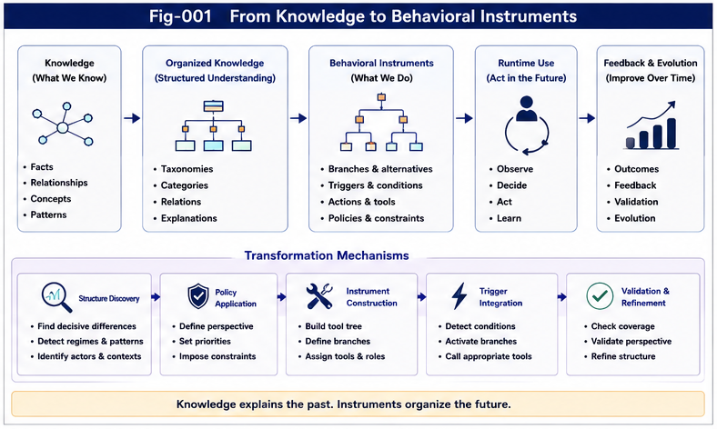
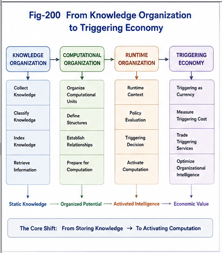
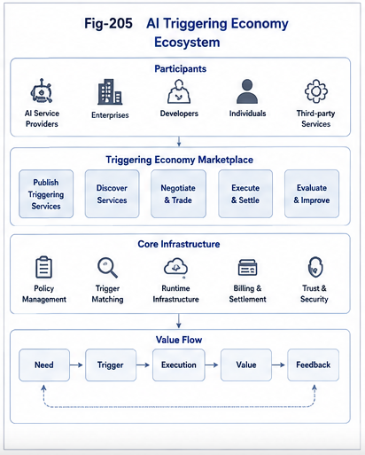
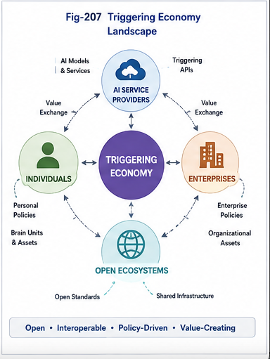
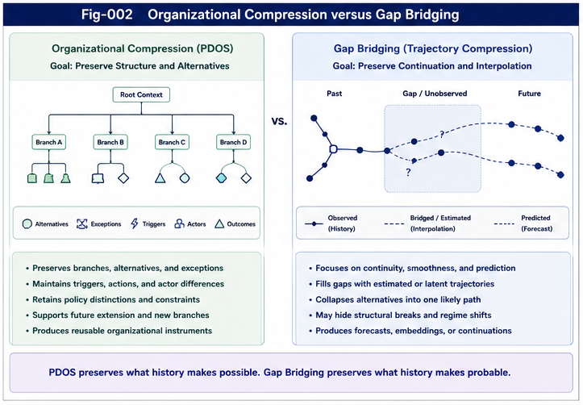
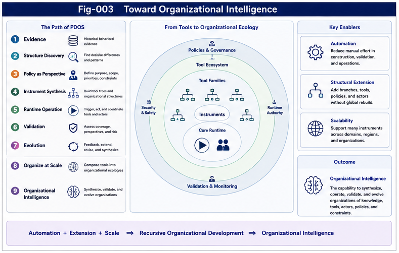

# Policy-Driven Organizational Synthesis (PDOS)

## Engineering Open-Domain Organizational Intelligence

**Policy-Driven Organizational Synthesis (PDOS)** is a computational framework for synthesizing, evolving, and exploiting organizational structures under explicit policies. Rather than treating organization as a static description of knowledge, PDOS regards organization itself as a computational object that can be designed, optimized, simulated, and continuously evolved toward higher-level goals.

PDOS introduces a shift from **knowledge organization** to **organizational intelligence**. In this view, organization is not merely a passive representation of information, but an active computational mechanism that influences runtime behavior, decision making, structural adaptation, and long-term competitive advantage.

PDOS is not a theory of storing knowledge.

PDOS is a theory of organizing computation.

> **Policy-Driven Organizational Synthesis (PDOS) is a computational framework that unifies organizational intelligence and localized runtime intelligence through policy-driven organization, runtime computation, continuous learning, and organizational evolution.**

---


---


---

# Motivation

Most existing computational organization methods focus on discovering existing structures.

Typical pipelines include:

```
Objects
    ↓
Representation
    ↓
Embedding
    ↓
Clustering
    ↓
Taxonomy
```

These approaches successfully organize existing knowledge but generally assume that the objective of organization is fixed.

PDOS begins with a different question:

> **How should organizational structures themselves be synthesized under explicit policies to achieve evolving computational goals?**

The answer is not a single taxonomy, but an organizational synthesis process driven by runtime objectives.

---

# Core Idea

PDOS proposes that organizational structures are computational assets.

Instead of asking

> "What is the correct organization?"

PDOS asks

> "Which organization best supports the current policy and future runtime objectives?"

This introduces **Policy** as a first-class computational component.

Conceptually,

```
Policy
      ↓
Organizational Synthesis
      ↓
Difference Trees
      ↓
Runtime Organization
      ↓
Decision
      ↓
Execution
```

Organization is therefore no longer static.

It becomes continuously synthesizable, optimizable, and reusable.

---

# From Knowledge Organization to Organizational Intelligence

---



---

Traditional organization emphasizes

* classification
* indexing
* ontology
* knowledge graphs
* taxonomy

PDOS extends these ideas into organizational intelligence.

Instead of organizing knowledge once,

PDOS continuously synthesizes organizations according to changing objectives.

Consequently,

Organization becomes

* adaptive
* policy-driven
* goal-oriented
* runtime-aware
* explainable
* evolvable

---



---


---

# Open-Domain Organizational Intelligence

Many computational frameworks implicitly assume a closed problem space.

The primary task becomes

* searching
* optimizing
* connecting
* filling existing gaps

PDOS instead supports an open-domain perspective.

Policies may continuously generate

* new concepts
* new organizational boundaries
* new Difference Trees
* new computational units
* new runtime organizations

Rather than merely bridging existing structures, PDOS enables the continuous synthesis of new organizational structures.

This provides a computational framework for open-domain organizational intelligence.

---



---



---



---



---

# Relationship with CKOI

PDOS builds upon the computational infrastructure established by **Computational Knowledge Organization and Infrastructure (CKOI)**.

CKOI primarily provides

* Universal Typing and Naming (UTN)
* structural representation
* metric relationships
* embeddings
* clustering
* computational organization infrastructure

PDOS utilizes these capabilities as organizational primitives while introducing an additional layer:

**Policy-Driven Organizational Synthesis.**

Conceptually,

```
CKOI
    ↓
PDOS
    ↓
GTDO
    ↓
FTRI
    ↓
Runtime Computational Systems
```

CKOI answers

> **How can knowledge be computationally organized?**

PDOS answers

> **How can organizational intelligence itself be synthesized, evolved, and engineered?**

---

# Relationship with Structural Intelligence

PDOS naturally complements several repositories within the Structural Intelligence series.

* **UTN** provides unified structural representation.
* **CKOI** provides computational organizational infrastructure.
* **PDOS** synthesizes organizations under policies.
* **GTDO** dispatches organizational structures into computational units.
* **FTRI** performs runtime organizational switching.
* **RCP** studies reusable runtime computational primitives.

Together, these repositories describe different layers of structural computation rather than isolated algorithms.

---

# Potential Applications

PDOS is intentionally scale-independent.

It may organize

* three visual objects,
* local runtime learning,
* software architectures,
* enterprise strategies,
* military planning,
* scientific research,
* hybrid AI systems,
* autonomous agents,
* distributed computational ecosystems.

The same computational principles apply across these scales.

---

# Guiding Principles

PDOS is developed around several fundamental principles.

* Organization is computation.
* Policy actively shapes organization.
* Organization should continuously evolve.
* Runtime behavior depends on organizational structures.
* Difference Trees are computational assets.
* Organizational intelligence extends beyond static knowledge organization.
* Open-domain synthesis complements closed-domain optimization.
* Explainability emerges naturally from explicit organizational structures.

---

# Repository Structure

```
README.md
START-HERE.md
CONSTITUTION.md
OUTLINE.md
ROADMAP.md
CONTENTS.md
FIGURE-INDEX.md

docs/
    Part-I-Foundations/
    Part-II-From-Knowledge-Organization-to-Triggering-Economy
    Part-III-Policy-Driven-Runtime-Architecture/
    Part-IV-Toward-Organizational-Intelligence/
    Part-V-Toward-Organizational-Intelligence/
    Part-V-Localized-Runtime-Intelligence/

figures/
```
## Part IV: Toward Organizational Intelligence

Part IV extends PDOS beyond knowledge organization and runtime architecture toward a broader theory of **Organizational Intelligence**.

Rather than viewing AI primarily as a prediction engine or a collection of computational tools, Part IV proposes that future AI systems may increasingly function as **organizational systems** capable of synthesizing reusable behavioral instruments from historical experience.

The central ideas introduced in this part include:

- Policy-Driven Organizational Synthesis (PDOS)
- Behavioral Instruments
- Organizational Compression
- Structural Coverage
- Perspective Validation
- Organizational Instruments
- Recursive Organizational Synthesis
- Organizational Intelligence

Together these concepts describe a transition from:

    Knowledge
          ↓
    Behavioral Instruments
          ↓
    Runtime Organizations
          ↓
    Recursive Organizational Ecology
          ↓
    Organizational Intelligence

---

## Part V — Localized Runtime Intelligence

---


---

Part V extends Policy-Driven Organizational Synthesis from **organizational intelligence** to **runtime intelligence**.

The previous parts establish how policy-driven organizational structures can localize open-domain problems into computationally meaningful organizational nodes.

Part V investigates what happens **after organizational routing has completed**.

Rather than repeatedly reasoning over an undifferentiated global knowledge space, PDOS introduces **Localized Runtime Intelligence**, where computation operates over localized organizational structures.

Major topics include:

- Per-Node X–Y–M Runtime Memory
- Decision Landscapes
- Unified Dispatch Methods
- Localized Runtime Learning
- Brain Units
- Multi-Policy Runtime Intelligence
- Closed-Loop Runtime Organizations

Together, these concepts establish the first runtime computational architecture built upon Policy-Driven Organizational Synthesis.

For readers interested in future AI runtime architectures, Part V provides the computational bridge connecting organizational intelligence with continuous runtime computation, learning, and organizational evolution.

---

# Intended Audience

This repository is intended for

* AI researchers
* computational scientists
* knowledge engineers
* software architects
* runtime system designers
* cognitive scientists
* organizational researchers
* strategic planners

who are interested in computational organization as a fundamental component of intelligence.

---

# Vision

Policy-Driven Organizational Synthesis proposes that the evolution of intelligence is not solely the evolution of computation.

It is equally the evolution of organization.

By treating organizational structures as explicit computational objects that can be synthesized, evaluated, reused, and continuously evolved under policy guidance, PDOS aims to establish a unified engineering framework for organizational intelligence across artificial intelligence, software systems, scientific discovery, and biological inspiration.

Rather than viewing organization as the endpoint of knowledge management, PDOS views organization as the beginning of computation.

> **The evolution of artificial intelligence is no longer driven solely by larger models or greater computational capacity. It increasingly depends on how computation is organized, governed, and activated. Policy-Driven Organizational Synthesis positions organizational policies and runtime triggering as the operational foundation of this next stage, establishing the Triggering Economy as a unifying framework for future intelligent systems.**

# Closing Perspective

Policy-Driven Organizational Synthesis begins with historical behavioral evidence but does not end with prediction.

Its objective is to transform experience into reusable organizational instruments that guide future behavior under explicit policy, structural preservation, validation, and runtime evolution.

As these instruments become increasingly automated, structurally extensible, recursively reusable, and scalable, they form progressively richer organizational ecologies.

This repository proposes that Organizational Intelligence may emerge from this progression—not as the intelligence of a single model, but as the intelligence of an evolving ecosystem of policies, tools, actors, knowledge, validation, and runtime organization.