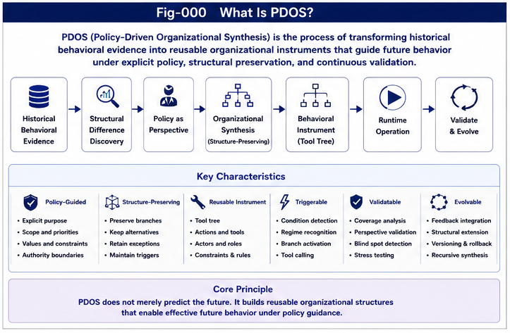
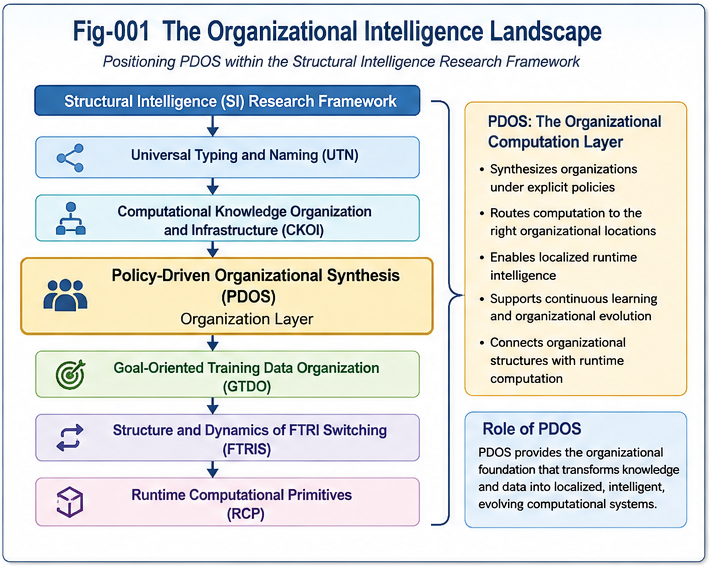
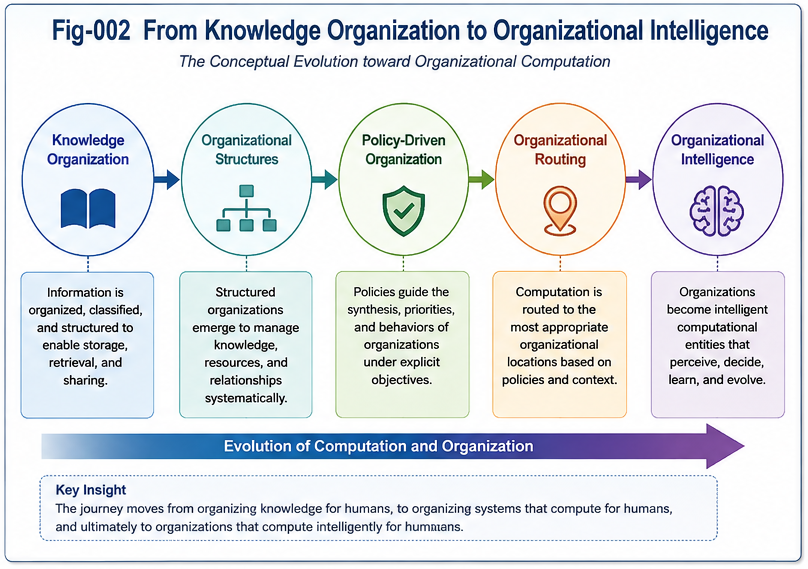
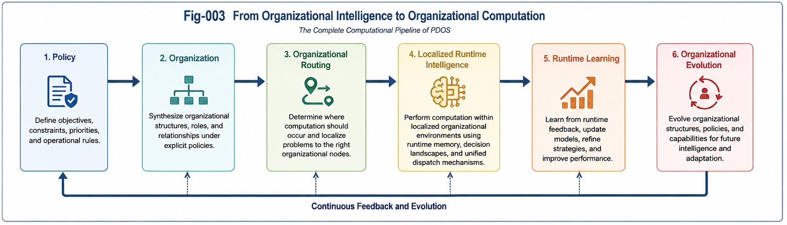
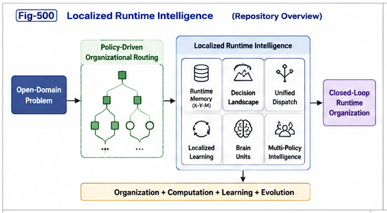
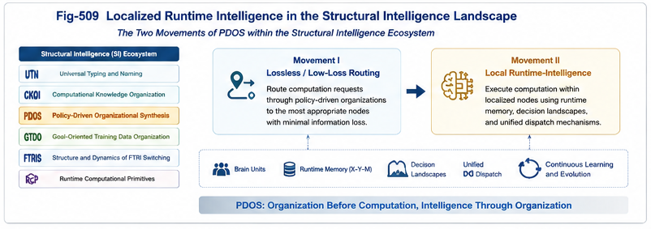
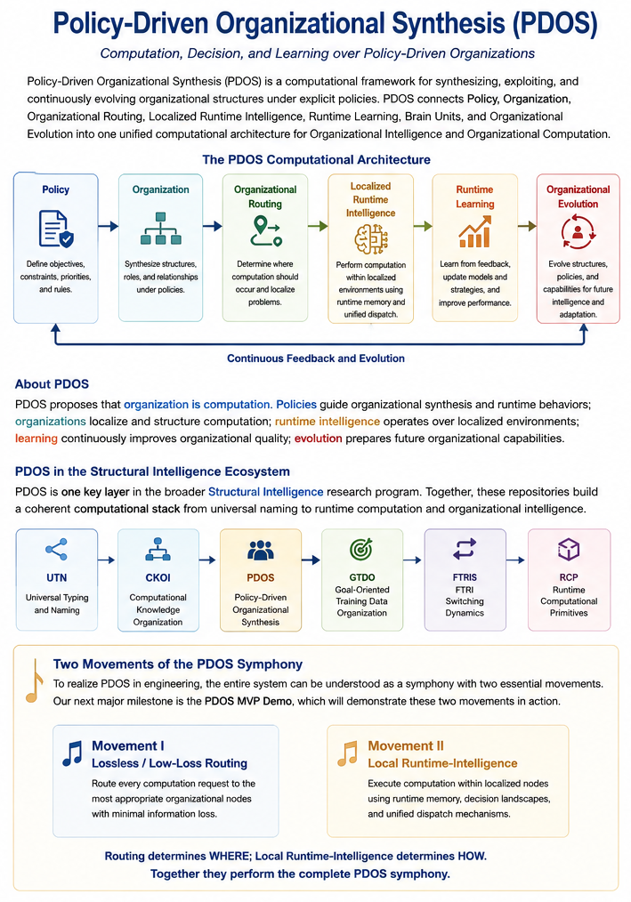

# Policy-Driven Organizational Synthesis (PDOS)

## Engineering Organizational Intelligence through Policy, Organization, and Localized Runtime Intelligence

---

# Overview

**Policy-Driven Organizational Synthesis (PDOS)** is a computational framework that investigates how organizational structures can be **explicitly synthesized, computationally exploited, continuously improved, and progressively evolved under explicit policies.**

Unlike traditional approaches that primarily organize knowledge or optimize computation directly, PDOS studies **organization itself as a computational object**.

Within PDOS,

organizations are not passive information structures.

Organizations actively

- localize computation,
- coordinate runtime behavior,
- guide decision making,
- support continuous learning,
- and enable long-term organizational evolution.

The repository develops a unified computational architecture connecting

**Policy → Organization → Organizational Routing → Localized Runtime Intelligence → Continuous Learning → Organizational Evolution.**

---



**Figure 000. Policy-Driven Organizational Synthesis.**
Repository overview illustrating the complete computational architecture developed throughout PDOS.

---

# Why PDOS?

Modern Artificial Intelligence has achieved remarkable progress in

- representation,
- optimization,
- machine learning,
- foundation models,
- and large-scale reasoning.

However, an equally fundamental computational question remains comparatively underexplored:

> **How should intelligent systems organize computation before computation begins?**

PDOS begins from this question.

Rather than viewing organization as passive information management,

PDOS investigates organization itself as an active computational mechanism capable of determining

- where computation should occur,
- how runtime resources should be coordinated,
- how localized intelligence should emerge,
- and how organizations should continuously improve through experience.

This organizational perspective complements existing computational paradigms rather than replacing them.

---

# Core Idea

The central idea of PDOS may be summarized in one sentence:

> **Organization is Computation.**

Policy determines organizational objectives.

Organization determines computational structure.

Organizational Routing determines where computation should occur.

Localized Runtime Intelligence determines how computation should occur.

Runtime learning continuously improves organizational quality.

Organizational evolution continuously improves future computation.

---

# Core Contributions

PDOS introduces a unified organizational computation framework built upon several major contributions.

## Policy as a Computational Primitive

Policies become explicit computational objects capable of governing

- organizational synthesis,
- routing strategies,
- structural priorities,
- optimization objectives,
- and organizational evolution.

---

## Organization as Computation

Organizations are elevated from passive organizational structures to active computational mechanisms supporting

- localization,
- coordination,
- dispatch,
- structural transformation,
- and runtime computation.

---

## Organizational Intelligence

PDOS extends traditional Knowledge Organization into **Organizational Intelligence**, where organizations actively participate in intelligent computation.

---

## Organizational Routing

Problems are progressively localized into the most appropriate organizational nodes through policy-driven organizational synthesis.

Rather than immediately performing computation,

PDOS first determines

> **where computation belongs.**

---

## Localized Runtime Intelligence

Once organizational routing has completed,

runtime computation becomes localized.

Each organizational node may independently maintain

- runtime memories,
- Decision Landscapes,
- dispatch strategies,
- localized learning,
- and specialized computational expertise.

---

## Continuous Organizational Evolution

Organizations continuously evolve through

- runtime observations,
- measured utility,
- policy refinement,
- localized learning,
- and organizational adaptation.

PDOS therefore treats organizational evolution as an intrinsic computational process.

---

# The PDOS Computational Pipeline

The overall computational architecture developed throughout the repository may be summarized as

```text
Open-Domain Problems

        │

        ▼

Policy

        │

        ▼

Organizational Synthesis

        │

        ▼

Organizational Routing

        │

        ▼

Localized Runtime Intelligence

        │

        ▼

Runtime Learning

        │

        ▼

Brain Units

        │

        ▼

Multi-Policy Runtime Intelligence

        │

        ▼

Organizational Evolution
```

This computational progression represents the central architectural contribution of Policy-Driven Organizational Synthesis.

Unlike traditional computational pipelines that primarily focus on algorithmic execution, PDOS introduces an explicit organizational layer preceding runtime computation, allowing intelligent systems to organize computation before performing computation.

---

# Position within Artificial Intelligence

PDOS complements existing AI paradigms rather than replacing them.

Conceptually,

```
Representation

        ↓

Learning

        ↓

Reasoning

        ↓

Optimization

        ↓

Policy

        ↓

Organization

        ↓

Localized Runtime Intelligence
```

The repository therefore introduces **Organizational Computation** as an additional computational layer operating alongside existing AI methodologies.

This perspective naturally supports future hybrid intelligent systems capable of combining multiple computational paradigms within one coherent organizational framework.

---

# Repository Goal

The long-term objective of PDOS is to establish **Organizational Intelligence** as a foundational computational discipline.

The repository progressively develops theoretical principles, engineering methodologies, runtime architectures, localized learning mechanisms, and organizational evolution strategies required for future large-scale intelligent systems.

The remaining sections of this README introduce the repository architecture, the five Parts of PDOS, its relationship with the broader Structural Intelligence framework, recommended reading paths, applications, and future research directions.

--- 

# Repository Architecture

Policy-Driven Organizational Synthesis is organized as a progressive computational framework.

Each Part introduces one major computational layer while preserving conceptual continuity with the previous Parts.

Rather than presenting isolated ideas, the repository gradually develops a complete organizational computation architecture.

The overall progression is illustrated below.

---



**Figure 001. The Organizational Intelligence Landscape.**
Positions PDOS within the broader Structural Intelligence research framework and illustrates its role in organizational computation.

---

The conceptual evolution developed throughout the repository may be summarized as

```text
Knowledge

        │

        ▼

Organization

        │

        ▼

Policy

        │

        ▼

Organizational Routing

        │

        ▼

Localized Runtime Intelligence

        │

        ▼

Continuous Organizational Evolution
```

Each Part expands one layer of this computational architecture.

---

# Repository Organization

The repository consists of five progressively connected Parts.

```text
Part I

Foundations

        │

        ▼

Part II

From Knowledge Organization
to Triggering Economy

        │

        ▼

Part III

Policy-Driven Runtime Architecture

        │

        ▼

Part IV

Toward Organizational Intelligence

        │

        ▼

Part V

Localized Runtime Intelligence
```

Each Part introduces one increasingly sophisticated level of organizational computation.

---

# Part I — Foundations

**The Foundational Principles of Policy-Driven Organizational Synthesis**

Part I establishes the conceptual foundations of PDOS.

Major topics include

- Organization as Computation
- Policy as a Computational Primitive
- Organizational Intelligence
- Open-Domain Organizational Intelligence

Primary outcome

> Organization becomes a computational object.

---

# Part II — From Knowledge Organization to Triggering Economy

Part II explains why organizations possess computational value.

It introduces

- Organizational Triggering
- Triggering Economy
- Organizational Policies
- Triggering Infrastructure
- Organizational Value Generation

Primary outcome

> Organizations become computational infrastructure capable of generating measurable runtime value.

---

# Part III — Policy-Driven Runtime Architecture

Part III transforms organizational synthesis into executable engineering systems.

Topics include

- Runtime Pipelines
- Organizational Dispatch
- Runtime APIs
- Organizational Validation
- Reference Runtime Architecture

Primary outcome

> Organizations become executable runtime systems.

---

# Part IV — Toward Organizational Intelligence

Part IV generalizes organizational synthesis into a broader computational theory.

Topics include

- Policy Perspectives
- Organizational Compression
- Organizational Coverage
- Recursive Organizational Synthesis
- Organizational Intelligence

Primary outcome

> Organization becomes an independent form of computational intelligence.

---

# Part V — Localized Runtime Intelligence

**Computation, Decision, and Learning over Policy-Driven Organizations**

Part V establishes the runtime computational framework operating over policy-driven organizations.

Topics include

- Per-Node Runtime Memory
- Decision Landscapes
- Unified Dispatch Methods
- Localized Runtime Learning
- Brain Units
- Multi-Policy Runtime Intelligence
- Closed-Loop Runtime Organizations

Primary outcome

> Organization and runtime computation become one unified computational architecture.

---



**Figure 002. From Knowledge Organization to Organizational Intelligence.**
Illustrates the conceptual evolution developed throughout the five Parts of PDOS.

---

# Relationship with Computational Knowledge Organization (CKOI)

PDOS naturally extends the work introduced in

**Computational Knowledge Organization and Infrastructure (CKOI).**

The two repositories investigate different computational layers.

Conceptually,

```text
CKOI

Knowledge Organization

↓

Computational Organization

↓

Reusable Organizational Infrastructure

────────────────────────────

PDOS

Policy

↓

Organizational Synthesis

↓

Organizational Routing

↓

Localized Runtime Intelligence

↓

Continuous Organizational Evolution
```

CKOI studies how computational knowledge can be organized.

PDOS studies how organized computational structures become intelligent computational organizations.

The two repositories therefore complement one another while addressing different architectural levels.

---

# Relationship with the Structural Intelligence Framework

PDOS forms one major component of the broader Structural Intelligence research program.

Conceptually,

```text
SRMS

↓

Structural Recognition

↓

FTRIA

↓

Runtime Structural Operators

↓

FTRIS

↓

Runtime Structural Switching

↓

RCP

↓

Runtime Computational Primitives

────────────────────────────

CKOI

↓

Computational Knowledge Organization

↓

PDOS

↓

Organizational Intelligence

↓

Localized Runtime Intelligence
```

Rather than replacing previous repositories,

PDOS builds upon them,

integrating organizational computation into the larger Structural Intelligence architecture.

---



**Figure 003. From Organizational Intelligence to Organizational Computation.**
Illustrates the complete computational progression developed throughout the repository, connecting policy, organization, routing, runtime intelligence, and organizational evolution.

---

# Architectural Perspective

One important design principle consistently followed throughout PDOS is the explicit separation between

> **organization**

and

> **runtime computation.**

Policy determines organizational objectives.

Organization determines computational structure.

Organizational Routing determines where computation belongs.

Localized Runtime Intelligence determines how computation is performed.

Continuous learning improves organizational quality.

This architectural separation allows organizational structures and runtime computation to evolve independently while remaining computationally coordinated.

It also provides a natural foundation for integrating multiple runtime methods—including probability-based decision making, structural dispatch, transformer-based inference, hybrid systems, and future computational models—within one unified organizational framework.

The remaining sections of this README introduce the computational significance of Part V, practical application domains, repository navigation, and future research directions.

---

# Part V Highlight

## Localized Runtime Intelligence

One of the most significant developments introduced in **Version 1.0** is **Part V — Localized Runtime Intelligence**.

The first four Parts establish how policy-driven organizations can progressively synthesize organizational structures capable of supporting intelligent computation.

Part V addresses the next fundamental question:

> **Once a problem has been successfully organized and localized, how should runtime intelligence operate?**

Rather than repeatedly reasoning over an undifferentiated global computational space,

PDOS proposes that runtime intelligence should operate primarily over **localized organizational environments** created through Policy-Driven Organizational Routing.

This transition establishes one of the central architectural principles of the repository.

```
Policy

        │

        ▼

Organization

        │

        ▼

Organizational Routing

        │

        ▼

Localized Runtime Intelligence
```

Organization determines

> **where computation belongs.**

Localized Runtime Intelligence determines

> **how computation proceeds.**

The separation between these two responsibilities significantly improves modularity,

specialization,

continuous learning,

and long-term organizational evolution.

---



**Figure 500. Localized Runtime Intelligence.**
Repository overview illustrating the runtime computational architecture developed throughout Part V.

---

# From Organizational Intelligence to Organizational Computation

Part V extends Organizational Intelligence into a complete runtime computational architecture.

Rather than viewing organizations as static computational infrastructure,

PDOS treats each localized organizational node as an independent runtime computational environment capable of maintaining its own

- runtime memory,
- Decision Landscape,
- dispatch strategies,
- localized learning,
- and accumulated operational experience.

Intelligence therefore becomes distributed across organizational structures rather than concentrated inside one undifferentiated computational process.

---

# Localized Runtime Intelligence

Localized Runtime Intelligence is built upon several complementary computational concepts.

## Per-Node Runtime Memory

Each organizational node continuously accumulates runtime experience using

```
(X, Y, M)
```

where

- **X** represents runtime observations,
- **Y** represents runtime decisions,
- **M** represents measured utility.

These runtime memories become reusable computational assets supporting future decision making.

---

## Decision Landscapes

Accumulated runtime memories naturally form localized **Decision Landscapes**.

Rather than solving every problem from scratch,

runtime computation increasingly navigates accumulated operational experience.

Decision Landscapes therefore become the computational substrate supporting intelligent runtime decision making.

---

## Unified Dispatch Methods

PDOS interprets multiple runtime decision paradigms within one unified computational framework.

Examples include

- Probability Dispatch,
- Structural Dispatch using Two-Way CCC,
- Transformer-based inference,
- Hybrid Dispatch,
- and future runtime decision methods.

Organizational Routing determines where runtime computation should occur.

Dispatch determines how localized runtime computation should proceed.

This separation significantly improves computational flexibility.

---

## Localized Runtime Learning

Learning occurs where runtime experience is generated.

Each organizational node continuously improves itself through

- runtime observations,
- measured utility,
- organizational feedback,
- policy refinement,
- and localized adaptation.

Global retraining therefore becomes only one possible learning strategy rather than the only learning mechanism.

---

## Brain Units

As localized learning accumulates,

specialized organizational nodes naturally evolve into **Brain Units**.

Each Brain Unit contains

- specialized runtime memory,
- domain-specific Decision Landscapes,
- optimized dispatch strategies,
- localized runtime learning,
- and reusable computational expertise.

Brain Units therefore emerge through organizational specialization rather than predefined architectural design.

---

## Multi-Policy Runtime Intelligence

Complex open-domain environments often require multiple complementary organizational perspectives.

PDOS therefore supports multiple policy-driven organizational structures operating simultaneously.

Rather than relying upon one global organizational perspective,

multiple Policy Forests cooperate to improve

- coverage,
- robustness,
- confidence,
- explainability,
- and organizational diversity.

---

## Closed-Loop Organizational Evolution

Localized Runtime Intelligence concludes by integrating

- policy,
- organization,
- runtime computation,
- learning,
- feedback,
- and organizational refinement

into one continuously evolving computational lifecycle.

Organizations therefore become continuously improving computational systems.

---

# Practical Applications

Although PDOS is primarily a theoretical and engineering framework,

its computational principles naturally support numerous application domains.

Potential applications include

- intelligent software engineering,
- AI runtime orchestration,
- organizational operating systems,
- enterprise decision support,
- workflow optimization,
- scientific discovery,
- autonomous agents,
- robotics,
- knowledge-intensive engineering,
- computational biology,
- and hybrid AI systems.

The repository intentionally emphasizes computational principles rather than domain-specific implementations, allowing future engineering work to extend these concepts into diverse application areas.

---

# From Research Framework to Engineering Systems

The concepts introduced throughout PDOS are intended not only as theoretical constructs but also as engineering principles.

One important observation emerging from Version 1.0 is that the practical realization of PDOS naturally separates into two complementary computational stages.

The first stage determines

> **where computation should occur.**

The second stage determines

> **how localized computation should proceed.**

This separation forms the engineering foundation of future PDOS runtime systems.



**Figure 509. Localized Runtime Intelligence in the Structural Intelligence Landscape.**

> Repository-level engineering summary
illustrating the two complementary
computational movements developed by PDOS.

This figure summarizes the engineering interpretation of PDOS within the broader Structural Intelligence framework.

Rather than relying upon one monolithic computational process, PDOS separates intelligent computation into two complementary movements.

### Movement I

Lossless / Low-Loss Organizational Routing

Policy-driven organizations localize computational problems into the most appropriate organizational nodes while preserving as much structural information as possible.

### Movement II

Localized Runtime Intelligence

Each localized organizational node performs runtime computation using its own runtime memory, Decision Landscape, dispatch strategies, and localized learning mechanisms.

Together, these two complementary stages establish the engineering foundation for future PDOS runtime systems.

---

**Figure 009. Policy-Driven Organizational Synthesis PDOS Summary.**



---

# Research Philosophy

PDOS follows several long-term research principles.

## Explicit Organization

Organizational structures should remain

- interpretable,
- reusable,
- explainable,
- composable,
- and computationally meaningful.

---

## Separation of Responsibilities

Policy determines objectives.

Organization determines computational structure.

Routing determines computational location.

Localized Runtime Intelligence determines runtime behavior.

Learning determines future improvement.

This explicit separation greatly simplifies large-scale intelligent systems.

---

## Engineering Before Scale

PDOS emphasizes improving organizational quality before increasing computational scale.

Well-organized computation often provides greater long-term benefit than simply increasing computational resources.

---

## Progressive Evolution

Organizational systems should continuously improve through runtime experience.

Rather than repeatedly redesigning complete systems,

PDOS advocates incremental organizational evolution driven by localized operational evidence.

---

# Transition to Repository Navigation

Having introduced the conceptual foundations, repository architecture, and runtime computational framework,

the remaining sections of this README explain

- how the repository is organized,
- how new readers should approach the material,
- where individual documents are located,
- and how the repository may continue evolving in future releases.

---

# Repository Guides

PDOS provides several repository-level documents designed to help readers understand the computational architecture before studying the individual articles.

Each document serves a different purpose.

| Document | Purpose |
|-----------|---------|
| **README.md** | Repository overview and introduction |
| **START-HERE.md** | Recommended reading guide for new readers |
| **CONSTITUTION.md** | Long-term constitutional principles of PDOS |
| **OUTLINE.md** | Repository architecture and logical organization |
| **CONTENTS.md** | Complete article catalog |
| **ROADMAP.md** | Long-term development strategy |
| **FIGURE-INDEX.md** | Complete figure catalog |

Together these documents provide a complete architectural guide to the repository.

---

# Recommended Reading Path

Readers from different backgrounds may approach PDOS differently.

The following reading path is recommended for most readers.

## Step 1

Understand the repository architecture.

Read

```
README

↓

START-HERE

↓

CONSTITUTION

↓

OUTLINE
```

These documents explain

- why PDOS exists,
- what problems it studies,
- how the repository is organized,
- and the long-term architectural vision.

---

## Step 2

Study the repository progressively.

```
Part I

↓

Part II

↓

Part III

↓

Part IV

↓

Part V
```

The repository is intentionally organized so that each Part naturally prepares the reader for the next.

---

## Step 3

Review the figures.

```
FIGURE-INDEX

↓

Repository Overview

↓

Part Figures

↓

Article Figures
```

Many readers will find that the figures provide a useful high-level understanding before studying the individual articles.

---

# Repository Structure

The repository follows a consistent engineering organization.

```text
Policy-Driven-Organizational-Synthesis-PDOS/
│
├── README.md
├── CHANGELOG.md
├── CITATION.cff
├── .zenodo.json
├── Apache-2.0 LICENSE.txt
│
└── docs/
       ├── START-HERE.md
       ├── CONSTITUTION.md
       ├── OUTLINE.md
       ├── CONTENTS.md
       ├── ROADMAP.md
       ├── FIGURE-INDEX.md
       ├── figures/
       ├── Part-I-Foundations/
       ├── Part-II-From-Knowledge-Organization-to-Triggering-Economy/
       ├── Part-III-Policy-Driven-Runtime-Architecture/
       ├── Part-IV-Toward-Organizational-Intelligence/
       └── Part-V-Localized-Runtime-Intelligence/

```

Each Part contains

- articles,
- figures,
- and a dedicated README introducing the Part.

The repository therefore supports both sequential reading and topic-oriented exploration.

---

# Intended Audience

PDOS is intended for researchers and engineers interested in

- Artificial Intelligence
- Organizational Intelligence
- Runtime Systems
- Software Engineering
- Knowledge Organization
- Enterprise Computing
- Intelligent Agents
- Robotics
- Scientific Discovery
- Computational Biology
- Hybrid AI Systems

The repository intentionally combines theoretical principles with engineering perspectives, making it suitable for both conceptual research and practical system design.

---

# Relationship with Existing AI

PDOS is not proposed as a replacement for existing AI methodologies.

Instead,

PDOS introduces an additional computational layer.

Conceptually,

```text
Representation

↓

Learning

↓

Reasoning

↓

Optimization

────────────────────

Policy

↓

Organization

↓

Organizational Routing

↓

Localized Runtime Intelligence
```

Traditional AI methods primarily determine

> **how computation is performed.**

PDOS additionally investigates

> **how computation should first be organized.**

This organizational perspective naturally complements

- symbolic AI,
- statistical learning,
- large language models,
- graph-based methods,
- optimization,
- and future hybrid intelligent systems.

---

# Engineering Perspective

Throughout the repository,

PDOS consistently separates computational responsibilities.

```
Policy

↓

Organization

↓

Routing

↓

Localized Runtime Computation

↓

Learning

↓

Evolution
```

Each layer performs one primary responsibility.

This explicit separation

- improves modularity,
- simplifies engineering,
- enables specialization,
- increases explainability,
- supports incremental evolution,
- and facilitates integration of multiple runtime decision methods.

The repository therefore emphasizes architectural organization before algorithmic complexity.

---

# Future Directions

Version 1.0 establishes the conceptual foundation of Policy-Driven Organizational Synthesis.

Future research may further explore

## Organizational Runtime Platforms

Engineering environments capable of directly executing policy-driven organizations.

---

## Decision Landscape Theory

Formal computational models describing localized runtime decision spaces.

---

## Brain Unit Ecosystems

Large-scale cooperation among specialized Brain Units operating over shared organizational structures.

---

## Organizational Operating Systems

General runtime systems capable of supporting organization-aware intelligent computation.

---

## Organizational Ecology

Dynamic interaction, cooperation, competition, and evolution among multiple policy-driven organizations.

---

## Hybrid Organizational AI

Integration of

- structural methods,
- probabilistic inference,
- transformer-based computation,
- runtime structural operators,
- and future organizational computation methods.

---

## Biological Organizational Intelligence

Exploration of organizational principles potentially underlying biological intelligent systems.

---

# Repository Philosophy

PDOS follows one simple engineering philosophy.

```
Organize

        ↓

Localize

        ↓

Compute

        ↓

Learn

        ↓

Evolve
```

The repository argues that well-organized intelligent systems naturally become

- more scalable,
- more explainable,
- more reusable,
- more maintainable,
- and more adaptable.

Organization therefore becomes an active engineering discipline rather than merely a method for arranging information.

---

# Transition to the Final Repository Information

The final section of this README provides repository metadata, citation information, acknowledgements, and the long-term vision of Policy-Driven Organizational Synthesis as an emerging framework for Organizational Intelligence and Organizational Computation.

---

# Citation

If you find this repository useful in your research, software, or engineering projects, please consider citing it.

```bibtex
@software{tan2026pdos,
  title  = {Policy-Driven Organizational Synthesis (PDOS)},
  author = {Sizhe Tan},
  year   = {2026},
  version = {1.0.0},
  doi = {10.5281/zenodo.21844616},
  url    = {https://github.com/sizhet/Policy-Driven-Organizational-Synthesis-PDOS}
}
```

The repository also contains

- `CITATION.cff`
- `.zenodo.json`

to support citation management and DOI registration.

---

# Version

Current Version

```
Version 1.0.0
```

This release establishes the first complete theoretical foundation of **Policy-Driven Organizational Synthesis**.

Version 1.0 introduces a unified computational architecture integrating

- Policy,
- Organization,
- Organizational Routing,
- Localized Runtime Intelligence,
- Runtime Learning,
- Brain Units,
- Multi-Policy Runtime Intelligence,
- and Organizational Evolution.

Future versions are expected to emphasize engineering implementations, runtime platforms, organizational operating systems, and experimental validation while preserving the constitutional principles established in this release.

---

# Repository Characteristics

Policy-Driven Organizational Synthesis emphasizes

✓ Explicit organizational structures

✓ Explainable computational organization

✓ Organization-aware runtime computation

✓ Modular organizational architectures

✓ Localized runtime intelligence

✓ Continuous organizational evolution

✓ Engineering-oriented research

✓ Open-domain organizational systems

Rather than proposing another isolated AI algorithm,

PDOS provides an organizational computational framework capable of supporting multiple computational paradigms.

---

# Repository Status

Current repository components include

```
Repository Documents

↓

5 Parts

↓

44 Articles

↓

Repository Overview

↓

44+ Engineering Figures

↓

Part READMEs

↓

Complete Navigation Documents
```

Together,

these components establish a complete first-generation research repository for **Policy-Driven Organizational Synthesis**.

---

# License

Unless otherwise specified,

all original repository content is released under the license described in the repository LICENSE file.

Readers are encouraged to

- study,
- cite,
- discuss,
- compare,
- validate,
- implement,
- and extend

the computational principles presented throughout the repository.

Constructive collaboration is warmly welcomed.

---

# Acknowledgements

The development of PDOS has benefited from continuous iterative exploration across multiple complementary research directions including

- Structural Recognition,
- Runtime Structural Operators,
- Computational Knowledge Organization,
- Runtime Organizational Systems,
- Localized Runtime Intelligence,
- and Organizational Computation.

Many of the concepts presented in this repository emerged through progressive refinement, comparative analysis, engineering-oriented thinking, and continuous integration across the broader Structural Intelligence research program.

The repository also reflects the increasing role of modern AI-assisted research environments in supporting structured exploration, conceptual integration, technical writing, and engineering documentation.

---

# Repository Philosophy

The overall philosophy of PDOS may be summarized by the following progression.

```
Policy

        ↓

Organization

        ↓

Localization

        ↓

Runtime Computation

        ↓

Continuous Learning

        ↓

Organizational Evolution
```

Every contribution within this repository supports one or more stages of this computational progression.

Rather than emphasizing isolated algorithms,

PDOS emphasizes the computational organization that enables intelligent systems to become progressively more capable over time.

---

# Looking Ahead

Version 1.0 establishes the theoretical foundation of Policy-Driven Organizational Synthesis.

Future work may continue expanding

- organizational engineering,
- runtime organizational platforms,
- Decision Landscape theory,
- organizational operating systems,
- Brain Unit ecosystems,
- organizational ecology,
- hybrid organizational AI,
- organizational computational primitives,
- and biologically inspired organizational intelligence.

The long-term objective is to transform Organizational Intelligence into a practical engineering discipline supporting future large-scale intelligent systems.

---

# Closing Perspective

Artificial Intelligence has traditionally focused on improving computation itself.

Policy-Driven Organizational Synthesis explores a complementary direction.

Rather than asking only

> **How should intelligent systems compute?**

PDOS first asks

> **How should intelligent systems organize computation?**

This organizational perspective naturally leads to

- localized computation,
- reusable organizational structures,
- explainable runtime systems,
- continuous learning,
- and long-term organizational evolution.

Policy therefore becomes the mechanism that shapes organizations.

Organizations become the structures that shape computation.

Runtime intelligence becomes the mechanism that continuously improves organizations.

Together,

they establish a unified framework connecting organizational structure with intelligent computation.

---

# Final Statement

Policy-Driven Organizational Synthesis represents a transition

> **from organizing knowledge**

to

> **engineering organizational intelligence.**

By treating organizational structures as explicit computational objects governed by policies, PDOS establishes a unified computational architecture in which policy guides organization, organization localizes computation, localized runtime intelligence performs computation, and continuous organizational evolution progressively improves future intelligent systems.

We hope this repository provides a useful foundation for researchers and engineers interested in Organizational Intelligence, Organizational Computation, and the future evolution of large-scale intelligent systems.

Thank you for your interest in **Policy-Driven Organizational Synthesis (PDOS)**.

---

## Release 1.0 Closing Remark

The completion of Version 1.0 marks the establishment of the first integrated theoretical framework for **Policy-Driven Organizational Synthesis**.

Across five progressively connected Parts, the repository develops a coherent computational architecture spanning foundational principles, organizational value generation, runtime engineering, organizational intelligence, and localized runtime intelligence.

Rather than viewing organization as passive structure, PDOS demonstrates how organization can actively participate in computation, decision making, learning, and continuous evolution.

The repository is intended not as the conclusion of this research direction, but as a stable foundation upon which future theoretical advances, engineering implementations, and collaborative exploration may continue to grow.

**Organization before computation.  
Localization before intelligence.  
Evolution through continuous runtime learning.**

These three principles summarize the long-term vision of Policy-Driven Organizational Synthesis.

---

## Author

Sizhe Tan\
Independent Researcher

GPT-Obot\
AI Research Assistant

2026

---

## 📚 DBM-SI Series Navigation

See:\
[./docs/DBM-SI-Series-of-gitHub-Repositories/DBM-SI-Series-of-gitHub-Repositories.md](./docs/DBM-SI-Series-of-gitHub-Repositories/DBM-SI-Series-of-gitHub-Repositories.md)

[./docs/DBM-SI-Series-of-gitHub-Repositories/DBM-SI-Structural-Intelligence-Dictionary-(v2).md](./docs/DBM-SI-Series-of-gitHub-Repositories/DBM-SI-Structural-Intelligence-Dictionary-(v2).md)

