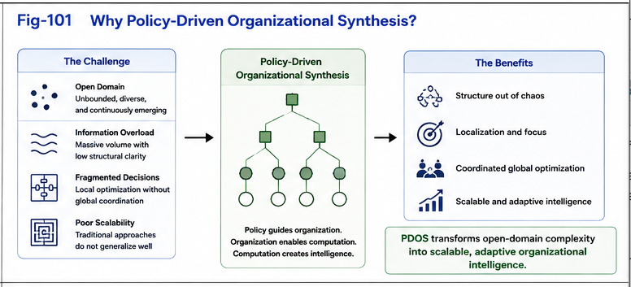

# PDOS-001

# Why Policy-Driven Organizational Synthesis?

## Engineering Open-Domain Organizational Intelligence

---

# Abstract

Artificial intelligence has achieved remarkable progress in representation learning, embedding models, knowledge graphs, clustering algorithms, and large-scale language models. These technologies have significantly improved the ability of computational systems to represent, retrieve, and utilize knowledge.

However, an important question remains largely unexplored:

> **How should organizational structures themselves be synthesized according to explicit policies and evolving computational objectives?**

Policy-Driven Organizational Synthesis (PDOS) addresses this question by treating organization itself as a computational object.

Rather than organizing knowledge once and for all, PDOS studies how organizations can be continuously synthesized, evaluated, refined, and evolved under explicit policies.

This paper introduces the motivation, principles, and long-term vision of PDOS.

---



---

# 1. Introduction

Knowledge alone does not produce intelligence.

Computation alone does not produce intelligence.

Even accurate representations do not necessarily produce effective behavior.

Between representation and runtime lies another fundamental layer:

**organization.**

The same computational resources may exhibit dramatically different behavior simply because they are organized differently.

PDOS begins with the observation that organization is not merely descriptive.

Organization actively participates in computation.

---

# 2. The Traditional Perspective

Most existing computational organization methods follow a broadly similar process.

```text
Objects
      ↓
Representation
      ↓
Embedding
      ↓
Similarity
      ↓
Clustering
      ↓
Taxonomy
```

The objective is typically to discover an existing organizational structure hidden within data.

These methods have achieved enormous practical success.

However, they generally assume that the desired organization already exists and merely needs to be discovered.

---

# 3. The Missing Layer

PDOS argues that organizational structures are not always discovered.

They are frequently **synthesized**.

Different users, organizations, scientific communities, companies, or intelligent agents often organize exactly the same information differently.

The reason is simple.

They pursue different objectives.

Consequently,

different objectives produce

different policies,

which produce

different organizations.

Organization therefore becomes an engineering problem rather than merely a discovery problem.

---

# 4. Policy as a Computational Object

Policies are often treated as external configuration parameters.

PDOS proposes a different interpretation.

Policies are computational objects that actively determine

* organizational boundaries,
* organizational priorities,
* organizational granularity,
* organizational evolution,
* organizational reuse,
* runtime behavior.

Conceptually,

```text
Policy
        ↓
Organizational Synthesis
        ↓
Difference Trees
        ↓
Runtime Organization
        ↓
Decision
        ↓
Execution
```

Policies therefore participate directly in computation.

---

# 5. Organization as Computation

PDOS introduces a simple but important principle.

> **Organization is computation.**

Organizations are not passive storage structures.

Organizations influence

* search,
* reasoning,
* comparison,
* dispatch,
* runtime switching,
* adaptation,
* learning,
* explanation.

Consequently,

organizational quality directly influences computational quality.

---

# 6. From Knowledge Organization to Organizational Intelligence

Traditional organization primarily answers

> "How should knowledge be organized?"

PDOS asks a different question.

> **How should organizations themselves evolve to support changing computational goals?**

This transition transforms

Knowledge Organization

into

Organizational Intelligence.

Organizations become adaptive computational assets.

---

# 7. Beyond Closed-Domain Intelligence

Many computational systems implicitly assume a bounded problem space.

The primary task becomes

* optimization,
* search,
* inference,
* gap bridging.

PDOS introduces an additional capability.

Organizations may continuously generate

* new categories,
* new Difference Trees,
* new computational boundaries,
* new organizational structures.

Instead of only connecting existing structures,

PDOS supports the continuous creation of new organizational structures.

This extends computational intelligence from closed-domain optimization toward open-domain organizational intelligence.

---

# 8. Relationship with CKOI

Policy-Driven Organizational Synthesis builds directly upon **Computational Knowledge Organization and Infrastructure (CKOI).**

CKOI provides the computational infrastructure required for organization, including

* Universal Typing and Naming (UTN),
* structural representation,
* metric relationships,
* embedding,
* clustering,
* organizational infrastructure.

PDOS builds upon these capabilities by introducing explicit policy-driven organizational synthesis.

Conceptually,

```text
CKOI
        ↓
PDOS
        ↓
GTDO
        ↓
FTRI
        ↓
Runtime Computational Primitives
```

CKOI answers

> **How can knowledge be computationally organized?**

PDOS answers

> **How can organizational intelligence itself be synthesized and evolved?**

The two repositories are complementary.

---

# 9. Scale Independence

One important property of PDOS is scale independence.

The same computational principles may organize

* three visual objects,
* software modules,
* enterprise architectures,
* scientific knowledge,
* military systems,
* autonomous agents,
* biological learning,
* large-scale computational ecosystems.

The objective is not large-scale organization.

The objective is better organization.

---

# 10. A Computational Hypothesis

PDOS naturally suggests an intriguing computational hypothesis.

If organizational synthesis consistently improves computational effectiveness across many domains, similar mechanisms may also contribute to biological intelligence.

Under this hypothesis,

localized organizational structures could continuously evolve under different policies,

forming multiple relatively independent organizational regions,

each adapted to its own objectives and environment.

This hypothesis remains speculative but offers an interesting direction for future computational and biological research.

---

# 11. Long-Term Vision

Policy-Driven Organizational Synthesis represents a shift

from

discovering organizations

toward

engineering organizations.

Organizations become

computational assets,

policies become

engineering instruments,

and organizational intelligence becomes

an explicit computational discipline.

Rather than considering organization the endpoint of knowledge management,

PDOS proposes that organization is the beginning of intelligent computation.

---

# Summary

Policy-Driven Organizational Synthesis introduces a new perspective on intelligent computation.

Instead of treating organization as a passive description of knowledge, PDOS treats organization as an active computational object that can be synthesized, evaluated, reused, optimized, and continuously evolved under explicit policies.

By integrating organizational synthesis with runtime computation, PDOS seeks to establish a unified engineering framework for organizational intelligence spanning artificial intelligence, software systems, scientific discovery, strategic planning, and potentially biological intelligence.

The long-term goal is not merely better knowledge organization.

The long-term goal is the engineering of organizational intelligence itself.
