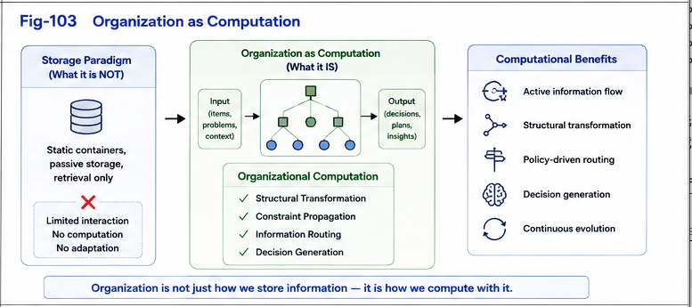

# PDOS-003

# Organization as Computation

## Engineering Open-Domain Organizational Intelligence

---

# Abstract

Computation has traditionally been understood as the execution of algorithms upon data.

Knowledge organization, in contrast, has generally been regarded as a supporting activity for representation, storage, indexing, and retrieval.

Policy-Driven Organizational Synthesis (PDOS) proposes a different perspective.

This paper argues that **organization itself constitutes an essential component of computation.**

Organizational structures determine how computational resources are connected, activated, coordinated, interpreted, and continuously evolved.

Consequently, organization should be regarded as an explicit computational object rather than merely a descriptive representation.

---

# 1. Introduction

Computational systems usually emphasize

* algorithms,
* data structures,
* execution,
* optimization,
* learning.

Organization is often considered secondary.

It is frequently viewed as

* classification,
* indexing,
* documentation,
* ontology,
* metadata.

PDOS proposes a fundamentally different interpretation.

Organization is not external to computation.

Organization participates directly in computation.

---

# 2. The Traditional Computational View

A conventional computational model can be simplified as

```text id="np7eeq"
Input

↓

Algorithm

↓

Output
```

Knowledge organization typically appears before computation.

```text id="ebg03j"
Knowledge

↓

Organization

↓

Algorithm

↓

Result
```

In this interpretation,

organization prepares computation,

but does not itself compute.

---



---

# 3. A Different Perspective

PDOS proposes another model.

```text id="8i6r1l"
Policy

↓

Organization

↓

Runtime Computation

↓

Feedback

↓

Organizational Evolution
```

Organization continuously determines

* computational boundaries,
* computational priorities,
* computational pathways,
* computational reuse,
* computational adaptation.

Organization therefore becomes part of computation itself.

---

# 4. Why Organization Computes

Consider two systems containing exactly the same knowledge.

If they organize that knowledge differently,

they may

search differently,

reason differently,

dispatch differently,

learn differently,

adapt differently,

and ultimately

produce different runtime behavior.

Nothing inside the individual computational primitives has changed.

Only the organization has changed.

Yet the computation changes.

This observation suggests that organization itself performs computational work.

---

# 5. Organization Determines Runtime

Organizations influence nearly every runtime activity.

Examples include

* computational reachability,
* search paths,
* Difference Trees,
* dispatch structures,
* runtime switching,
* reusable computational units,
* organizational feedback.

Instead of merely storing information,

organizations determine how computation unfolds.

---

# 6. Organization Generates Computational Constraints

Every organization implicitly creates

* neighborhoods,
* priorities,
* boundaries,
* hierarchies,
* relationships,
* reusable structures.

These structures constrain future computation.

Different organizations therefore generate different computational possibilities.

Organization does not merely represent computation.

Organization shapes computation.

---

# 7. Organization as a Computational Primitive

PDOS proposes that organizations themselves should be treated as computational primitives.

Organizations become reusable assets capable of

* synthesis,
* comparison,
* optimization,
* composition,
* runtime execution,
* organizational evolution.

This perspective naturally complements Runtime Computational Primitives (RCP).

Primitive computation no longer consists solely of executable instructions.

It also includes reusable organizational structures.

---

# 8. Policy Organizes Computation

Organizations do not appear randomly.

Policies actively synthesize organizations.

Conceptually,

```text id="l0q9ql"
Policy

↓

Organization

↓

Difference Trees

↓

Runtime Organization

↓

Runtime Behavior
```

Policies therefore indirectly determine computational behavior through organizational synthesis.

The computational object is no longer only the algorithm.

The computational object becomes

Policy + Organization + Runtime.

---

# 9. Organization Enables Open-Domain Intelligence

Traditional computational optimization frequently assumes a relatively stable organizational space.

PDOS extends computation beyond this assumption.

Organizations may continuously synthesize

new categories,

new computational boundaries,

new organizational relationships,

new Difference Trees,

new runtime organizations.

Instead of merely optimizing existing structures,

organization continuously expands the computational search space.

This capability supports open-domain organizational intelligence.

---

# 10. Relationship with Structural Intelligence

Within the Structural Intelligence framework,

organization naturally connects several computational layers.

```text id="8mvpxk"
UTN

↓

CKOI

↓

PDOS

↓

GTDO

↓

FTRIS

↓

Runtime Computational Primitives
```

Each layer contributes a different aspect of structural computation.

PDOS occupies the organizational synthesis layer.

---

# 11. Biological Perspective

If organization contributes directly to computation,

then biological intelligence may also depend upon explicit organizational mechanisms.

Under this hypothesis,

different local objectives may continuously synthesize different organizational structures,

allowing multiple localized organizational systems to evolve independently while remaining partially coordinated.

This hypothesis remains speculative.

Nevertheless,

it provides an interesting computational interpretation of localized intelligent behavior.

---

# 12. Engineering Implications

Treating organization as computation produces several engineering consequences.

Organizations become

computational assets.

Policies become

organizational generators.

Difference Trees become

runtime computational structures.

Organizational evolution becomes

computational optimization.

Computational systems therefore improve not only through better algorithms,

but also through better organizations.

---

# Summary

Policy-Driven Organizational Synthesis proposes a simple but fundamental principle.

> **Organization is Computation.**

Organization no longer serves merely as a descriptive representation of knowledge.

Instead, organization actively shapes runtime behavior, computational reachability, structural evolution, and intelligent adaptation.

By recognizing organizations as explicit computational objects, PDOS establishes organizational synthesis as a new computational discipline situated between knowledge representation and runtime execution.

This perspective extends intelligent computation beyond algorithm design toward the engineering of organizational intelligence itself.

Rather than asking only

> **How should computation be executed?**

PDOS asks an equally important question:

> **How should computation itself be organized?**

This shift forms one of the central principles of the Policy-Driven Organizational Synthesis framework.
