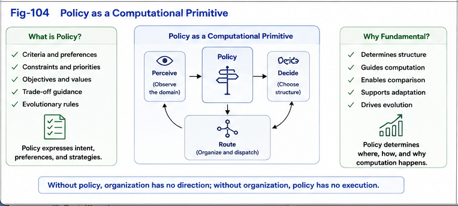

# PDOS-004

# Policy as a Computational Primitive

## Engineering Open-Domain Organizational Intelligence

---

# Abstract

Policies are traditionally regarded as external configurations that guide computational systems.

Typical examples include configuration files, optimization objectives, business rules, scheduling priorities, or engineering constraints.

Policy-Driven Organizational Synthesis (PDOS) proposes a fundamentally different interpretation.

This paper argues that **policies themselves should be regarded as computational primitives** because they actively synthesize organizational structures that subsequently determine runtime computation.

Rather than existing outside computation, policies participate directly in computational organization, organizational evolution, and intelligent behavior.

---

# 1. Introduction

Most computational systems begin with

data,

algorithms,

and execution.

Policies usually appear later as configuration parameters.

Examples include

* optimization goals,
* scheduling rules,
* search preferences,
* engineering constraints,
* user settings.

These policies are generally viewed as external controls.

PDOS proposes a different perspective.

Policies are not external.

Policies actively generate computation.

---

# 2. The Traditional Interpretation

A conventional computational workflow may be simplified as

```text id="3f31jt"
Input

↓

Algorithm

↓

Output
```

Policies are often inserted afterwards.

```text id="ivly3t"
Input

↓

Algorithm

↓

Policy Adjustment

↓

Output
```

In this interpretation,

policies modify computation.

They do not fundamentally define computation.

---



---

# 3. A Different Computational Chain

PDOS introduces another computational perspective.

```text id="hww2c4"
Policy

↓

Organizational Synthesis

↓

Organization

↓

Runtime Computation

↓

Feedback

↓

Policy Refinement
```

Policies no longer modify an existing computation.

Policies determine how computation itself becomes organized.

---

# 4. Why Policies Compute

Policies determine

* organizational priorities,
* organizational boundaries,
* organizational granularity,
* organizational objectives,
* organizational evolution,
* organizational reuse.

These organizational choices directly influence

* search,
* reasoning,
* dispatch,
* runtime switching,
* adaptation,
* learning.

Consequently,

changing only the policy may produce completely different computational behavior without modifying the underlying algorithms.

Policies therefore perform computational work.

---

# 5. Policies Generate Organizations

The same knowledge may produce many different organizations.

The difference often does not originate from the data.

It originates from policy.

For example,

the same collection of concepts may be organized according to

* function,
* safety,
* efficiency,
* biological similarity,
* market value,
* military objectives,
* educational priorities.

The resulting organizations are all computationally valid.

Their differences originate from different policies.

Organization therefore becomes policy-dependent.

---

# 6. Policies Determine Runtime

Organizations determine runtime behavior.

Policies determine organizations.

Therefore,

policies indirectly determine runtime computation.

Conceptually,

```text id="5k0vkp"
Policy

↓

Organization

↓

Difference Trees

↓

Dispatch

↓

Runtime Switching

↓

Runtime Behavior
```

Policies therefore become upstream computational primitives.

---

# 7. Policies and Difference Trees

Difference Trees are not generated solely by structural similarities.

Policies influence

which differences matter,

which similarities matter,

which organizational boundaries are preserved,

and which computational structures become reusable.

Difference Trees therefore become

policy-dependent computational assets.

---

# 8. Policies Enable Open-Domain Growth

Traditional computational optimization usually assumes that organizational structures already exist.

PDOS introduces another possibility.

Policies may continuously synthesize

* new organizational boundaries,
* new categories,
* new computational units,
* new Difference Trees,
* new runtime organizations.

Policies therefore become engines of organizational growth.

Rather than merely selecting among existing organizations,

policies actively generate new organizations.

---

# 9. Relationship with CKOI

CKOI provides the computational infrastructure required for organization.

Examples include

* Universal Typing and Naming,
* metric relationships,
* embedding,
* clustering,
* computational organizational structures.

PDOS introduces policies as the computational mechanisms that actively synthesize these organizational capabilities into runtime organizational intelligence.

Conceptually,

```text id="rq7wqj"
CKOI

↓

Policy

↓

Organizational Synthesis

↓

Runtime Organization
```

Infrastructure provides possibilities.

Policies determine realization.

---

# 10. Biological Perspective

Policies need not be explicitly programmed.

Within biological systems,

local objectives,

survival requirements,

resource limitations,

developmental pressures,

and environmental interactions

may collectively function as implicit policies.

These implicit policies may continuously synthesize localized organizational structures throughout development and adaptation.

Under this computational hypothesis,

organizational intelligence naturally emerges from policy-driven organizational evolution.

---

# 11. Engineering Implications

Treating policies as computational primitives changes several engineering assumptions.

Policies become

organizational generators.

Organizations become

computational assets.

Difference Trees become

policy-dependent runtime structures.

Organizational evolution becomes

continuous computational optimization.

Runtime intelligence increasingly depends upon policy engineering.

Future intelligent systems may therefore compete not only through algorithms,

but through superior organizational policies.

---

# 12. Toward Policy Engineering

If policies actively synthesize computation,

then policy engineering becomes an independent engineering discipline.

Future work may investigate

* policy languages,
* policy composition,
* policy simulation,
* policy comparison,
* policy optimization,
* policy verification,
* policy evolution.

These studies extend beyond conventional configuration management.

They become part of computational intelligence itself.

---

# Summary

Policy-Driven Organizational Synthesis proposes that policies should be regarded as computational primitives rather than external configuration parameters.

Policies actively synthesize organizational structures, Difference Trees, computational boundaries, and runtime organizations.

By placing **Policy** at the beginning of the computational chain,

```text id="vf9lzt"
Policy

↓

Organization

↓

Computation

↓

Runtime

↓

Evolution
```

PDOS introduces a new interpretation of intelligent computation.

Algorithms execute computation.

Organizations structure computation.

Policies generate organization.

Together they establish a computational framework in which organizational intelligence becomes an explicit engineering discipline.

Policy is therefore not merely a mechanism for controlling computation.

**Policy becomes one of the fundamental origins of computation itself.**
