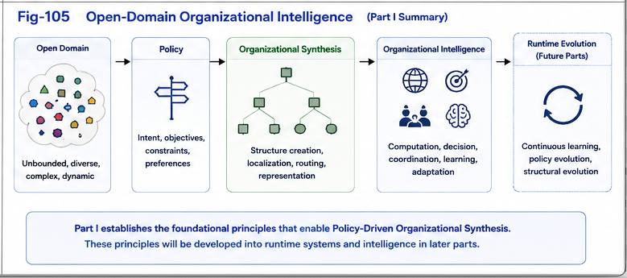

# PDOS-005

# Open-Domain Organizational Intelligence

## Engineering Open-Domain Organizational Intelligence

---

# Abstract

Most computational intelligence systems operate within predefined organizational boundaries. Their primary objectives are to search, optimize, classify, infer, or bridge existing computational structures.

Policy-Driven Organizational Synthesis (PDOS) proposes a broader computational paradigm.

Instead of assuming that organizational structures already exist, PDOS studies how new organizational structures may be continuously synthesized under explicit policies.

This paper introduces **Open-Domain Organizational Intelligence**, a computational framework in which intelligent systems continually expand their organizational space rather than merely optimizing existing organizations.

---

# 1. Introduction

Many successful computational methods share an implicit assumption.

The computational space already exists.

The remaining task is to discover efficient solutions within that space.

Examples include

* optimization,
* search,
* classification,
* inference,
* planning,
* scheduling,
* routing.

Their objective is primarily to improve computation inside an existing organizational domain.

PDOS proposes another possibility.

Intelligence may also arise by continuously creating new organizational domains.

---

# 2. Closed-Domain Intelligence

Closed-domain intelligence assumes that computational objects and organizational structures are already available.

Typical computational processes become

```text
Existing Organization

↓

Search

↓

Optimization

↓

Decision
```

The organization itself remains largely fixed.

The computational effort concentrates on finding better solutions inside an existing framework.

This approach has produced remarkable success across many engineering disciplines.

---



---

# 3. Gap Bridging

Many intelligent systems can also improve performance by connecting previously disconnected structures.

Conceptually,

```text
Existing Structure A

↓

Gap Bridging

↓

Existing Structure B
```

Gap Bridging significantly improves computational connectivity.

However, it still assumes that both organizational endpoints already exist.

The future organization is primarily discovered or completed.

It is not fundamentally synthesized.

---

# 4. A Different Perspective

PDOS introduces another computational paradigm.

Instead of asking

> **How should existing structures be connected?**

PDOS asks

> **What new organizational structures should be created?**

The computational objective therefore changes.

Rather than completing an existing organization,

PDOS continuously synthesizes new organizations.

---

# 5. Organizational Expansion

Policy-driven organizational synthesis allows intelligent systems to generate

* new categories,
* new Difference Trees,
* new organizational boundaries,
* new computational units,
* new relationships,
* new organizational hierarchies.

Conceptually,

```text
Policy

↓

Organizational Synthesis

↓

New Organizational Structures

↓

Expanded Computational Space
```

Organization becomes a continuously expanding computational resource.

---

# 6. Policies Enable Open Domains

Different policies naturally produce different organizations.

The same observations may generate entirely different computational structures depending upon

* objectives,
* priorities,
* constraints,
* environments,
* runtime requirements.

Consequently,

organizational growth becomes policy-dependent.

Policies no longer merely configure computation.

Policies generate new computational possibilities.

---

# 7. Open-Domain Organizational Intelligence

PDOS defines **Open-Domain Organizational Intelligence** as

> **the computational capability to continuously synthesize, expand, and evolve organizational structures beyond previously established organizational boundaries.**

This capability differs fundamentally from conventional optimization.

Optimization improves an existing organization.

Open-domain organizational intelligence creates new organizations.

---

# 8. Scale Independence

Open-domain organizational intelligence naturally operates across multiple scales.

Examples include

A child learning to distinguish three cats.

A scientist proposing a new research discipline.

An enterprise reorganizing its computational resources.

A military organization adapting to new strategic environments.

A hybrid AI system synthesizing new computational modules.

The scale changes.

The underlying computational principles remain remarkably similar.

---

# 9. Organizational Evolution

Open-domain intelligence naturally produces continuous organizational evolution.

```text
Policy

↓

Organization

↓

Runtime

↓

Observation

↓

Organizational Evolution

↓

Expanded Organization
```

Rather than repeatedly optimizing a fixed organization,

the organization itself continuously grows.

This provides an explicit computational mechanism for organizational adaptation.

---

# 10. Biological Perspective

Open-domain organizational intelligence also suggests an interesting biological hypothesis.

Rather than relying upon a single globally optimized organizational structure,

biological intelligence may consist of numerous localized organizational systems.

Each localized system may

* pursue different objectives,
* synthesize different organizations,
* evolve independently,
* cooperate when necessary.

Under this interpretation,

large-scale intelligence emerges through the interaction of many evolving organizational regions.

PDOS provides one possible computational hypothesis for studying this process.

---

# 11. Relationship with Structural Intelligence

Within the Structural Intelligence framework,

open-domain organizational intelligence naturally connects

* Universal Typing and Naming,
* CKOI,
* Policy-Driven Organizational Synthesis,
* GTDO,
* FTRI,
* Runtime Computational Primitives.

PDOS contributes the organizational expansion layer.

It continuously enlarges the computational structures available to runtime systems.

---

# 12. Engineering Implications

Open-domain organizational intelligence suggests several engineering directions.

Future intelligent systems may increasingly compete through

* superior organizational synthesis,
* superior policy engineering,
* superior organizational evolution,
* superior runtime organizations,
* superior organizational reuse.

The competitive advantage may arise not only from better algorithms,

but from continuously better organizations.

---

# Summary

Policy-Driven Organizational Synthesis extends intelligent computation beyond conventional organizational optimization.

Rather than assuming that computational organizations already exist, PDOS proposes that organizations can be continuously synthesized, expanded, and evolved under explicit policies.

This perspective establishes **Open-Domain Organizational Intelligence** as a computational discipline in which organizational growth itself becomes an essential component of intelligence.

Closed-domain intelligence improves computation within an existing organizational space.

Open-domain organizational intelligence expands the organizational space itself.

The long-term objective of PDOS is therefore not merely to optimize intelligent computation, but to continuously enlarge the organizational possibilities through which future intelligent computation can emerge.
