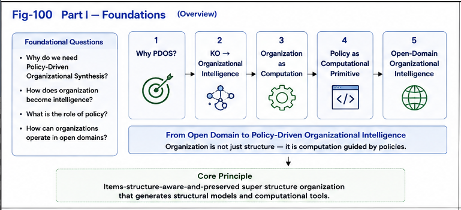

# Part I — Foundations

## The Foundational Principles of Policy-Driven Organizational Synthesis

---



---

# Overview

Part I establishes the conceptual and computational foundations of **Policy-Driven Organizational Synthesis (PDOS)**.

The central premise of PDOS is that **organization is not merely a method for storing information—it is itself a computational process.**

Traditional Artificial Intelligence has focused primarily on representation, learning, optimization, and reasoning.

PDOS begins one level earlier.

Before computation can become efficient, problems must first be **organized**.

Policy determines how organization should be constructed.

Organization determines where computation should occur.

Runtime intelligence then performs localized computation over these organizational structures.

Consequently, organization becomes the bridge connecting open-domain complexity with scalable intelligent computation.

---


**Figure 100. Part I — Foundations.**  
The conceptual roadmap of Part I, introducing Policy-Driven Organizational Synthesis and its foundational computational principles.

---

# Motivation

Modern intelligent systems increasingly face open-domain environments characterized by

- enormous information volume,
- heterogeneous knowledge,
- dynamic runtime behavior,
- continuous evolution,
- and growing computational complexity.

Traditional approaches often attempt to address these challenges by expanding computational capability alone.

PDOS proposes a complementary strategy.

Instead of beginning with computation,

begin with **organization**.

Well-designed organizational structures reduce complexity before computation begins, allowing runtime intelligence to operate within localized computational contexts.

---

# Core Principles

Part I develops five foundational principles.

## 1. Why Policy-Driven Organizational Synthesis?

Policy provides explicit organizational objectives.

Rather than allowing organizational structures to emerge implicitly, PDOS constructs organizations according to clearly defined computational policies.

---

## 2. From Knowledge Organization to Organizational Intelligence

Knowledge Organization (KO) primarily focuses on representation and classification.

PDOS extends this concept toward **Organizational Intelligence**, where organization actively supports computation, decision making, and continuous adaptation.

---

## 3. Organization as Computation

Organization is interpreted as an active computational mechanism.

Organizational structures perform

- localization,
- routing,
- constraint propagation,
- structural transformation,
- and computational coordination.

Organization therefore becomes part of the computational process itself.

---

## 4. Policy as a Computational Primitive

Policy determines

- organizational objectives,
- structural priorities,
- routing strategies,
- optimization goals,
- and evolutionary direction.

Within PDOS,

policy is elevated from a management concept to a fundamental computational primitive.

---

## 5. Open-Domain Organizational Intelligence

Open-domain environments require computational systems capable of organizing continuously emerging knowledge rather than relying upon fixed predefined structures.

PDOS therefore introduces Organizational Intelligence as a scalable computational framework for open-domain intelligence.

---

# Articles

| Article | Title |
|----------|-------|
| **PDOS-001** | Why Policy-Driven Organizational Synthesis? |
| **PDOS-002** | From Knowledge Organization to Organizational Intelligence |
| **PDOS-003** | Organization as Computation |
| **PDOS-004** | Policy as a Computational Primitive |
| **PDOS-005** | Open-Domain Organizational Intelligence |

---

# Figures

| Figure | Title |
|----------|-------|
| **Fig-100** | Part I — Foundations |
| **Fig-101** | Why Policy-Driven Organizational Synthesis? |
| **Fig-102** | From Knowledge Organization to Organizational Intelligence |
| **Fig-103** | Organization as Computation |
| **Fig-104** | Policy as a Computational Primitive |
| **Fig-105** | Open-Domain Organizational Intelligence |

---

# Relationship to Later Parts

Part I provides the conceptual foundation for the remainder of the repository.

```
Part I
Foundations

        │

        ▼

Part II
From Organization to the Triggering Economy

        │

        ▼

Part III
Engineering Policy-Driven Runtime Organizations

        │

        ▼

Part IV
Policy-Driven Organizational Runtime Systems

        │

        ▼

Part V
Localized Runtime Intelligence
```

The concepts introduced here gradually evolve into a complete computational architecture in later parts.

Policy guides organization.

Organization localizes computation.

Localized computation enables runtime intelligence.

Runtime intelligence continuously improves organizational quality.

---

# Key Contributions

Part I introduces several foundational ideas that define the remainder of PDOS.

- Policy as a computational primitive.
- Organization as computation rather than storage.
- Organizational Intelligence beyond traditional Knowledge Organization.
- Policy-driven localization of open-domain problems.
- Organizational structures as computational infrastructure.
- Foundations for Localized Runtime Intelligence.

Together, these principles establish the conceptual basis upon which the subsequent engineering, runtime, and learning architectures are constructed.

---

# Summary

Part I establishes the theoretical foundations of **Policy-Driven Organizational Synthesis**.

Rather than treating organization as passive information management, PDOS interprets organization as an active computational mechanism capable of localizing computation, guiding runtime intelligence, and supporting continuous organizational evolution.

These foundational principles prepare the reader for the engineering architectures developed throughout the subsequent parts of the repository, ultimately leading to **Localized Runtime Intelligence** and **Closed-Loop Runtime Organizations** introduced in Part V.