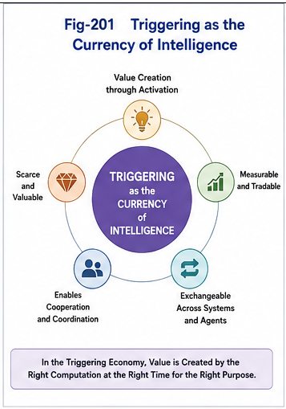

# PDOS-102 — Triggering as the Currency of Intelligence

## Abstract

Every intelligent system ultimately exists to decide what computation should occur next. Although modern AI has dramatically increased the ability to generate, retrieve, and organize knowledge, these capabilities alone do not produce intelligent behavior. Intelligence emerges only when the appropriate computation is activated at the appropriate runtime moment.

This paper argues that **triggering** represents the fundamental unit of value in intelligent computation. Just as currency enables economic exchange, triggering enables computational exchange by determining which knowledge, agents, services, or computational structures become active. Under this perspective, intelligent systems are not primarily knowledge-processing systems but triggering systems, and the efficiency of intelligence increasingly depends on the quality, accuracy, and cost of triggering.

---

# 1. Introduction

Human civilization has experienced multiple economic transformations.

Agricultural societies were organized around land.

Industrial societies were organized around manufacturing.

Information societies became organized around data and knowledge.

The next generation of intelligent systems may instead become organized around **triggering**.

Knowledge alone produces no action.

Models alone perform no computation.

Policies alone execute nothing.

Only triggering converts potential computation into runtime computation.

Triggering therefore becomes the operational foundation of intelligence.

---

# 2. Potential Intelligence versus Runtime Intelligence

Every intelligent system contains significantly more computational capability than it executes at any given moment.

Large language models contain billions of parameters.

Software ecosystems contain thousands of services.

Enterprise systems contain countless workflows.

Human brains contain enormous numbers of possible behaviors.

Yet only a tiny fraction becomes active.

The difference between **potential intelligence** and **runtime intelligence** is determined by triggering.

Without triggering,

potential computation remains inactive.

---

# 3. Triggering Creates Computational Value

Traditional AI often measures capability by:

* model size,
* parameter count,
* dataset size,
* benchmark accuracy,
* computational throughput.

These measurements describe computational capacity.

They do not describe computational activation.

Two systems with identical knowledge may produce entirely different results because they activate different computations.

The computational value therefore lies not only in what a system knows, but also in what it decides to execute.

Triggering converts computational potential into computational value.

---

# 4. Triggering as Computational Currency

Currency enables economic exchange.

Triggering enables computational exchange.

Every triggering decision allocates computational resources by determining:

* what computation begins,
* what computation remains inactive,
* which agents cooperate,
* which services become available,
* which runtime path is selected,
* which computational authority is granted.

In this sense, every trigger functions as a unit of computational expenditure.

Runtime computation continuously consumes triggering decisions.

The larger and more complex an intelligent system becomes, the more valuable each triggering decision becomes.

---



---

# 5. Why Triggering Is Scarce

Knowledge can often be duplicated at negligible cost.

Triggering cannot.

Every triggering decision consumes:

* computational attention,
* runtime authority,
* scheduling opportunities,
* energy,
* hardware resources,
* execution bandwidth,
* security permissions,
* organizational coordination.

Poor triggering wastes computational resources.

Good triggering multiplies computational efficiency.

Triggering therefore becomes a scarce resource whose quality directly determines system performance.

---

# 6. Triggering Determines Intelligence

Many traditional AI discussions emphasize reasoning.

PDOS emphasizes triggering.

Reasoning generates possibilities.

Triggering selects reality.

Reasoning may produce hundreds of candidate actions.

Only triggering determines which action actually executes.

Intelligence therefore should not be measured solely by reasoning capability, but also by triggering quality.

A highly intelligent system is one that consistently triggers the appropriate computation while avoiding unnecessary computation.

---

# 7. Triggering across Structural Intelligence

The concept of triggering naturally unifies the Structural Intelligence framework.

| Framework | Triggering Contribution                                           |
| --------- | ----------------------------------------------------------------- |
| **SRMS**  | Structural recognition identifies triggering candidates.          |
| **FTRIA** | Runtime invariants stabilize triggering decisions.                |
| **SRAI**  | Runtime intelligence coordinates computational activation.        |
| **GTDO**  | Organizational structures constrain triggering scope.             |
| **FTRI**  | Runtime switching determines active computational channels.       |
| **RCP**   | Runtime computational primitives implement triggering mechanisms. |
| **PDOS**  | Organizational policies govern triggering authority.              |

Rather than introducing an independent concept, PDOS positions triggering as the common runtime language shared by these frameworks.

---

# 8. Triggering Economy

If triggering represents computational currency, an entire computational economy naturally emerges.

Future AI infrastructures may exchange:

* triggering authority,
* triggering policies,
* triggering services,
* triggering validation,
* triggering optimization,
* triggering scheduling,
* triggering marketplaces,
* triggering security,
* triggering auditing.

Organizations may increasingly purchase optimized triggering rather than larger AI models.

Individuals may own personal triggering policies.

Enterprises may operate organizational triggering infrastructures.

Cloud providers may offer Triggering-as-a-Service.

The Triggering Economy therefore becomes an ecosystem rather than a single technology.

---

# 9. Looking Beyond Knowledge

Knowledge remains essential.

However, knowledge increasingly becomes the substrate upon which triggering operates.

The central runtime question is no longer:

> What knowledge exists?

Instead, it becomes:

> What computation should become active now?

The future competitiveness of intelligent systems will therefore depend less on possessing more knowledge than on activating the right knowledge at the right runtime moment.

---

# 10. Conclusion

Triggering transforms static computational capability into dynamic intelligent behavior.

Every runtime decision represents an allocation of computational authority, computational resources, and organizational intent.

As intelligent systems continue growing in complexity, triggering becomes the fundamental mechanism through which intelligence manifests itself.

PDOS therefore proposes that triggering should be viewed as the operational currency of intelligence.

Knowledge provides possibility.

Triggering creates reality.

---

# Key Contributions

* Defines triggering as the operational currency of intelligent systems.
* Distinguishes computational capacity from computational activation.
* Explains why triggering becomes increasingly valuable as AI systems grow.
* Positions triggering as the scarce runtime resource of intelligent infrastructures.
* Unifies SRMS, FTRIA, SRAI, GTDO, FTRI, RCP, and PDOS through a common triggering perspective.
* Establishes the theoretical foundation of the Triggering Economy.

---

# Suggested Figure

**Fig-201 — Triggering as the Currency of Intelligence**

**Description**

The figure illustrates the transformation:

```text
Knowledge
      │
      ▼
Organization
      │
      ▼
Policies
      │
      ▼
Triggering
      │
      ▼
Runtime Computation
      │
      ▼
Intelligent Behavior
```

Alongside the main pipeline, triggering is depicted as the **currency** exchanged among knowledge, policies, agents, computational services, organizational units, and runtime execution, emphasizing that triggering—not stored knowledge—is the fundamental carrier of computational value within intelligent systems.
