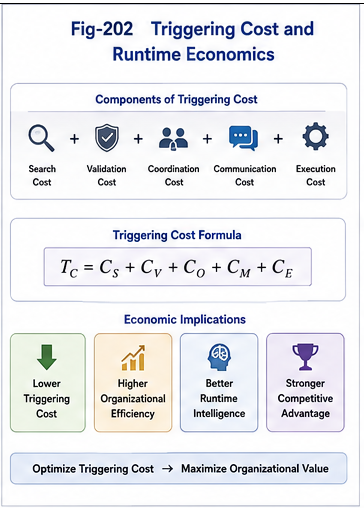

# PDOS-103 — Triggering Cost and Computational Economics

## Abstract

Every runtime computation begins with a triggering decision. While traditional computational complexity primarily evaluates the cost of executing algorithms, modern intelligent systems increasingly spend substantial computational resources determining **which computation should execute**. This paper introduces the concept of **Triggering Cost (TC)** as a new computational metric that measures the cost of selecting, validating, authorizing, scheduling, and activating runtime computation.

Within the Triggering Economy, computational efficiency depends not only on execution efficiency but also on triggering efficiency. As intelligent infrastructures continue to expand, Triggering Cost becomes a fundamental component of computational economics.

---

# 1. Introduction

Classical computer science has developed numerous methods for evaluating computational cost.

Common examples include:

* Time Complexity
* Space Complexity
* Communication Cost
* Energy Consumption
* Hardware Utilization

These metrics describe the cost of executing computation.

However, intelligent systems increasingly spend significant resources before execution even begins.

They must determine:

* what should execute,
* which computational path should be selected,
* which agent should become active,
* which policy should apply,
* which resources should remain inactive.

These decisions themselves consume computation.

PDOS refers to this overhead as **Triggering Cost**.

---

# 2. Computation Before Computation

Every runtime execution contains two fundamentally different phases.

Phase 1:

Determine what should execute.

Phase 2:

Execute the selected computation.

Traditional computational theory primarily studies Phase 2.

PDOS emphasizes that Phase 1 is becoming increasingly dominant in modern AI systems.

As the number of available computational choices increases, triggering complexity often grows faster than execution complexity.

---

# 3. Components of Triggering Cost

Triggering Cost consists of multiple computational activities.

Typical components include:

* structural recognition,
* policy evaluation,
* organizational search,
* runtime dispatch,
* permission verification,
* security validation,
* dependency analysis,
* scheduling,
* resource reservation,
* activation.

Different intelligent systems distribute Triggering Cost differently, but every runtime system must pay it.

---

# 4. Why Triggering Cost Matters

Large AI systems increasingly contain:

* millions of documents,
* thousands of AI agents,
* numerous computational tools,
* distributed services,
* heterogeneous hardware,
* multiple organizational policies.

Executing a computation may require only milliseconds.

Finding the correct computation may require substantially more resources.

Consequently,

Triggering Cost gradually becomes a dominant component of overall computational cost.

The future bottleneck of AI systems may therefore shift from execution to triggering.

---

# 5. Triggering Cost versus Execution Cost

Execution Cost measures the resources consumed after computation begins.

Triggering Cost measures the resources required before computation begins.

The two costs are complementary.

```text
Runtime Cost

├── Triggering Cost
│      ├── Recognition
│      ├── Organization
│      ├── Policy Evaluation
│      ├── Dispatch
│      ├── Validation
│      └── Activation
│
└── Execution Cost
       ├── Computation
       ├── Memory
       ├── Communication
       └── Output
```

Reducing execution cost alone cannot guarantee efficient intelligent systems.

Reducing Triggering Cost often produces significantly greater system-wide improvements.

---



---

# 6. Triggering Cost in Structural Intelligence

Each Structural Intelligence framework contributes to reducing Triggering Cost.

| Framework | Contribution                                   |
| --------- | ---------------------------------------------- |
| **SRMS**  | Reduces structural search space.               |
| **FTRIA** | Simplifies runtime decision operators.         |
| **SRAI**  | Organizes runtime intelligence hierarchically. |
| **GTDO**  | Restricts organizational search scope.         |
| **FTRI**  | Minimizes switching uncertainty.               |
| **RCP**   | Provides efficient runtime primitives.         |
| **PDOS**  | Optimizes policy-driven triggering.            |

Rather than adding computational overhead, these frameworks collectively reduce Triggering Cost.

---

# 7. Computational Economics

Every computational resource has an associated economic cost.

Examples include:

* CPU cycles,
* GPU hours,
* memory,
* storage,
* network bandwidth,
* energy.

PDOS argues that intelligent systems introduce an additional economic resource:

**runtime triggering.**

Organizations increasingly invest computational resources into deciding:

* what to compute,
* when to compute,
* who should compute,
* where computation should occur.

Computational economics therefore expands beyond hardware utilization toward organizational efficiency.

---

# 8. Toward Triggering Cost Optimization

Future intelligent infrastructures will optimize Triggering Cost using:

* organizational policies,
* structural indexing,
* Brain Units,
* computational specialization,
* reusable triggering patterns,
* runtime caching,
* predictive dispatch,
* policy synthesis,
* distributed triggering networks.

The objective is not simply faster execution.

The objective is minimizing the total cost of intelligent activation.

---

# 9. Triggering Cost as an Engineering Metric

Triggering Cost provides a practical engineering metric for evaluating intelligent systems.

Future AI platforms may compare systems according to:

* average Triggering Cost,
* peak Triggering Cost,
* Triggering Latency,
* Triggering Accuracy,
* Triggering Efficiency,
* Triggering Success Rate,
* Triggering Reuse Rate,
* Triggering Energy Consumption.

These measurements complement traditional computational benchmarks.

---

# 10. Conclusion

As intelligent systems become increasingly modular and organizationally complex, determining what should execute becomes a computational problem in its own right.

PDOS introduces Triggering Cost as the computational expense associated with selecting, validating, organizing, and activating runtime computation.

Future computational economics will therefore evaluate not only execution efficiency but also triggering efficiency.

Lower Triggering Cost leads to faster, safer, more scalable, and more economically efficient intelligent infrastructures.

---

# Key Contributions

* Introduces **Triggering Cost (TC)** as a new computational metric.
* Separates Triggering Cost from traditional Execution Cost.
* Defines Triggering Cost as a central component of Computational Economics.
* Explains why organizational complexity increasingly dominates runtime cost.
* Connects Triggering Cost optimization with SRMS, FTRIA, SRAI, GTDO, FTRI, RCP, and PDOS.
* Establishes Triggering Cost as an engineering benchmark for future AI infrastructures.

---

# Suggested Figure

**Fig-202 — Triggering Cost and Computational Economics**

**Description**

The figure illustrates runtime computation as two sequential economic phases:

```text
Runtime Request
       │
       ▼
Triggering Cost
──────────────────────────
Structural Recognition
Organization
Policy Evaluation
Dispatch
Validation
Activation
──────────────────────────
       │
       ▼
Execution Cost
──────────────────────────
Algorithm Execution
Memory Access
Communication
Output Generation
──────────────────────────
       │
       ▼
Runtime Result
```

The illustration emphasizes that future intelligent systems should optimize **both** Triggering Cost and Execution Cost, positioning Triggering Cost as a first-class engineering metric within the Triggering Economy.
