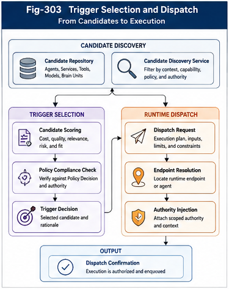

# PDOS-204 — Trigger Selection and Dispatch

## Abstract

Policy-Driven Runtime Architecture requires a mechanism that can transform a structured Policy Decision into an executable runtime action. This paper defines **Trigger Selection and Dispatch** as the operational bridge between organizational governance and computation.

Trigger Selection determines which eligible computational candidate should become active under current policy, context, authority, cost, and runtime conditions. Runtime Dispatch then converts that Trigger Decision into a concrete execution request, binds inputs and authority, selects an endpoint, allocates resources, establishes validation and fallback requirements, and initiates observable execution.

By separating selection from dispatch, PDOS creates a runtime architecture in which organizational reasoning, execution routing, and computational work remain distinct, testable, and governable.

---

## 1. Introduction

The Policy Runtime Engine determines:

* what is allowed,
* what is prohibited,
* what is preferred,
* what authority may be granted,
* what validation is required.

It does not necessarily determine the final execution target.

That responsibility belongs to the Trigger Selector.

Once a trigger has been selected, another component must translate the decision into an operational runtime request.

That responsibility belongs to the Runtime Dispatcher.

The relationship can be summarized as:

```text id="rj67t4"
Policy Decision
      │
      ▼
Trigger Selection
      │
      ▼
Trigger Decision
      │
      ▼
Runtime Dispatch
      │
      ▼
Execution Request
```

Trigger Selection decides.

Runtime Dispatch operationalizes.

Execution performs the work.

---

## 2. Why Selection and Dispatch Must Be Separate

Many software systems combine candidate selection, routing, authorization, resource allocation, and execution inside one component.

This creates several problems:

* policy logic becomes hidden in routing code,
* dispatch mechanisms silently influence organizational decisions,
* execution components gain excessive authority,
* failures become difficult to diagnose,
* candidate comparisons are not preserved,
* fallback behavior becomes inconsistent,
* Triggering Cost cannot be measured clearly.

PDOS separates the responsibilities.

### Trigger Selection

Determines which eligible candidate should become active.

### Runtime Dispatch

Determines how the selected candidate should be invoked.

This separation allows each stage to be tested, optimized, and audited independently.

---



---

## 3. Inputs to Trigger Selection

The Trigger Selector should receive structured input rather than a raw user request.

Typical inputs include:

```text id="75je80"
TriggerSelectionInput
├── Runtime Context
├── Organizational Scope
├── Policy Decision
├── Eligible Candidates
├── Resource State
├── Execution History
├── Cost Estimates
└── Current Runtime Conditions
```

The selector should not rediscover policy independently.

It should operate within the organizational boundaries already defined by the Policy Runtime Engine.

---

## 4. Trigger Candidates

A Trigger Candidate represents a computational option that may become active.

Candidates may include:

* Brain Units,
* AI agents,
* software services,
* tools,
* models,
* workflows,
* human operators,
* composite execution plans,
* runtime channels.

A minimal candidate model may contain:

```text id="5w35ou"
TriggerCandidate
├── Identity
├── Candidate Type
├── Capabilities
├── Organizational Scope
├── Required Authority
├── Estimated Cost
├── Estimated Latency
├── Validation History
├── Availability
└── Runtime Endpoint
```

Candidates should describe both capability and operational conditions.

---

## 5. Candidate Eligibility

The Trigger Selector should only compare candidates already permitted by policy.

Eligibility may depend on:

* organizational scope,
* approved candidate type,
* security classification,
* authority requirement,
* resource availability,
* model or service approval,
* data locality,
* validation status,
* version compatibility.

The eligibility process may be represented as:

```text id="5jr3s8"
Discovered Candidates
        │
        ▼
Policy Eligibility Filter
        │
        ▼
Authority Compatibility Filter
        │
        ▼
Runtime Availability Filter
        │
        ▼
Eligible Candidate Set
```

A candidate that is technically capable but organizationally unauthorized should not enter final selection.

---

## 6. Structural Relevance

Eligible candidates may still vary greatly in structural relevance.

Structural relevance evaluates how well a candidate matches:

* request type,
* organizational objective,
* runtime context,
* required output,
* dependency structure,
* known structural deltas.

This stage may use:

* SRMS,
* GTDO grouping,
* structural indexes,
* Brain Unit metadata,
* organizational graph relationships.

Structural relevance should stand above generic metric similarity when small but decisive structural differences matter.

---

## 7. Selection Criteria

Trigger Selection may consider multiple criteria.

Typical criteria include:

* policy priority,
* structural fit,
* authority compatibility,
* Triggering Cost,
* Execution Cost,
* latency,
* reliability,
* security,
* validation history,
* resource availability,
* locality,
* fallback readiness.

A selection model may organize these criteria into ordered layers.

```text id="3w2hdx"
Hard Constraints
      │
      ▼
Structural Eligibility
      │
      ▼
Policy Priority
      │
      ▼
Cost and Latency
      │
      ▼
Reliability and History
      │
      ▼
Selected Trigger
```

Hard constraints should be evaluated before optimization criteria.

---

## 8. Constraint-First Selection

A central engineering principle is:

> **Do not score candidates that are already invalid.**

Constraint-first selection reduces both risk and Triggering Cost.

Examples of hard rejection include:

* insufficient authority,
* prohibited external access,
* expired service,
* incompatible version,
* missing validator,
* unavailable resource,
* data residency violation.

Only candidates satisfying all hard constraints should enter comparative ranking.

---

## 9. Priority before Metric Optimization

Policy priority should generally be evaluated before generic cost or similarity metrics.

Example:

```text id="usvwql"
Policy Preference
1. Validated local Brain Unit
2. Approved enterprise service
3. Specialized external service
4. General model fallback
```

A lower-cost general model should not override an explicit policy preference for a validated local Brain Unit unless the policy permits such substitution.

This preserves organizational intent.

---

## 10. Triggering Cost and Execution Cost

Trigger Selection should distinguish two costs.

### Triggering Cost

The cost of:

* candidate discovery,
* evaluation,
* comparison,
* authorization,
* preparation.

### Execution Cost

The cost of:

* computation,
* memory,
* network,
* external service use,
* validation.

A cheap execution path may still be expensive to trigger.

A more expensive execution path may be preferable if it is already validated, local, and structurally aligned.

The selector should therefore consider total runtime economics rather than a single cost metric.

---

## 11. Trigger Strategies

Different runtime environments may use different selection strategies.

### Deterministic Selection

Selects the first candidate satisfying an explicit ordered policy.

Suitable for:

* high-risk systems,
* compliance-sensitive workflows,
* fixed enterprise rules.

### Ranked Selection

Scores eligible candidates and selects the highest-ranked option.

Suitable for:

* service selection,
* agent selection,
* cost and latency balancing.

### Two-Way Selection

Evaluates competing channels through structured preserve, subtract, or switching logic.

Suitable for:

* FTRI switching,
* paired runtime alternatives,
* actor-sensitive decisions.

### Composite Selection

Builds an execution plan containing multiple cooperating candidates.

Suitable for:

* multi-agent workflows,
* parallel Brain Units,
* distributed validation.

---

## 12. Trigger Decision

The output of Trigger Selection is a structured Trigger Decision.

```text id="m7r3xv"
TriggerDecision
├── Selected Candidate
├── Selection Strategy
├── Trigger Reason
├── Applied Policy Decision
├── Authority Grant
├── Input Binding
├── Estimated Cost
├── Required Validators
├── Timeout
├── Fallback Plan
├── Downstream Trigger Permissions
└── Decision Trace
```

The Trigger Decision should be immutable after selection.

It becomes the contract consumed by the Runtime Dispatcher.

---

## 13. Trigger Decision Trace

The Trigger Decision should explain:

* which candidates were considered,
* which candidates were rejected,
* which constraints applied,
* which priorities applied,
* which cost estimates were used,
* why the final candidate was selected.

Example:

```text id="u82rzk"
Trigger Decision Trace

1. External model rejected by data-locality policy.
2. General model retained as fallback only.
3. Two local Brain Units satisfied authority requirements.
4. Validated coding Brain Unit ranked above general research Brain Unit.
5. Local coding Brain Unit selected.
```

This trace supports debugging, validation, audit, and policy improvement.

---

## 14. Runtime Dispatch

Runtime Dispatch begins after the Trigger Decision has been produced.

The Runtime Dispatcher converts the decision into an executable request.

Its responsibilities include:

* resolving the target endpoint,
* preparing and validating inputs,
* attaching authority,
* allocating resources,
* binding validators,
* setting timeout,
* registering fallback,
* creating a trace identifier,
* initiating execution.

The dispatcher should not change the selected candidate unless an explicit dispatch failure policy permits reselection.

---

## 15. Dispatch Request

A dispatch request may contain:

```text id="rf9n1d"
DispatchRequest
├── Trigger Decision ID
├── Target Endpoint
├── Bound Inputs
├── Authority Token
├── Resource Budget
├── Timeout
├── Validation Plan
├── Fallback Plan
├── Trace Identifier
└── Callback or Response Channel
```

This request represents the fully operationalized trigger.

It should contain all runtime information required by the execution environment.

---

## 16. Input Binding

A selected candidate may require inputs in a specific form.

Input binding may include:

* field mapping,
* format conversion,
* context reduction,
* credential attachment,
* parameter defaults,
* policy-derived arguments,
* dependency outputs.

Example:

```text id="9sqhhg"
Runtime Context
      │
      ▼
Input Binder
      ├── Request Data
      ├── Organizational Context
      ├── Policy Parameters
      └── Previous Runtime Output
      │
      ▼
Candidate-Specific Input
```

Input binding should be explicit and observable.

Hidden prompt construction or implicit parameter injection makes runtime behavior difficult to audit.

---

## 17. Authority Binding

The dispatcher must attach the authority granted by the Policy Runtime Engine.

Authority may define:

* data access scope,
* allowed operations,
* downstream calls,
* time limit,
* cost limit,
* persistence rights,
* state modification rights.

The execution unit should receive only the authority required for the current trigger.

This supports least-authority runtime design.

---

## 18. Resource Allocation

Runtime Dispatch may reserve:

* CPU or GPU capacity,
* memory,
* network bandwidth,
* service quota,
* execution slot,
* human review capacity,
* robotic control window.

Resource allocation should remain bounded by policy.

If required resources are unavailable, the dispatcher should follow explicit behavior such as:

* wait,
* use fallback candidate,
* reduce execution scope,
* escalate,
* reject the request.

---

## 19. Endpoint Resolution

A logical candidate may have multiple physical endpoints.

Example:

```text id="6dz3k5"
Enterprise Research Service
      │
      ├── Local Instance
      ├── Regional Cloud Instance
      └── External Backup Instance
```

Endpoint resolution may consider:

* locality,
* health,
* latency,
* cost,
* compliance,
* capacity,
* version.

The dispatcher may select among endpoints without changing the logical Trigger Decision, provided all endpoints satisfy the same policy and authority requirements.

---

## 20. Dispatch Modes

The Runtime Dispatcher may support several modes.

### Direct Dispatch

Invokes a target immediately.

```text id="27w6kw"
Trigger Decision → Target
```

### Queue-Based Dispatch

Places the request into a managed queue.

```text id="zj7ngk"
Trigger Decision → Queue → Worker
```

### Event-Based Dispatch

Publishes an event that activates one or more subscribers.

```text id="yaamq6"
Trigger Decision → Event Bus → Eligible Subscribers
```

### Composite Dispatch

Coordinates multiple targets.

```text id="vld5eq"
Trigger Decision
      ├── Agent A
      ├── Brain Unit B
      └── Validator C
```

The dispatch mode should be selected according to policy and runtime architecture.

---

## 21. Synchronous Dispatch

Synchronous dispatch is appropriate when:

* response latency is bounded,
* the caller requires an immediate result,
* execution is short,
* validation can occur inline.

```text id="iy3it1"
Request
   │
   ▼
Trigger
   │
   ▼
Dispatch
   │
   ▼
Execute
   │
   ▼
Validate
   │
   ▼
Return
```

Timeout and fallback behavior should be explicit.

---

## 22. Asynchronous Dispatch

Asynchronous dispatch is appropriate when:

* execution is long-running,
* resources are scheduled,
* human review is involved,
* distributed work is required.

```text id="b8v9gi"
Trigger Decision
      │
      ▼
Dispatch Queue
      │
      ▼
Execution Worker
      │
      ▼
Validation
      │
      ▼
Result Event
```

The runtime trace must preserve continuity across asynchronous boundaries.

---

## 23. Composite Dispatch

Some triggers require multiple cooperating execution units.

Examples include:

* parallel Brain Unit evaluation,
* agent plus validator,
* planner plus executor,
* competitive hedging,
* cooperative research workflows.

A composite dispatch plan may specify:

```text id="s4nbek"
CompositePlan
├── Parallel Tasks
├── Sequential Dependencies
├── Shared Context
├── Merge Strategy
├── Validation Strategy
└── Failure Policy
```

Composite dispatch transforms one Trigger Decision into a controlled runtime organization.

---

## 24. Dispatch Graph

Complex execution may be represented as a dispatch graph.

Nodes may include:

* execution units,
* validators,
* merge nodes,
* fallback nodes,
* human approval nodes.

Edges may represent:

* sequence,
* dependency,
* parallelism,
* fallback,
* validation,
* escalation.

```text id="60f7za"
Trigger
   │
   ├──► Brain Unit A ──┐
   │                   ├──► Merge ──► Validator
   └──► Agent B ───────┘
```

The graph should remain bounded by the authority and constraints of the original Trigger Decision.

---

## 25. Fallback

Dispatch may fail because:

* endpoint unavailable,
* resource unavailable,
* timeout,
* input incompatibility,
* authority rejection,
* execution failure,
* validation failure.

Fallback behavior should be predefined.

```text id="0rkwjm"
Primary Candidate
      │
      ├── Dispatch Success
      │        ▼
      │     Execution
      │
      └── Dispatch Failure
               │
               ▼
        Approved Fallback
```

The dispatcher should not invent unauthorized fallback targets.

---

## 26. Reselection versus Fallback

Fallback and reselection are different.

### Fallback

Uses a candidate already approved in the Trigger Decision.

### Reselection

Returns control to the Trigger Selector to evaluate a new candidate set.

```text id="qyk7sp"
Dispatch Failure
      │
      ├── Approved Fallback Available
      │          ▼
      │      Dispatch Fallback
      │
      └── No Approved Fallback
                 ▼
          Return to Trigger Selection
```

This distinction prevents the dispatcher from silently becoming a selector.

---

## 27. Dispatch Validation

Before execution begins, the dispatcher should validate:

* target identity,
* endpoint health,
* authority compatibility,
* input completeness,
* resource limits,
* version compatibility,
* validator availability,
* trace initialization.

This is pre-execution validation.

It differs from result validation performed after execution.

---

## 28. Idempotency

Dispatch operations should support idempotency where repeated invocation could create duplicate effects.

Examples include:

* financial transactions,
* external API calls,
* state changes,
* job scheduling,
* robotic commands.

An idempotency key may be derived from:

```text id="rhuv76"
Request ID
+
Trigger Decision ID
+
Dispatch Attempt
```

The execution environment should reject or safely reuse duplicate requests when appropriate.

---

## 29. Cancellation and Revocation

Runtime authority may need to be revoked after dispatch.

Reasons include:

* user cancellation,
* policy update,
* security event,
* cost threshold exceeded,
* organizational priority change,
* dependency failure.

The dispatcher should support:

* cancellation tokens,
* authority revocation,
* task termination,
* downstream cancellation,
* partial result handling.

Cancellation behavior should be policy-governed.

---

## 30. Trigger and Dispatch State

A runtime implementation should expose explicit state.

```text id="tt7u11"
Trigger State
├── CANDIDATES_READY
├── SELECTING
├── SELECTED
├── REJECTED
└── RESELECTION_REQUIRED

Dispatch State
├── PREPARING
├── AUTHORIZED
├── QUEUED
├── DISPATCHED
├── RUNNING
├── COMPLETED
├── FAILED
├── CANCELLED
└── FALLBACK
```

Explicit state improves observability and recovery.

---

## 31. Triggering and Dispatch Metrics

Useful metrics include:

### Selection Metrics

* candidate count,
* candidates rejected by policy,
* selection latency,
* Triggering Cost,
* ranking stability,
* fallback probability.

### Dispatch Metrics

* dispatch latency,
* queue time,
* endpoint failure rate,
* resource allocation time,
* cancellation rate,
* fallback rate,
* duplicate dispatch prevention.

These metrics help distinguish selection problems from execution-routing problems.

---

## 32. Trigger Selection API

A language-independent interface may be:

```text id="nfxvcb"
TriggerSelector
├── filter(candidates, policyDecision)
├── rank(candidates, runtimeContext)
├── select(candidates, policyDecision)
└── explain(triggerDecision)
```

A Java-oriented interface may be:

```java id="o5l4yz"
public interface TriggerSelector {

    TriggerDecision select(
        RuntimeContext context,
        PolicyDecision policyDecision,
        List<TriggerCandidate> candidates
    );

    TriggerExplanation explain(
        TriggerDecision decision
    );
}
```

The selector should return a structured decision rather than directly invoking the selected target.

---

## 33. Runtime Dispatcher API

A language-independent interface may be:

```text id="4acq7u"
RuntimeDispatcher
├── prepare(triggerDecision)
├── validate(dispatchRequest)
├── dispatch(dispatchRequest)
├── cancel(traceId)
└── status(traceId)
```

A Java-oriented interface may be:

```java id="hyhfuu"
public interface RuntimeDispatcher {

    DispatchRequest prepare(
        RuntimeContext context,
        TriggerDecision triggerDecision
    );

    DispatchResult dispatch(
        DispatchRequest request
    );

    DispatchStatus status(
        String traceId
    );

    CancellationResult cancel(
        String traceId
    );
}
```

Preparation and dispatch should be separable for testing and dry-run validation.

---

## 34. Minimal Data Types

A minimal Java-oriented model may include:

```java id="drh3yn"
public final class TriggerCandidate {
    private final String id;
    private final CandidateType type;
    private final CapabilityProfile capabilities;
    private final RuntimeEndpoint endpoint;
    private final CostEstimate costEstimate;
}

public final class TriggerDecision {
    private final String decisionId;
    private final TriggerCandidate selectedCandidate;
    private final AuthorityGrant authorityGrant;
    private final ValidationPlan validationPlan;
    private final FallbackPlan fallbackPlan;
    private final DecisionTrace trace;
}

public final class DispatchRequest {
    private final String traceId;
    private final RuntimeEndpoint endpoint;
    private final InputBinding inputBinding;
    private final AuthorityGrant authorityGrant;
    private final ResourceBudget resourceBudget;
}
```

These types should remain immutable after creation whenever possible.

---

## 35. Testing Trigger Selection

Trigger Selection tests should include:

* hard constraint rejection,
* priority ordering,
* cost comparison,
* tie resolution,
* unavailable candidate handling,
* fallback selection,
* deterministic replay,
* structural delta sensitivity.

Example:

```text id="vx7312"
Given:
    Local validated Brain Unit
    External lower-cost model
    Policy prefers validated local assets

Expect:
    Local Brain Unit selected
```

The test should verify both the selected candidate and the decision trace.

---

## 36. Testing Runtime Dispatch

Dispatch tests should include:

* endpoint resolution,
* input binding,
* authority binding,
* resource allocation,
* timeout,
* cancellation,
* idempotency,
* fallback,
* reselection request,
* trace continuity.

Example:

```text id="817nn1"
Given:
    Selected primary endpoint unavailable
    Approved fallback endpoint available

Expect:
    Fallback dispatched
    Original failure recorded
    Trace preserved
```

---

## 37. Simulation

Trigger and dispatch behavior should be simulated before deployment.

Simulation may compare:

* policy versions,
* selection strategies,
* candidate sets,
* dispatch modes,
* resource constraints,
* fallback plans.

Useful outputs include:

* expected Triggering Cost,
* selection distribution,
* endpoint utilization,
* fallback frequency,
* validation load,
* failure propagation.

Simulation supports engineering decisions before runtime risk is introduced.

---

## 38. Relationship to SRMS

SRMS contributes to Trigger Selection by identifying small but decisive structural differences among candidates.

Metric similarity may rank two candidates closely.

Structural recognition may reveal that only one satisfies the required runtime structure.

SRMS therefore provides a recognition layer above generic scoring.

---

## 39. Relationship to GTDO

GTDO contributes:

* candidate grouping,
* dispatch trees,
* call paths,
* organizational scope,
* local computational units.

The Trigger Selector may discover candidates through GTDO structures.

The Runtime Dispatcher may execute along GTDO-defined call paths.

---

## 40. Relationship to FTRI

FTRI contributes:

* event-sensitive switching,
* actor-sensitive channel selection,
* runtime state transitions,
* paired or competitive triggering.

Trigger Selection may use FTRI to choose among runtime channels.

Runtime Dispatch operationalizes the selected channel.

---

## 41. Relationship to RCP

RCP contributes minimal primitives for:

* activation,
* selective reachability,
* authority,
* switching,
* runtime connection.

Trigger Selection composes these primitives into a decision.

Runtime Dispatch realizes them in execution.

---

## 42. Engineering Principles

Trigger Selection and Dispatch follow several principles.

### 42.1 Select Only among Eligible Candidates

Capability does not override policy.

### 42.2 Apply Hard Constraints before Ranking

Do not optimize invalid candidates.

### 42.3 Preserve Organizational Priority

Metric optimization should not silently override policy intent.

### 42.4 Separate Selection from Routing

The selector decides what should run.

The dispatcher determines how to run it.

### 42.5 Bind Minimal Authority

Every dispatch should carry only the authority required.

### 42.6 Make Fallback Explicit

Fallback candidates and reselection paths must be policy-governed.

### 42.7 Preserve the Decision Trace

Every runtime action should remain explainable.

### 42.8 Dispatch Must Be Reversible Where Possible

Cancellation, timeout, and revocation should be supported.

---

## 43. Conclusion

Trigger Selection and Dispatch form the operational bridge between organizational policy and runtime execution.

The Trigger Selector evaluates eligible candidates under policy, structural relevance, authority, cost, reliability, and runtime conditions. It produces an explicit and explainable Trigger Decision.

The Runtime Dispatcher then converts that decision into an executable request by binding inputs, authority, resources, endpoints, validation, tracing, and fallback behavior.

By separating these responsibilities, PDOS prevents policy, routing, and execution from collapsing into an opaque runtime component.

Trigger Selection determines what should become active.

Runtime Dispatch determines how that activation enters execution.

Together, they form the activation core of Policy-Driven Runtime Architecture.

---

## Key Contributions

* Defines Trigger Selection and Runtime Dispatch as separate architectural responsibilities.
* Establishes the Trigger Selector as the component that transforms Policy Decisions into explicit Trigger Decisions.
* Defines candidates, eligibility, structural relevance, constraints, priorities, Triggering Cost, and Execution Cost.
* Introduces deterministic, ranked, two-way, and composite selection strategies.
* Defines the Trigger Decision as an immutable contract between selection and dispatch.
* Establishes Runtime Dispatch as the component responsible for input, authority, resource, endpoint, validation, and fallback binding.
* Distinguishes fallback from reselection.
* Introduces direct, queued, event-driven, synchronous, asynchronous, and composite dispatch modes.
* Defines dispatch graphs, idempotency, cancellation, revocation, state, observability, metrics, testing, and simulation.
* Integrates Trigger Selection and Dispatch with SRMS, GTDO, FTRI, and RCP.
* Establishes the activation core of Policy-Driven Runtime Architecture.

---

## Suggested Figure

**Fig-303 — Trigger Selection and Dispatch**

**Description**

The figure illustrates the complete transition from organizational governance to runtime execution.

```text id="c1y66m"
Runtime Context
      │
      ▼
Policy Decision
      │
      ▼
Eligible Trigger Candidates
      │
      ▼
────────────────────────────
      Trigger Selector
────────────────────────────
 • Hard Constraint Filtering
 • Structural Relevance
 • Policy Priority
 • Cost and Latency
 • Reliability and History
 • Fallback Planning
────────────────────────────
      │
      ▼
Trigger Decision
      │
      ├── Selected Candidate
      ├── Authority Grant
      ├── Input Binding
      ├── Validation Plan
      ├── Timeout
      └── Fallback Plan
      │
      ▼
────────────────────────────
      Runtime Dispatcher
────────────────────────────
 • Endpoint Resolution
 • Input Preparation
 • Authority Binding
 • Resource Allocation
 • Trace Initialization
 • Dispatch Validation
────────────────────────────
      │
      ▼
Execution Unit
      │
      ▼
Runtime Result
```

The figure should also show the failure path:

```text id="mlcul9"
Dispatch Failure
      │
      ├── Approved Fallback → Dispatch Fallback
      │
      └── No Approved Fallback → Return to Trigger Selection
```

This distinction emphasizes that the Runtime Dispatcher may execute an approved fallback, but only the Trigger Selector may perform a new organizational selection.
