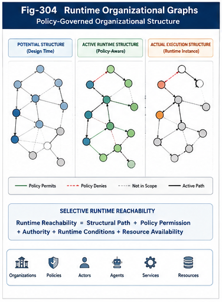

# PDOS-205 — Runtime Organizational Graphs

## Abstract

Policy-Driven Runtime Architecture cannot operate effectively over a flat collection of policies, agents, Brain Units, services, tools, and execution resources. Runtime computation depends not only on which components exist, but also on how those components are structurally related, what authority connects them, which paths are reachable, and how organizational conditions change during execution.

This paper defines the **Runtime Organizational Graph (ROG)** as the structural substrate of Policy-Driven Organizational Synthesis (PDOS). A Runtime Organizational Graph represents policies, triggers, computational units, validators, resources, actors, and runtime states as organizational nodes connected through typed and policy-governed relationships.

Unlike a static software dependency graph, a Runtime Organizational Graph distinguishes potential structure from active runtime structure. Policies determine which nodes and edges become reachable, Trigger Decisions establish active execution paths, Runtime Dispatch realizes those paths, and feedback modifies future organizational behavior.

Runtime Organizational Graphs therefore provide the structural foundation for policy evaluation, trigger selection, selective runtime reachability, execution tracing, validation, and controlled organizational evolution.

---

## 1. Introduction

The previous papers defined:

* the Organizational Runtime Pipeline,
* the Policy Runtime Engine,
* Trigger Selection,
* Runtime Dispatch.

These components require a common structural environment.

The Policy Runtime Engine must know:

* which policies govern which resources,
* which actors hold which authority,
* which computational units belong to which organizational scope.

The Trigger Selector must know:

* which candidates are structurally reachable,
* which paths are permitted,
* which alternatives exist,
* which dependencies must be satisfied.

The Runtime Dispatcher must know:

* where a selected candidate resides,
* how it may be invoked,
* which downstream calls are allowed,
* which validators must follow execution.

A flat registry cannot represent these relationships adequately.

PDOS therefore introduces the **Runtime Organizational Graph**.

---

## 2. What Is a Runtime Organizational Graph?

A Runtime Organizational Graph is a typed graph representing the organizational structure within which runtime computation occurs.

A simplified definition is:

```text id="be9y3t"
Runtime Organizational Graph
=
Organizational Nodes
+
Typed Relationships
+
Policy Constraints
+
Runtime State
+
Authority
```

The graph may contain nodes representing:

* organizational units,
* policies,
* actors,
* agents,
* Brain Units,
* tools,
* models,
* services,
* resources,
* validators,
* triggers,
* runtime requests,
* execution results.

Edges represent meaningful organizational relationships rather than generic connectivity.

Examples include:

* governs,
* owns,
* may-trigger,
* delegates-to,
* depends-on,
* validates,
* provides,
* substitutes-for,
* conflicts-with,
* reports-to,
* produces-feedback-for.

The graph therefore describes not merely system topology, but runtime organization.

---



---

## 3. Why a Flat Registry Is Insufficient

A flat component registry may answer:

> Which components are available?

It cannot reliably answer:

* Which component belongs to this organizational scope?
* Which policy governs this component?
* Which actor may activate it?
* Which validator must examine its result?
* Which downstream services may it call?
* Which fallback candidate is organizationally valid?
* Which runtime path is currently active?

Consider a registry containing:

```text id="qf9v1k"
Agent A
Agent B
Brain Unit C
Service D
Validator E
```

The registry says nothing about whether:

* Agent A may call Service D,
* Brain Unit C belongs to the current project,
* Validator E is mandatory,
* Agent B may substitute for Agent A,
* Service D is prohibited under the active security policy.

The Runtime Organizational Graph represents these structural facts explicitly.

---

## 4. Potential Structure versus Runtime Structure

A central distinction is the difference between **Potential Organizational Structure** and **Runtime Organizational Structure**.

### Potential Organizational Structure

Contains all known nodes and possible relationships.

```text id="yhwn55"
Potential Graph
├── All Policies
├── All Agents
├── All Brain Units
├── All Services
├── All Validators
└── All Permitted Relationship Types
```

### Runtime Organizational Structure

Contains only the nodes and relationships active or reachable under the current context and Policy Decision.

```text id="6u96lw"
Runtime Graph
├── Applicable Policies
├── Eligible Candidates
├── Granted Authority
├── Active Trigger Path
├── Required Validators
└── Approved Fallbacks
```

The potential graph describes what could occur.

The runtime graph describes what may occur now.

---

## 5. Organizational Graph Activation

A Runtime Organizational Graph is not fully active at all times.

Runtime context and policy selectively activate relevant regions.

```text id="2dtnun"
Potential Organizational Graph
            │
            ▼
Runtime Context
            │
            ▼
Policy Evaluation
            │
            ▼
Reachability Constraints
            │
            ▼
Active Runtime Subgraph
```

This selective activation reduces:

* search space,
* Triggering Cost,
* unauthorized access,
* unnecessary computation,
* organizational ambiguity.

The active runtime subgraph becomes the structural input to Trigger Selection and Dispatch.

---

## 6. Node Types

A practical Runtime Organizational Graph should use explicit node types.

### 6.1 Organizational Unit Nodes

Represent structural scopes such as:

* enterprise,
* department,
* project,
* personal workspace,
* agent group,
* Brain Unit group,
* runtime session.

### 6.2 Policy Nodes

Represent executable organizational policies.

They may govern:

* scope,
* eligibility,
* authority,
* priority,
* validation,
* fallback,
* evolution.

### 6.3 Actor Nodes

Represent entities participating in runtime decisions.

Actors may include:

* users,
* organizations,
* agents,
* services,
* robotic systems,
* human reviewers.

### 6.4 Trigger Nodes

Represent possible or active runtime activation points.

A Trigger Node may reference:

* triggering conditions,
* eligible targets,
* required authority,
* dispatch plan,
* fallback behavior.

### 6.5 Computational Unit Nodes

Represent executable assets such as:

* Brain Units,
* agents,
* tools,
* models,
* services,
* workflows,
* runtime primitives.

### 6.6 Validator Nodes

Represent components responsible for:

* structural validation,
* security validation,
* compliance validation,
* quality validation,
* human approval.

### 6.7 Resource Nodes

Represent resources such as:

* CPU,
* GPU,
* storage,
* service quotas,
* data repositories,
* network channels,
* human capacity.

### 6.8 Runtime State Nodes

Represent active runtime conditions, events, or execution states.

### 6.9 Result and Feedback Nodes

Represent:

* outputs,
* validation results,
* runtime traces,
* structural deltas,
* policy evidence.

---

## 7. Edge Types

Typed edges define the organizational meaning of graph relationships.

| Edge Type             | Meaning                                                      |
| --------------------- | ------------------------------------------------------------ |
| **governs**           | A policy governs a node, scope, or relationship.             |
| **owns**              | An actor or organization owns a computational asset.         |
| **belongs-to**        | A node belongs to an organizational scope.                   |
| **may-trigger**       | One node is permitted to activate another.                   |
| **delegates-to**      | Runtime authority may be delegated to another node.          |
| **depends-on**        | Execution requires another node or result.                   |
| **validates**         | A validator evaluates another node or result.                |
| **provides**          | A node provides a capability or resource.                    |
| **substitutes-for**   | A node may serve as an approved alternative.                 |
| **conflicts-with**    | Two nodes or policies cannot be active together.             |
| **produces**          | Execution produces a result or feedback artifact.            |
| **updates**           | Feedback may influence a policy or organizational structure. |
| **reachable-through** | A node is reachable through an approved runtime path.        |
| **escalates-to**      | Failure or uncertainty transfers authority upward.           |

Typed relationships prevent all connections from being treated as equivalent.

---

## 8. Edge Properties

An edge may contain runtime properties.

Example:

```text id="hm96ie"
MayTriggerEdge
├── Source
├── Target
├── Governing Policy
├── Required Authority
├── Conditions
├── Cost Limit
├── Time Limit
├── Validation Requirement
├── Active State
└── Version
```

This allows the graph to express conditional reachability.

An edge may exist structurally but remain inactive until:

* the correct policy applies,
* authority is granted,
* required resources are available,
* runtime conditions are satisfied.

---

## 9. Policy-Governed Reachability

Traditional graphs often treat reachability as a purely structural property.

PDOS treats reachability as both structural and organizational.

A node is runtime-reachable only when:

1. a structural path exists,
2. applicable policies permit the path,
3. the actor has sufficient authority,
4. runtime constraints are satisfied,
5. required resources are available.

```text id="fvdeq5"
Runtime Reachability
=
Structural Path
+
Policy Permission
+
Authority
+
Runtime Conditions
+
Resource Availability
```

This is **Selective Runtime Reachability**.

It prevents potential connectivity from becoming unrestricted runtime access.

---

## 10. Runtime Authority Graph

Authority may be represented as a graph layered over organizational structure.

```text id="gl7tcd"
User
  │
  └── delegates-to
          │
          ▼
Triggering Agent
          │
          └── may-access
                  │
                  ▼
             Brain Unit
                  │
                  └── may-call
                          │
                          ▼
                     Approved Service
```

Each authority edge should define:

* scope,
* duration,
* permitted operations,
* downstream delegation,
* revocation conditions.

This makes authority propagation visible and testable.

---

## 11. Organizational Scope Graph

Organizational scopes may form a hierarchy or directed graph.

```text id="q3ygxk"
Global
  │
  ▼
Enterprise
  │
  ├── Department A
  │      └── Project A1
  │
  └── Department B
         └── Project B1
```

Policies may attach at different levels.

A runtime request is resolved to a scope, after which:

* parent policies may be inherited,
* local policies may specialize behavior,
* higher-level constraints remain preserved.

The graph therefore supports policy scope resolution and inheritance.

---

## 12. Policy Graph

Policies themselves may form a graph.

Relationships may include:

* inherits-from,
* specializes,
* overrides,
* constrains,
* conflicts-with,
* requires,
* supersedes.

```text id="wh8itf"
Enterprise Security Policy
          │
          ├── constrains
          │       ▼
          │   Research Policy
          │
          └── constrains
                  ▼
              Coding Policy
```

A Policy Graph allows the Policy Runtime Engine to determine:

* applicable policy lineage,
* preserved constraints,
* conflict relationships,
* version dependencies,
* resolution order.

---

## 13. Trigger Graph

A Trigger Graph represents possible activation relationships.

```text id="r7nnkz"
Runtime Request
      │
      ▼
Research Trigger
      │
      ├──► Local Brain Unit
      │
      ├──► Enterprise Research Agent
      │
      └──► External Service Fallback
```

Edges may specify:

* priority,
* eligibility,
* fallback order,
* authority,
* validation.

The active trigger path is selected from this potential graph under current policy.

---

## 14. Dispatch Graph

After Trigger Selection, the Runtime Dispatcher may create an executable Dispatch Graph.

```text id="2283v8"
Selected Trigger
      │
      ├──► Context Preparation
      │
      ▼
Execution Unit
      │
      ├──► Security Validator
      │
      ├──► Quality Validator
      │
      ▼
Result Merge
      │
      ▼
Feedback Collector
```

The Dispatch Graph is more specific than the Trigger Graph.

The Trigger Graph represents available activation options.

The Dispatch Graph represents the selected execution organization.

---

## 15. Execution Graph

The Execution Graph records what actually occurred.

It may differ from the planned Dispatch Graph because of:

* retries,
* fallbacks,
* cancellations,
* resource changes,
* validation failures,
* downstream triggers.

```text id="xf2lki"
Planned Path
    Trigger → Agent A → Validator

Actual Path
    Trigger → Agent A
               │
               └── Failure
                       │
                       ▼
                    Agent B → Validator
```

The difference between planned and actual graphs provides valuable runtime feedback.

---

## 16. Graph Layers

A Runtime Organizational Graph may be represented through several logical layers.

```text id="ne4iqq"
Organizational Layer
    Scopes • Ownership • Responsibilities

Policy Layer
    Governance • Authority • Constraints

Trigger Layer
    Eligibility • Selection • Switching

Execution Layer
    Agents • Brain Units • Tools • Services

Validation Layer
    Validators • Approval • Compliance

Feedback Layer
    Results • Traces • Structural Deltas
```

Layering improves clarity without requiring separate physical graph systems.

---

## 17. Static and Dynamic Elements

Some graph elements are relatively stable.

Examples include:

* organizational ownership,
* approved service relationships,
* policy scope,
* agent capabilities.

Other elements change rapidly.

Examples include:

* current resource availability,
* active authority,
* runtime state,
* selected trigger,
* execution status,
* temporary delegation.

A practical implementation should distinguish:

```text id="uk6wan"
Stable Organizational Graph
+
Dynamic Runtime Overlay
=
Runtime Organizational Graph
```

This avoids rebuilding the entire graph for every runtime request.

---

## 18. Runtime Overlay

The Runtime Overlay adds request-specific state to the stable graph.

It may contain:

* active actor,
* resolved scope,
* applicable policy versions,
* granted authority,
* eligible candidate set,
* selected trigger,
* active dispatch path,
* runtime status.

The overlay may be temporary and associated with a Trace ID.

```text id="y5xds9"
Stable Graph
      │
      ├── Organizational Structure
      ├── Policies
      ├── Capabilities
      └── Approved Relationships
             +
Runtime Overlay
      │
      ├── Request Context
      ├── Active Authority
      ├── Selected Path
      └── Execution State
```

---

## 19. Graph Construction

A Runtime Organizational Graph may be constructed from:

* organizational repositories,
* policy repositories,
* service registries,
* Brain Unit indexes,
* agent capability descriptions,
* access-control systems,
* runtime telemetry,
* validation records.

Graph construction should preserve source provenance.

Each node and edge should be traceable to:

* its source,
* its version,
* its owner,
* its validation status.

---

## 20. Graph Resolution

Graph Resolution determines the runtime-relevant subgraph for a request.

A possible sequence is:

```text id="g46e51"
Runtime Context
      │
      ▼
Resolve Organizational Scope
      │
      ▼
Load Applicable Policies
      │
      ▼
Apply Authority Constraints
      │
      ▼
Discover Reachable Candidates
      │
      ▼
Build Active Runtime Subgraph
```

The resolved subgraph becomes an input to Trigger Selection.

---

## 21. Graph Pruning

Graph pruning removes nodes and edges that are irrelevant or invalid under current runtime conditions.

Pruning criteria may include:

* policy prohibition,
* insufficient authority,
* unavailable resource,
* incompatible version,
* failed validator,
* expired relationship,
* excessive cost,
* organizational scope mismatch.

```text id="3nz8b3"
Potential Graph
      │
      ▼
Policy Pruning
      │
      ▼
Authority Pruning
      │
      ▼
Availability Pruning
      │
      ▼
Runtime Candidate Graph
```

Pruning before ranking reduces Triggering Cost.

---

## 22. Graph Expansion

Some runtime decisions require controlled graph expansion.

Examples include:

* discovering a fallback service,
* requesting specialized validation,
* delegating to another organizational unit,
* adding a human reviewer,
* exploring a new Brain Unit group.

Expansion should remain bounded by policy.

The system should not traverse the global graph without limits.

Possible expansion controls include:

* maximum depth,
* allowed edge types,
* approved scopes,
* cost budget,
* time budget,
* authority boundary.

---

## 23. Path Selection

Trigger Selection can be understood as selecting a path through the active organizational graph.

```text id="ogjwvf"
Request Node
      │
      ▼
Policy Node
      │
      ▼
Trigger Node
      │
      ▼
Execution Node
      │
      ▼
Validator Node
      │
      ▼
Result Node
```

The selected path must satisfy:

* policy constraints,
* authority constraints,
* dependency requirements,
* runtime availability,
* cost limits,
* validation requirements.

The selected path becomes a Runtime Call Path.

---

## 24. Runtime Call Paths

A Runtime Call Path records the ordered organizational route through which execution occurs.

Example:

```text id="siq945"
User Request
    → Personal Research Policy
    → Research Trigger
    → Local Research Brain Unit
    → Structural Validator
    → Result
```

A call path should preserve:

* participating nodes,
* traversed edges,
* governing policies,
* authority transitions,
* runtime state,
* validation outcomes.

This supports reproducibility and auditability.

---

## 25. Multiple Candidate Paths

The graph may contain multiple valid paths.

```text id="p3az0a"
Path A
Request → Local Brain Unit → Validator

Path B
Request → Enterprise Agent → Service → Validator

Path C
Request → External Model → Human Review
```

The Trigger Selector compares these paths rather than comparing isolated components.

This is important because total runtime cost and organizational suitability depend on the complete path.

---

## 26. Composite Runtime Graphs

Some runtime tasks require multiple branches.

```text id="yghuas"
Research Trigger
      │
      ├──► Brain Unit A
      │
      ├──► Agent B
      │
      └──► Data Service C
                │
                ▼
             Merge Node
                │
                ▼
             Validator
```

Composite graphs may support:

* parallel computation,
* cooperative reasoning,
* competitive hedging,
* independent validation,
* staged execution.

The graph should specify how branch outputs are merged and validated.

---

## 27. Actor-Centered Graphs

FTRI introduced the importance of the Actor in runtime switching.

A Runtime Organizational Graph may therefore include Actor-centered relationships.

```text id="605ow5"
Actor
  │
  ├── owns → Personal Policies
  ├── controls → Brain Units
  ├── delegates-to → Triggering Agent
  └── authorizes → External Service
```

Different actors may activate different runtime subgraphs even when the initial request is similar.

Actor context affects:

* authority,
* policy scope,
* available assets,
* trusted services,
* triggering priorities.

---

## 28. Event-Centered Graphs

Runtime events may temporarily modify graph state.

Examples include:

* resource failure,
* security alert,
* policy update,
* service availability,
* deadline change,
* validation rejection.

An event may:

* disable an edge,
* activate a fallback node,
* revoke authority,
* change priority,
* trigger escalation.

```text id="v7x40c"
Service Failure Event
        │
        ▼
Disable Primary Edge
        │
        ▼
Activate Fallback Edge
        │
        ▼
Dispatch Alternative
```

---

## 29. Graph State Transitions

Graph elements may move through explicit runtime states.

### Node States

```text id="gmtxpl"
REGISTERED
ELIGIBLE
SELECTED
ACTIVE
COMPLETED
FAILED
DISABLED
RETIRED
```

### Edge States

```text id="xwyw0a"
POTENTIAL
PERMITTED
ACTIVE
BLOCKED
EXPIRED
REVOKED
```

Explicit state supports monitoring, replay, and recovery.

---

## 30. Graph Versioning

Stable graph structures should be versioned.

Versioning may apply to:

* organizational topology,
* policy relationships,
* capability descriptions,
* approved call paths,
* validation requirements.

A runtime trace should identify the graph version used during execution.

```text id="ww2a4u"
Runtime Trace
├── Organizational Graph Version
├── Policy Graph Version
├── Runtime Overlay ID
└── Execution Path
```

This allows historical runtime behavior to be reproduced.

---

## 31. Graph Validation

Before runtime use, the graph should be validated.

Validation may detect:

* missing policy ownership,
* unreachable required validators,
* circular delegation,
* unauthorized trigger paths,
* invalid fallback loops,
* conflicting authority edges,
* orphaned computational units,
* expired relationships.

Example:

```text id="hgc82f"
Validation Rule

Every externally reachable execution node
must have:
    governing policy
    authority requirement
    validation path
```

Graph validation turns architecture assumptions into testable constraints.

---

## 32. Cycle Detection

Cycles are not always invalid.

Feedback loops and retry paths may require cycles.

However, uncontrolled cycles can produce:

* infinite triggering,
* recursive dispatch,
* authority amplification,
* repeated cost,
* fallback loops.

The graph should distinguish:

* approved cycles,
* bounded cycles,
* prohibited cycles.

Example:

```text id="d2qpsk"
Approved Cycle
Execution → Feedback → Policy Evaluation

Prohibited Cycle
Agent A → Agent B → Agent A
without termination or budget
```

---

## 33. Authority Amplification Detection

Delegation paths may accidentally increase authority.

Example:

```text id="as8nxe"
User Authority
      │
      ▼
Agent A
      │
      ▼
Service B
      │
      ▼
External Tool with Broader Access
```

The Runtime Organizational Graph should verify that downstream authority does not exceed the original grant unless an explicit escalation policy permits it.

This supports monotonic or bounded authority propagation.

---

## 34. Graph Security

The graph itself is security-sensitive.

It reveals:

* organizational structure,
* available capabilities,
* authority relationships,
* trusted services,
* fallback paths.

Security controls may include:

* access-controlled graph views,
* signed graph updates,
* node and edge provenance,
* immutable runtime overlays,
* encrypted sensitive properties,
* audit logs.

Different actors may receive different graph projections.

---

## 35. Graph Projection

A Graph Projection exposes only the structure relevant to an actor or runtime component.

Example:

```text id="pncmst"
Full Organizational Graph
      │
      ├── User Projection
      ├── Agent Projection
      ├── Dispatcher Projection
      └── Auditor Projection
```

A Trigger Selector may need candidate and policy relationships.

An execution unit may need only its own inputs, authority, and permitted downstream calls.

Projection supports least-knowledge architecture.

---

## 36. Observability

The Runtime Organizational Graph provides a natural basis for observability.

A runtime visualization may show:

* active policies,
* selected trigger,
* execution path,
* fallback transitions,
* validator status,
* authority delegation,
* feedback path.

This allows operators to answer:

* Where is the request now?
* Which path was selected?
* Which node failed?
* Which policy blocked an edge?
* Why was fallback activated?
* Where was authority delegated?

---

## 37. Runtime Trace as a Graph

A Runtime Trace may itself be represented as a graph.

```text id="i0apdv"
Request
  │
  ▼
Policy Evaluation
  │
  ▼
Trigger Decision
  │
  ▼
Dispatch Attempt 1
  │
  ├── Failure
  │
  ▼
Fallback Dispatch
  │
  ▼
Execution
  │
  ▼
Validation
```

This representation preserves causality better than a flat log.

---

## 38. Feedback as Structural Delta

Feedback should not record only whether execution succeeded.

It should capture the structural delta between:

* expected path,
* selected path,
* actual path,
* validated outcome.

```text id="yr81xd"
Expected Graph
      versus
Actual Runtime Graph
      │
      ▼
Structural Delta
      │
      ▼
Policy and Graph Improvement
```

Examples of structural deltas include:

* unexpected fallback,
* missing validator,
* expensive path,
* invalid delegation,
* unnecessary branch,
* repeated failure node.

---

## 39. Graph Evolution

Validated feedback may support controlled graph evolution.

Possible changes include:

* adding a new candidate node,
* removing an expired service,
* changing fallback order,
* adding a validator edge,
* narrowing authority,
* creating a specialized organizational group,
* caching a successful call path.

Graph evolution should be:

* versioned,
* validated,
* reversible,
* policy-governed,
* scoped.

---

## 40. Runtime Graph Caching

Frequently used runtime subgraphs may be cached.

Examples include:

* common policy paths,
* validated Brain Unit routes,
* enterprise service paths,
* standard validation chains.

A cache entry should depend on:

```text id="z1wqnt"
Runtime Graph Cache Key
├── Organizational Scope
├── Policy Version
├── Actor Role
├── Request Type
├── Security Context
└── Resource State Class
```

Dynamic authority and availability must still be revalidated.

---

## 41. Triggering Cost Optimization

Runtime Organizational Graphs reduce Triggering Cost by:

* limiting candidate discovery to reachable nodes,
* pruning unauthorized paths early,
* reusing validated paths,
* localizing policy evaluation,
* avoiding global search,
* exposing path-level cost,
* caching stable subgraphs.

The graph makes Triggering Cost structurally observable.

Instead of measuring only how long selection took, the system can identify which graph traversal created the cost.

---

## 42. Distributed Runtime Graphs

Large systems may distribute graph ownership across:

* individuals,
* enterprises,
* cloud providers,
* service ecosystems,
* external organizations.

A distributed graph should not require full centralization.

Instead, participants may expose policy-governed graph interfaces describing:

* available capabilities,
* accepted trigger types,
* required authority,
* cost,
* validation,
* trust.

This supports Open Triggering Ecosystems while preserving organizational independence.

---

## 43. Federated Graph Resolution

Cross-organizational triggering may use federated resolution.

```text id="s0f95u"
Local Runtime Graph
        │
        ▼
External Capability Request
        │
        ▼
Federated Policy Gateway
        │
        ▼
Remote Organizational Graph Projection
        │
        ▼
Approved External Trigger Path
```

Only the necessary graph projection should cross organizational boundaries.

---

## 44. Runtime Organizational Graph API

A language-independent API may include:

```text id="cq9hkl"
RuntimeOrganizationalGraph
├── resolveScope(context)
├── applicablePolicies(context, scope)
├── reachableCandidates(context, policyDecision)
├── validPaths(source, target, constraints)
├── activatePath(triggerDecision)
├── applyRuntimeEvent(event)
├── recordExecution(trace)
├── validateGraph()
└── project(actor, scope)
```

A Java-oriented interface may begin as:

```java id="ap1s2z"
public interface RuntimeOrganizationalGraph {

    OrganizationalScope resolveScope(
        RuntimeContext context
    );

    List<TriggerCandidate> reachableCandidates(
        RuntimeContext context,
        PolicyDecision policyDecision
    );

    RuntimePath activate(
        TriggerDecision triggerDecision
    );

    GraphValidationResult validate();

    RuntimeGraphView project(
        Actor actor,
        OrganizationalScope scope
    );
}
```

---

## 45. Minimal Graph Data Types

A minimal Java-oriented design may include:

```java id="8yt00a"
public interface OrganizationalNode {
    String id();
    NodeType type();
    String version();
}

public final class OrganizationalEdge {
    private final String id;
    private final String sourceNodeId;
    private final String targetNodeId;
    private final EdgeType type;
    private final PolicyReference governingPolicy;
    private final AuthorityRequirement authorityRequirement;
    private final EdgeState state;
}

public final class RuntimePath {
    private final String pathId;
    private final List<String> nodeIds;
    private final List<String> edgeIds;
    private final AuthorityGrant authorityGrant;
    private final ValidationPlan validationPlan;
}
```

Graph storage technology should remain an implementation choice rather than a theoretical requirement.

---

## 46. Graph Storage Options

Runtime Organizational Graphs may be implemented using:

* in-memory graph structures,
* relational tables,
* document stores,
* graph databases,
* event-sourced projections,
* hybrid registries.

The correct choice depends on:

* graph size,
* mutation rate,
* query patterns,
* latency requirements,
* distributed ownership,
* audit requirements.

PDOS defines the organizational semantics, not a mandatory storage product.

---

## 47. Testing Runtime Organizational Graphs

Tests should include:

* scope resolution,
* policy inheritance,
* reachability,
* authority enforcement,
* graph pruning,
* fallback path availability,
* validator reachability,
* cycle control,
* version replay,
* projection boundaries.

Example:

```text id="ji1nu7"
Given:
    External service node
    Data-locality policy
    No approved external edge

Expect:
    External service unreachable
    No trigger candidate returned
```

Tests should verify both output and structural explanation.

---

## 48. Graph Simulation

Before deployment, graph changes may be simulated against historical runtime requests.

Simulation may reveal:

* new unreachable paths,
* authority expansion,
* increased Triggering Cost,
* validator bottlenecks,
* fallback loops,
* over-centralized nodes,
* single points of failure.

Comparative simulation can evaluate:

```text id="zxkjlj"
Graph Version A
      versus
Graph Version B
```

using the same runtime request set.

---

## 49. Relationship to GTDO

GTDO provides organizational groups, dispatch trees, computational units, and call paths.

Runtime Organizational Graphs extend these structures by adding:

* policy nodes,
* authority edges,
* runtime state,
* validation paths,
* feedback relationships,
* dynamic reachability.

GTDO provides computational organization.

PDOS turns that organization into a policy-governed runtime graph.

---

## 50. Relationship to FTRI

FTRI describes runtime switching among channels under events, triggers, and actor conditions.

The Runtime Organizational Graph provides the structural environment containing those channels.

FTRI determines how switching occurs.

The graph determines:

* which channels exist,
* which channels are reachable,
* which actor may use them,
* which policies govern them,
* what follows after switching.

---

## 51. Relationship to RCP

RCP introduces minimal runtime structures such as:

* runtime authority,
* selective reachability,
* activation,
* switching,
* runtime connection.

The Runtime Organizational Graph composes these primitives into larger organizational structures.

RCP supplies the primitive semantics.

PDOS supplies the policy-governed organizational graph.

---

## 52. Relationship to SRMS

SRMS supports graph resolution when candidates or paths appear metrically similar but differ structurally.

Structural recognition may identify:

* missing validation edge,
* incorrect authority path,
* incompatible node role,
* decisive dependency difference.

SRMS therefore helps distinguish structurally valid runtime paths from merely similar alternatives.

---

## 53. Engineering Principles

Runtime Organizational Graphs follow several principles.

### 53.1 Potential Connectivity Is Not Runtime Reachability

A structural edge does not automatically grant permission to traverse it.

### 53.2 Every Runtime Path Is Policy-Governed

Selected paths must preserve organizational authority and constraints.

### 53.3 Nodes and Edges Have Types

Organizational meaning should not be reduced to generic graph connectivity.

### 53.4 Stable Structure and Runtime State Are Separated

Use a stable organizational graph with dynamic runtime overlays.

### 53.5 Authority Must Not Amplify Silently

Downstream execution should remain within the original authority grant.

### 53.6 Graph Changes Are Versioned

Organizational topology must support validation, replay, and rollback.

### 53.7 Feedback Preserves Structural Delta

Record how actual runtime structure differed from expected structure.

### 53.8 Graph Views Follow Least Knowledge

Each component should see only the graph projection required for its role.

---

## 54. Conclusion

Policy-Driven Runtime Architecture requires more than a list of policies and computational resources.

It requires a structural representation capable of expressing organizational scope, governance, authority, triggering, execution, validation, fallback, and feedback.

The Runtime Organizational Graph provides this representation.

It distinguishes potential structure from active runtime structure.

It transforms connectivity into policy-governed reachability.

It represents Trigger Selection as path selection, Runtime Dispatch as path activation, execution as graph traversal, validation as structural evaluation, and feedback as runtime structural delta.

Runtime Organizational Graphs therefore provide the structural substrate through which the Organizational Runtime Pipeline becomes observable, governable, secure, and evolvable.

---

## Key Contributions

* Defines the **Runtime Organizational Graph (ROG)** as the structural substrate of Policy-Driven Runtime Architecture.
* Distinguishes Potential Organizational Structure from active Runtime Organizational Structure.
* Defines typed organizational nodes and relationships.
* Introduces policy-governed **Selective Runtime Reachability**.
* Represents runtime authority, policy inheritance, triggering, dispatch, validation, and feedback as graph structures.
* Distinguishes Trigger Graphs, Dispatch Graphs, Execution Graphs, and Runtime Traces.
* Introduces stable organizational graphs with dynamic runtime overlays.
* Defines graph pruning, bounded expansion, path selection, and Runtime Call Paths.
* Establishes graph validation, cycle control, authority-amplification detection, versioning, projection, and security.
* Defines feedback as the structural delta between expected and actual runtime graphs.
* Supports controlled graph evolution, caching, distributed graphs, and federated graph resolution.
* Integrates Runtime Organizational Graphs with GTDO, FTRI, RCP, and SRMS.

---

## Suggested Figure

**Fig-304 — Runtime Organizational Graphs**

**Description**

The figure illustrates a layered Runtime Organizational Graph connecting organizational governance to active runtime execution.

```text id="6wli6z"
                    Organizational Scope
                            │
                            ▼
                     Policy Nodes
                            │
               governs / constrains
                            │
                            ▼
                      Trigger Nodes
                            │
                  may-trigger / selects
                            │
          ┌─────────────────┼─────────────────┐
          ▼                 ▼                 ▼
     Agent Nodes       Brain Units       Service Nodes
          │                 │                 │
          └────────── depends-on ─────────────┘
                            │
                            ▼
                     Execution Path
                            │
                            ▼
                    Validator Nodes
                            │
                            ▼
                   Result and Feedback
                            │
                            └──── updates ───► Policies
```

The figure should distinguish three structural states:

```text id="s6pqeh"
Potential Graph
    All known organizational possibilities

Active Runtime Subgraph
    Policy-permitted and authority-reachable nodes

Execution Trace Graph
    The path that actually executed
```

A highlighted path should show:

```text id="9k2938"
Runtime Request
    → Applicable Policy
    → Selected Trigger
    → Brain Unit or Agent
    → Validator
    → Result
    → Feedback
```

Inactive nodes and edges should remain visible but muted, emphasizing that potential connectivity does not imply runtime reachability. Policy and authority gates should visibly control which parts of the organizational graph become active.
