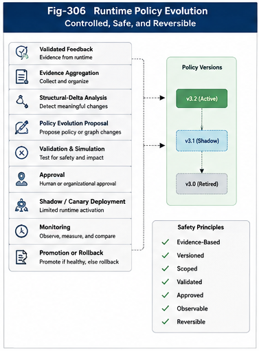

# PDOS-207 — Runtime Policy Evolution

## Abstract

Policy-Driven Runtime Architecture must adapt as organizational objectives, computational resources, runtime environments, and evidence change. However, policy evolution cannot be treated as unrestricted self-modification. A policy governs runtime authority, candidate eligibility, triggering priority, validation, fallback, and organizational boundaries. An incorrect policy update may therefore alter the behavior of the entire computational organization.

This paper defines **Runtime Policy Evolution** as the controlled process through which validated organizational feedback is transformed into proposed, tested, versioned, approved, deployed, monitored, and reversible policy change. It distinguishes runtime optimization from policy evolution, local adaptation from global modification, and evidence collection from authority to change policy.

PDOS requires policy evolution to pass through explicit stages including evidence aggregation, structural-delta analysis, proposal generation, simulation, validation, approval, canary deployment, runtime monitoring, promotion, and rollback. Through this disciplined lifecycle, organizational learning becomes possible without surrendering runtime governance.

---

## 1. Introduction

A static policy system eventually becomes obsolete.

Runtime conditions change.

New Brain Units become available.

Agents improve or fail.

Service costs change.

Organizational objectives evolve.

Security requirements become stricter.

Validation reveals unexpected structural deltas.

A Policy-Driven Runtime Architecture must therefore support change.

However, automatic change introduces a serious risk.

Policies determine:

* what computation may execute,
* which candidate may be selected,
* what authority may be granted,
* which resources may be accessed,
* which validation is required,
* how failure and fallback are handled.

A policy change is therefore not merely a parameter update.

It is a change to executable organization.

PDOS defines **Runtime Policy Evolution** as controlled organizational change based on validated runtime evidence.

---

## 2. From Feedback to Evolution

The previous runtime stage produces Organizational Feedback.

That feedback does not directly become policy.

It first becomes evidence for policy review.

```text id="cbh5dx"
Runtime Execution
      │
      ▼
Validation
      │
      ▼
Organizational Feedback
      │
      ▼
Evidence Aggregation
      │
      ▼
Policy Evolution Proposal
      │
      ▼
Simulation and Validation
      │
      ▼
Approval and Deployment
```

This separation is essential.

> **Feedback creates evidence.
> Evidence may justify a proposal.
> A proposal does not become policy until it is validated and authorized.**

---

## 3. Why Policy Evolution Is Necessary

Policy evolution is required when the existing organizational policy no longer produces acceptable runtime behavior.

Typical signals include:

* repeated trigger-selection failure,
* excessive Triggering Cost,
* frequent fallback,
* recurring validator rejection,
* outdated candidate preferences,
* new organizational requirements,
* changed resource availability,
* security incidents,
* repeated human override,
* stable success of a new runtime path.

Without evolution, the runtime organization may become:

* inefficient,
* brittle,
* expensive,
* unsafe,
* poorly aligned with current objectives.

Policy stability is valuable.

Policy stagnation is not.

---

## 4. Why Uncontrolled Evolution Is Dangerous

A policy update may unintentionally:

* expand runtime authority,
* make prohibited services reachable,
* bypass validation,
* increase cost,
* create triggering loops,
* weaken fallback,
* overfit to temporary conditions,
* propagate local behavior globally,
* invalidate historical assumptions.

For this reason, PDOS rejects direct runtime self-modification of active policy.

An execution unit should not be able to rewrite the policy that governs it merely because its own execution succeeded.

Capability, evidence, proposal authority, and deployment authority must remain separate.

---

## 5. Policy Evolution versus Runtime Optimization

Not every runtime adjustment is policy evolution.

### Runtime Optimization

Changes operational behavior within existing policy boundaries.

Examples include:

* selecting a healthier endpoint,
* reusing a cached path,
* changing queue allocation,
* adjusting an allowed ranking weight,
* choosing among approved fallbacks.

### Policy Evolution

Changes the organizational rules themselves.

Examples include:

* approving a new candidate type,
* modifying authority boundaries,
* changing required validators,
* altering policy priority,
* adding a new fallback,
* changing cost limits,
* redefining scope.

```text id="tq83eu"
Existing Policy Boundary
        │
        ├── Runtime Optimization
        │      operates inside boundary
        │
        └── Policy Evolution
               changes boundary
```

The two processes require different governance.

---

## 6. Policy Evolution Inputs

Runtime Policy Evolution may consume:

```text id="n2gnsm"
EvolutionInput
├── Validated Organizational Feedback
├── Feedback Aggregates
├── Structural Deltas
├── Runtime Metrics
├── Policy Violations
├── Human Review
├── Organizational Objectives
├── Security Requirements
├── Candidate and Resource Changes
└── Historical Policy Versions
```

No single runtime event should automatically justify broad policy change.

Evolution should depend on evidence appropriate to the scope and risk of the proposed modification.

---

## 7. Evolution Eligibility

Before evidence may influence policy evolution, it must pass an eligibility check.

Eligibility may require:

* accepted validation,
* complete runtime trace,
* known policy version,
* stable organizational scope,
* sufficient confidence,
* absence of unresolved security issues,
* reproducible or aggregated evidence.

```text id="j8ap42"
Organizational Feedback
      │
      ▼
Evolution Eligibility
      │
      ├── Monitoring Only
      ├── Local Optimization Eligible
      ├── Policy Proposal Eligible
      └── Ineligible
```

This prevents noisy or incomplete feedback from becoming organizational change.

---

## 8. Evidence Aggregation

Individual runtime events may reflect temporary or accidental conditions.

Policy evolution should often use aggregated evidence.

Aggregation may group feedback by:

* policy version,
* organizational scope,
* request type,
* candidate,
* trigger strategy,
* validation result,
* fallback path,
* structural delta,
* time period.

Example:

```text id="x3v4ts"
Policy P-17 Runtime Evidence

1,000 Requests
├── Primary candidate success: 720
├── Fallback activation: 210
├── Validation rejection: 45
├── Human escalation: 25
└── Cost threshold violation: 130
```

Aggregated evidence reveals persistent organizational patterns.

---

## 9. Structural-Delta Analysis

Policy evolution should not depend only on success rates.

It should analyze the structural difference among:

* expected runtime organization,
* selected runtime organization,
* actual runtime organization,
* validated runtime outcome.

```text id="frb2a1"
Expected Structure
        │
        ▼
Selected Structure
        │
        ▼
Actual Structure
        │
        ▼
Validated Outcome
        │
        ▼
Structural Delta Analysis
```

Structural-delta analysis may reveal:

* missing validator edges,
* unnecessary dispatch steps,
* incorrect authority paths,
* overused fallback,
* unavailable preferred candidates,
* hidden organizational dependencies.

The proposed policy change should address the structural cause rather than merely improve a metric.

---

## 10. Evolution Scope

Every policy change must have an explicit scope.

Possible scopes include:

* one runtime session,
* one user,
* one project,
* one Brain Unit group,
* one department,
* one enterprise,
* one ecosystem.

A local observation should not automatically produce a global rule.

```text id="2zeujc"
Local Evidence
      │
      ▼
Local Policy Proposal
      │
      ├── Validate Locally
      ├── Deploy Locally
      └── Consider Broader Promotion Later
```

Scope discipline reduces overgeneralization and organizational risk.

---

## 11. Local Policy Evolution

Local policy evolution modifies behavior within a bounded organizational region.

Examples include:

* changing candidate priority for one project,
* adding a local Brain Unit fallback,
* tightening validation for one workflow,
* lowering cost limits for one department,
* disabling one unreliable service.

Local evolution is often preferable because it:

* limits risk,
* preserves global stability,
* permits experimentation,
* supports specialized organizational knowledge,
* simplifies rollback.

Successful local policy may later become a candidate for promotion.

---

## 12. Global Policy Evolution

Global policy evolution affects broad organizational behavior.

Examples include:

* enterprise-wide security policy,
* common authority model,
* universal validation requirement,
* cross-system fallback rules,
* global policy-inheritance semantics.

Global changes require stronger evidence and more extensive validation because their failure radius is larger.

A useful principle is:

> **The broader the scope, the higher the required evidence and approval.**

---

## 13. Policy Evolution Proposal

A policy change should first exist as a proposal.

```text id="qhmf4v"
PolicyEvolutionProposal
├── Proposal Identity
├── Target Policy
├── Current Version
├── Proposed Version
├── Organizational Scope
├── Evidence References
├── Structural Delta
├── Proposed Changes
├── Expected Benefits
├── Risks
├── Required Validation
├── Deployment Strategy
└── Rollback Plan
```

The proposal provides a reviewable boundary between learning and active policy.

---

## 14. Types of Policy Change

Policy evolution may take several forms.

### 14.1 Priority Adjustment

Changes the order among already eligible candidates.

### 14.2 Constraint Adjustment

Changes cost, latency, resource, or security limits.

### 14.3 Eligibility Change

Adds or removes candidate types.

### 14.4 Authority Change

Modifies allowed operations or delegation boundaries.

### 14.5 Validation Change

Adds, removes, or changes validators and acceptance criteria.

### 14.6 Fallback Change

Changes fallback candidates, order, or escalation.

### 14.7 Scope Change

Expands or narrows where a policy applies.

### 14.8 Structural Change

Changes organizational graph relationships or runtime call paths.

Different change types require different risk controls.

---

## 15. Additive versus Subtractive Evolution

Policy evolution may add behavior or remove behavior.

### Additive Evolution

Examples include:

* adding a candidate,
* adding a validator,
* adding a fallback,
* extending a policy scope.

### Subtractive Evolution

Examples include:

* removing an unsafe service,
* revoking authority,
* narrowing scope,
* disabling a trigger path.

Subtractive evolution may reduce capability while increasing safety and organizational clarity.

Evolution should not be equated with permanent expansion.

---

## 16. Preserve, Refine, Replace, and Retire

A policy review may produce four broad outcomes.

```text id="h3lkgm"
Current Policy
      │
      ├── Preserve
      ├── Refine
      ├── Replace
      └── Retire
```

### Preserve

Evidence supports the current policy.

### Refine

A bounded change improves behavior.

### Replace

The policy structure is no longer adequate.

### Retire

The policy is obsolete or unsafe.

This classification prevents change from being assumed necessary merely because review occurred.

---

## 17. Policy Synthesis

A new policy proposal may be synthesized from:

* validated feedback,
* human-authored rules,
* existing policy templates,
* runtime organizational graphs,
* repeated successful paths,
* identified structural deltas.

Policy synthesis may be assisted by AI, but generated policy should remain a proposal.

It must still undergo:

* structural validation,
* conflict analysis,
* simulation,
* approval,
* controlled deployment.

Generated policy is not self-authorizing policy.

---

## 18. Policy Merge

Multiple proposals may need to be combined.

A merge process should identify:

* overlapping scope,
* compatible rules,
* conflicting constraints,
* authority differences,
* duplicated validators,
* competing priorities.

```text id="td6h4h"
Proposal A
      │
      ├── Compatible Rules ───┐
      │                       ▼
Proposal B               Merged Proposal
      │                       │
      └── Conflicts ──────────┘
                  │
                  ▼
            Explicit Resolution
```

Policy merge should preserve provenance from all contributing proposals.

---

## 19. Conflict Analysis

A proposed policy may conflict with:

* parent policy,
* sibling policy,
* security policy,
* compliance policy,
* runtime graph constraints,
* authority model,
* active deployment.

Conflict analysis should occur before simulation and deployment.

Possible outcomes include:

* proposal rejected,
* proposal narrowed,
* parent policy amendment required,
* explicit exception required,
* human escalation.

---

## 20. Policy Invariants

Some organizational properties should remain invariant through evolution.

Examples include:

* authority may not expand without approval,
* mandatory security validation cannot be removed locally,
* prohibited data paths remain unreachable,
* rollback must remain possible,
* policy provenance must be preserved,
* active runtime decisions retain their original policy version.

These invariants provide a stable constitutional boundary around policy evolution.

---

## 21. Static Validation of Policy Proposals

Before runtime simulation, a proposed policy should undergo static validation.

Checks may include:

* schema validity,
* scope validity,
* unresolved references,
* conflicting rules,
* authority amplification,
* unreachable validators,
* fallback cycles,
* invalid inheritance,
* missing rollback metadata.

```text id="7qd7rm"
Policy Proposal
      │
      ▼
Static Validation
      │
      ├── Valid
      ├── Invalid
      └── Requires Resolution
```

Static validation rejects structurally invalid policy before runtime cost is incurred.

---

## 22. Policy Simulation

A valid proposal should be simulated against:

* historical runtime requests,
* synthetic edge cases,
* failure scenarios,
* security scenarios,
* resource constraints,
* alternative candidate sets.

Simulation may compare:

```text id="zqziz3"
Current Policy
      versus
Proposed Policy
```

Measurements may include:

* Triggering Accuracy,
* Triggering Cost,
* Execution Cost,
* validation acceptance,
* fallback frequency,
* authority violations,
* latency,
* organizational outcomes.

---

## 23. Counterfactual Evaluation

Historical traces allow counterfactual analysis.

The system can ask:

> What would have happened if the proposed policy had governed this request?

```text id="d61v1n"
Historical Runtime Context
        │
        ├── Current Policy Outcome
        │
        └── Proposed Policy Outcome
                  │
                  ▼
          Comparative Validation
```

Counterfactual evaluation helps estimate benefit and risk before live deployment.

---

## 24. Adversarial and Boundary Testing

Policy proposals should be tested against difficult conditions.

Examples include:

* missing context,
* conflicting authority,
* unavailable primary candidate,
* malicious input,
* resource exhaustion,
* repeated fallback,
* recursive triggering,
* partial validation failure.

Boundary testing reveals whether policy remains safe outside ordinary cases.

---

## 25. Approval

A validated proposal may require approval according to its risk and scope.

Possible approvers include:

* policy owner,
* project owner,
* enterprise governance,
* security authority,
* domain expert,
* human operator,
* automated low-risk approval service.

Approval requirements should themselves be policy-defined.

---

## 26. Separation of Duties

The following responsibilities should not automatically belong to one component:

* evidence collection,
* proposal generation,
* policy validation,
* approval,
* deployment,
* rollback.

Separation of duties reduces the risk that one agent can create, approve, and activate its own authority expansion.

```text id="0awsbc"
Feedback Collector
      │
      ▼
Proposal Generator
      │
      ▼
Policy Validator
      │
      ▼
Approver
      │
      ▼
Deployment Manager
```

---

## 27. Policy Versioning

Every policy evolution creates a new version.

A version record may contain:

```text id="iiok56"
PolicyVersion
├── Policy ID
├── Version
├── Parent Version
├── Change Set
├── Evidence References
├── Validation Results
├── Approval Record
├── Effective Scope
├── Deployment Status
└── Rollback Target
```

The previous version should remain available for traceability and rollback.

---

## 28. Policy Change Set

A Change Set should describe the exact difference between policy versions.

```text id="5g89qd"
PolicyChangeSet
├── Added Rules
├── Removed Rules
├── Modified Rules
├── Scope Changes
├── Authority Changes
├── Validator Changes
├── Fallback Changes
└── Graph Changes
```

A policy should not be deployed as an opaque replacement when a precise structural delta can be recorded.

---

## 29. Policy Lifecycle

An evolved policy may pass through:

```text id="uzte2x"
Proposed
   │
   ▼
Validated
   │
   ▼
Approved
   │
   ▼
Staged
   │
   ▼
Canary
   │
   ▼
Active
   │
   ├── Superseded
   ├── Rolled Back
   └── Retired
```

Lifecycle state determines whether and where the policy may be evaluated.

---



---

## 30. Staged Deployment

A new policy should often be deployed gradually.

Possible stages include:

* test environment,
* shadow evaluation,
* one user or project,
* limited traffic,
* selected organizational units,
* broad deployment.

Staged deployment limits failure radius and generates new validation evidence.

---

## 31. Shadow Evaluation

In shadow mode, the proposed policy evaluates live runtime context without controlling execution.

```text id="b86ugg"
Live Runtime Context
      │
      ├── Active Policy → Controls Execution
      │
      └── Proposed Policy → Shadow Decision Only
                            │
                            ▼
                     Comparative Analysis
```

Shadow evaluation allows the organization to compare decisions safely.

---

## 32. Canary Policy Deployment

A canary deployment applies the new policy to a limited scope or percentage of runtime requests.

```text id="k9gbqz"
Runtime Requests
      │
      ├── 95% → Current Policy
      └── 5%  → Candidate Policy
```

Canary results should be evaluated against predefined success and rollback criteria.

---

## 33. Policy Promotion

A candidate policy may be promoted when:

* validation requirements are satisfied,
* runtime metrics improve,
* no critical invariants are violated,
* fallback remains reliable,
* evidence is sufficient,
* approval remains valid.

Promotion may expand:

* traffic percentage,
* organizational scope,
* candidate coverage,
* deployment duration.

Promotion should be explicit rather than automatic drift.

---

## 34. Runtime Monitoring

After deployment, the evolved policy should be monitored for:

* Triggering Accuracy,
* Triggering Cost,
* validation failure,
* fallback rate,
* authority violations,
* resource consumption,
* structural deltas,
* unexpected scope effects.

Deployment is not the end of policy validation.

It is the beginning of live evidence collection.

---

## 35. Rollback

Every policy evolution should define rollback before deployment.

Rollback may be triggered by:

* critical policy violation,
* authority expansion,
* increased failure rate,
* cost regression,
* validator overload,
* triggering loop,
* security incident,
* unmet canary criteria.

```text id="hhjw0k"
New Policy Active
      │
      ├── Meets Criteria → Continue
      │
      └── Violates Criteria
                 │
                 ▼
          Roll Back to Stable Version
```

Rollback should restore both policy and related runtime graph changes when necessary.

---

## 36. Automatic versus Human-Authorized Rollback

Some rollback conditions may be automatic.

Examples include:

* hard security violation,
* authority amplification,
* catastrophic failure threshold,
* unreachable required validator.

Other cases may require human decision.

Examples include:

* moderate cost regression,
* mixed organizational outcome,
* validator disagreement,
* uncertain long-term effect.

Rollback authority should be explicit.

---

## 37. Policy Freeze

During incidents or audits, policy evolution may be frozen.

A freeze may prevent:

* new proposal activation,
* promotion,
* scope expansion,
* adaptive parameter changes.

Runtime execution may continue under a stable approved version.

Policy freeze supports incident containment and reproducibility.

---

## 38. Policy Branches

Different organizational scopes may evolve from a shared policy baseline.

```text id="lt75rd"
Base Policy
    │
    ├── Personal Branch
    ├── Enterprise Branch
    └── Research Branch
```

Branches support specialization without modifying the shared parent policy directly.

Successful branch changes may later be proposed for merge.

---

## 39. Policy Fork and Merge

Independent organizations may fork a policy and adapt it locally.

A later merge may compare:

* common preserved rules,
* local specializations,
* conflicting authority,
* different validation requirements,
* different runtime environments.

This supports federated organizational evolution.

---

## 40. Evolution Rate

Policy should not evolve faster than it can be validated.

A high change rate may create:

* unstable runtime behavior,
* invalid feedback comparisons,
* version fragmentation,
* difficult rollback,
* policy interactions that cannot be understood.

A useful principle is:

> **The permissible rate of policy evolution is bounded by validation capacity.**

---

## 41. Stability Windows

After deployment, a policy may require a stability window before further evolution.

During this period:

* feedback accumulates,
* delayed outcomes appear,
* structural effects are observed,
* policy interactions become visible.

Stability windows prevent rapid oscillation between policy versions.

---

## 42. Policy Oscillation

A policy may oscillate when short-term feedback repeatedly reverses priority or thresholds.

Example:

```text id="dbw03q"
Version A prefers Candidate X
      │
      ▼
Short-term failure
      │
      ▼
Version B prefers Candidate Y
      │
      ▼
Short-term failure
      │
      ▼
Version C returns to Candidate X
```

Controls may include:

* minimum evidence,
* hysteresis,
* stability windows,
* larger rollback thresholds,
* long-term outcome measures.

---

## 43. Policy Drift

Policy drift occurs when many small changes gradually move policy away from its original organizational objective.

Drift may occur through:

* repeated local exceptions,
* priority adjustments,
* fallback expansion,
* validator removal,
* authority accumulation.

Periodic constitutional review should compare active policy against:

* original objectives,
* preserved invariants,
* authority boundaries,
* organizational principles.

---

## 44. Constitutional Policies

Some policies should define stable, high-level constraints governing lower-level evolution.

Examples include:

* authority cannot self-expand,
* external execution requires approval,
* validation cannot be bypassed,
* every active policy must support rollback,
* every policy change must preserve provenance.

These constitutional policies are not ordinary optimization targets.

They define the permissible space of runtime policy evolution.

---

## 45. Adaptive Parameters

Some policy fields may be explicitly marked as adaptively tunable.

Examples include:

* cost threshold within bounds,
* candidate ranking weight,
* timeout range,
* validation sampling rate,
* cache duration.

```text id="n320lt"
Fixed Policy Structure
├── Authority
├── Eligibility
├── Security
└── Required Validation

Adaptive Parameters
├── Ranking Weight
├── Cost Target
├── Timeout
└── Sampling Rate
```

Adaptive parameters may evolve more frequently because their allowed range is predetermined.

---

## 46. Authority Evolution

Changes to runtime authority require the strongest controls.

Authority evolution may:

* permit new data access,
* allow external services,
* permit state modification,
* enable downstream triggering,
* expand delegation.

Such changes should generally require:

* explicit proposal,
* security analysis,
* human approval,
* limited deployment,
* strong rollback.

Runtime success alone should never authorize authority expansion.

---

## 47. Candidate Evolution

The candidate set may evolve when:

* a new Brain Unit is validated,
* an agent becomes reliable,
* a service is deprecated,
* a model version changes,
* a tool becomes unavailable.

Candidate evolution should update:

* eligibility,
* priority,
* validation requirements,
* fallback,
* Runtime Organizational Graphs.

Adding a candidate does not automatically make it primary.

---

## 48. Validation Evolution

Validation policies may evolve based on observed risk.

Examples include:

* adding a structural validator,
* replacing an unreliable model-based validator,
* changing human-review thresholds,
* using lighter validation for established low-risk paths,
* strengthening validation for new candidates.

Validation evolution must not create circular self-approval.

---

## 49. Fallback Evolution

Repeated fallback use may indicate:

* primary candidate weakness,
* unrealistic policy preference,
* resource instability,
* missing candidate,
* incorrect timeout.

Fallback evolution may:

* reorder approved alternatives,
* promote a proven fallback,
* add escalation,
* remove a failing path.

Fallback success should be validated before promotion to primary status.

---

## 50. Graph Evolution

Policy evolution may change Runtime Organizational Graphs.

Possible graph changes include:

* adding a policy edge,
* removing reachability,
* adding a validator node,
* changing delegation,
* creating a new organizational group,
* caching a validated call path.

Graph change should be versioned together with the policy that authorizes it.

---

## 51. Organizational Learning

Runtime Policy Evolution is a form of organizational learning.

It differs from model training.

Model training changes statistical parameters.

Organizational learning changes:

* runtime governance,
* candidate organization,
* authority,
* trigger structure,
* validation,
* fallback,
* computational relationships.

```text id="v2pr3j"
Model Learning
    changes internal model behavior

Organizational Learning
    changes how computation is governed and activated
```

The two may cooperate but should not be conflated.

---

## 52. Policy Evolution Metrics

Useful metrics include:

* proposal acceptance rate,
* simulation rejection rate,
* canary failure rate,
* rollback rate,
* time to promotion,
* policy stability duration,
* Triggering Cost change,
* Triggering Accuracy change,
* validation-load change,
* authority-change frequency,
* scope-expansion frequency.

These metrics evaluate the health of the policy evolution process itself.

---

## 53. Evolution Provenance

Every evolved policy should preserve provenance.

Provenance may include:

* evidence sources,
* proposal author,
* synthesis method,
* validators,
* approvers,
* simulation dataset,
* deployment history,
* rollback events.

This allows the organization to explain not only what the current policy is, but why it became that way.

---

## 54. Runtime Policy Evolution API

A language-independent API may include:

```text id="zimw4k"
PolicyEvolutionManager
├── evaluateEligibility(feedback)
├── aggregate(evidenceQuery)
├── analyzeStructuralDelta(evidence)
├── propose(targetPolicy, evidence)
├── validate(proposal)
├── simulate(proposal, runtimeTraces)
├── approve(proposal, authority)
├── deploy(policyVersion, strategy)
├── monitor(policyVersion)
├── promote(policyVersion)
└── rollback(policyVersion)
```

A Java-oriented interface may begin as:

```java id="2df6rr"
public interface PolicyEvolutionManager {

    PolicyEvolutionProposal propose(
        OrganizationalPolicy currentPolicy,
        FeedbackAggregate evidence
    );

    PolicySimulationResult simulate(
        PolicyEvolutionProposal proposal,
        List<RuntimeTrace> historicalTraces
    );

    PolicyDeploymentResult deploy(
        ApprovedPolicyVersion policyVersion,
        DeploymentStrategy strategy
    );

    RollbackResult rollback(
        String policyId,
        String targetVersion
    );
}
```

---

## 55. Minimal Data Types

A minimal Java-oriented design may include:

```java id="vkx5rl"
public final class PolicyEvolutionProposal {
    private final String proposalId;
    private final PolicyReference targetPolicy;
    private final PolicyChangeSet changeSet;
    private final EvidenceBundle evidence;
    private final OrganizationalScope scope;
    private final RiskAssessment riskAssessment;
    private final RollbackPlan rollbackPlan;
}

public final class PolicyVersion {
    private final String policyId;
    private final String version;
    private final String parentVersion;
    private final PolicyChangeSet changeSet;
    private final ApprovalRecord approvalRecord;
    private final PolicyLifecycleState lifecycleState;
}

public final class PolicyDeployment {
    private final PolicyReference policyVersion;
    private final DeploymentStrategy strategy;
    private final DeploymentScope scope;
    private final DeploymentMetrics metrics;
}
```

These objects should preserve immutability and provenance.

---

## 56. Policy Repository Requirements

A Policy Repository should support:

* version storage,
* branch and merge,
* lifecycle state,
* approval metadata,
* evidence linkage,
* deployment status,
* rollback targets,
* policy-diff inspection.

The repository should separate:

* draft policies,
* validated policies,
* active policies,
* historical policies.

Runtime engines should evaluate only deployable policy versions.

---

## 57. Testing Policy Evolution

Tests should include:

* insufficient evidence,
* invalid scope expansion,
* authority amplification,
* policy conflict,
* successful local refinement,
* simulation regression,
* canary failure,
* rollback,
* version replay,
* policy freeze.

Example:

```text id="6f680v"
Given:
    Local feedback from one project
    Proposal modifies global enterprise policy

Expect:
    Proposal rejected or narrowed
    Evidence scope insufficient
```

---

## 58. Testing Rollback

Rollback tests should verify:

* correct previous policy restored,
* runtime graph restored,
* active requests retain policy-version consistency,
* new requests use restored policy,
* rollback event recorded,
* invalid candidate paths disabled.

Rollback should be tested before deployment rather than only during failure.

---

## 59. Policy Evolution Simulation

A complete simulation may evaluate:

```text id="df1vvz"
Historical Requests
      │
      ├── Current Policy
      │       └── Baseline Metrics
      │
      └── Proposed Policy
              └── Candidate Metrics
                       │
                       ▼
             Structural Comparison
                       │
                       ▼
                  Risk Decision
```

Simulation should compare both numerical measures and structural runtime paths.

---

## 60. Relationship to Organizational Feedback

Organizational Feedback provides the evidence base for policy evolution.

Runtime Policy Evolution determines:

* whether evidence is sufficient,
* what scope it supports,
* what change is proposed,
* how the proposal is validated,
* whether the change is deployed.

Feedback and evolution therefore form separate but connected responsibilities.

---

## 61. Relationship to GTDO

GTDO supports localized evolution through:

* computational groups,
* call paths,
* local validation,
* local versioning,
* rollback,
* structural scope of optimization.

PDOS applies these principles to policy governance and runtime organization.

A change may remain local to one GTDO group until broader evidence supports promotion.

---

## 62. Relationship to FTRI

FTRI switching behavior may evolve through:

* trigger-threshold refinement,
* channel-priority adjustment,
* actor-condition refinement,
* fallback-channel changes.

PDOS ensures that such changes remain policy-governed, validated, versioned, and reversible.

---

## 63. Relationship to RCP

RCP provides runtime primitives whose composition may be governed by policy.

Policy evolution may change:

* authority boundaries,
* selective reachability,
* switching composition,
* activation conditions.

The primitives remain stable while organizational composition evolves.

---

## 64. Relationship to CKOI

CKOI provides organized computational knowledge that may support:

* policy templates,
* validated operational patterns,
* reusable evolution evidence,
* runtime organizational assets.

Policy evolution may transform successful organizational knowledge into reusable policy infrastructure.

---

## 65. Engineering Principles

Runtime Policy Evolution follows several principles.

### 65.1 Feedback Is Not Policy

Runtime evidence must pass through proposal, validation, and approval.

### 65.2 Evolution Respects Scope

Local evidence supports local change before global change.

### 65.3 Validation Capacity Bounds Evolution Rate

Policy should not change faster than the organization can evaluate it.

### 65.4 Authority Cannot Self-Expand

Runtime success does not grant authority to broaden policy.

### 65.5 Every Change Is Versioned

Policy evolution must remain reproducible and auditable.

### 65.6 Every Deployment Has a Rollback Plan

Reversibility is a requirement, not an afterthought.

### 65.7 Structural Delta Guides Change

Improve the organizational structure, not only a numerical score.

### 65.8 Stability Is an Objective

An unchanged policy may be preferable to an unstable improvement.

### 65.9 Constitutional Policies Bound Evolution

Some organizational constraints remain outside ordinary optimization.

### 65.10 Promotion Requires Evidence

A successful local policy does not become global without broader validation.

---

## 66. Conclusion

Policy-Driven Runtime Architecture must learn, but it must not surrender organizational control to unrestricted self-modification.

Runtime Policy Evolution provides a disciplined path from validated feedback to organizational change.

It aggregates evidence, analyzes structural deltas, determines scope, creates explicit proposals, checks policy invariants, simulates alternative behavior, requires approval, deploys changes gradually, monitors runtime effects, and supports rollback.

Through this process, policy becomes evolvable without becoming unstable.

Organizational learning becomes possible without allowing execution units to rewrite their own authority.

Runtime Policy Evolution therefore transforms feedback into governed, testable, versioned, and reversible improvement—the mechanism through which the Triggering Economy can adapt while preserving trust, safety, and organizational integrity.

---

## Key Contributions

* Defines **Runtime Policy Evolution** as controlled organizational change based on validated runtime evidence.
* Distinguishes runtime optimization from policy evolution.
* Separates feedback, evidence, proposal, validation, approval, and deployment.
* Introduces evolution eligibility, evidence aggregation, structural-delta analysis, and scope discipline.
* Distinguishes local and global policy evolution.
* Defines explicit Policy Evolution Proposals and Policy Change Sets.
* Introduces additive, subtractive, preserve, refine, replace, and retire operations.
* Defines policy synthesis, merge, conflict analysis, and constitutional invariants.
* Establishes static validation, simulation, counterfactual evaluation, and adversarial testing.
* Introduces staged, shadow, and canary policy deployment.
* Defines promotion, monitoring, freeze, rollback, branch, fork, and merge.
* Identifies policy oscillation, policy drift, evolution rate, and stability windows.
* Establishes strong controls for authority, candidate, validation, fallback, and graph evolution.
* Positions policy evolution as organizational learning distinct from model training.
* Integrates Runtime Policy Evolution with Organizational Feedback, GTDO, FTRI, RCP, and CKOI.

---

## Suggested Figure

**Fig-306 — Runtime Policy Evolution**

**Description**

The figure illustrates the complete controlled lifecycle from runtime evidence to reversible policy deployment.

```text id="i4j68f"
Validated Organizational Feedback
              │
              ▼
       Evidence Aggregation
              │
              ▼
    Structural-Delta Analysis
              │
              ▼
   Policy Evolution Proposal
              │
              ▼
────────────────────────────────
   Policy Validation Boundary
────────────────────────────────
 • Scope Validation
 • Conflict Analysis
 • Authority Analysis
 • Invariant Validation
 • Simulation
 • Counterfactual Evaluation
 • Risk Assessment
────────────────────────────────
              │
              ▼
           Approval
              │
              ▼
       Staged Deployment
              │
      ┌───────┼────────┐
      ▼       ▼        ▼
   Shadow   Canary   Local Scope
      │       │        │
      └───────┴────────┘
              │
              ▼
      Runtime Monitoring
              │
      ┌───────┴────────┐
      ▼                ▼
   Promote          Roll Back
      │                │
      ▼                ▼
New Active Policy   Stable Prior Version
```

The figure should distinguish four major zones:

```text id="h7ra5w"
Evidence Zone
    Feedback • Aggregation • Structural Delta

Proposal Zone
    Change Set • Scope • Expected Benefit • Risk

Governance Zone
    Validation • Simulation • Approval

Deployment Zone
    Shadow • Canary • Promotion • Monitoring • Rollback
```

A strong boundary should separate **Organizational Feedback** from **Active Policy**, labeled:

```text id="pmplyx"
No Direct Self-Modification
```

A second highlighted principle should appear beside the deployment loop:

```text id="08zh21"
Every Evolution Is Versioned,
Validated, Scoped, and Reversible
```

The figure should also show a narrow path for adaptive parameter tuning inside existing policy boundaries, while authority, eligibility, security, and constitutional constraints pass through the full policy-evolution lifecycle.
