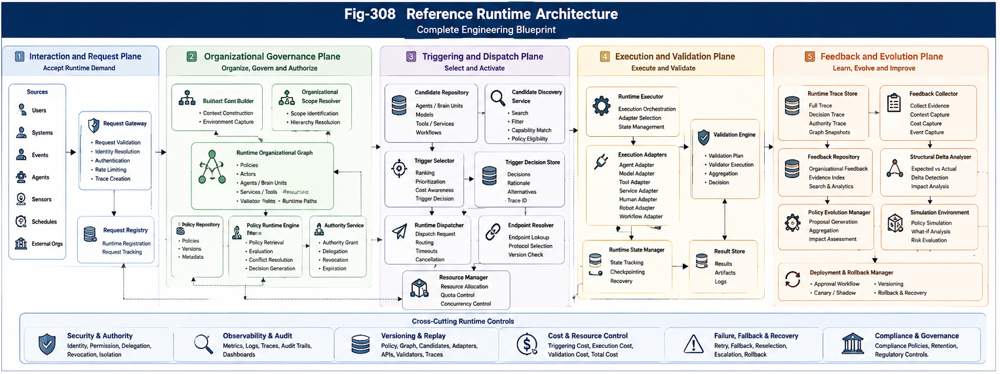

# PDOS-209 — Reference Runtime Architecture

## Abstract

The previous papers in Part III defined the major engineering components of Policy-Driven Runtime Architecture: the Organizational Runtime Pipeline, Policy Runtime Engine, Trigger Selection and Dispatch, Runtime Organizational Graphs, Organizational Feedback and Validation, Runtime Policy Evolution, and Organizational Runtime APIs.

This paper integrates those components into a complete **PDOS Reference Runtime Architecture**.

The reference architecture defines how runtime requests enter the system, how organizational context and scope are resolved, how executable policies produce governance decisions, how candidates and runtime paths are discovered, how triggers are selected and dispatched, how execution is validated, how organizational feedback is preserved, and how policy evolution occurs through a controlled and reversible lifecycle.

The architecture is designed as a language-independent engineering blueprint. It may be implemented as a modular monolith, distributed service system, event-driven runtime, enterprise platform, local personal AI environment, robotic control architecture, or federated triggering ecosystem.

Its central purpose is to provide a concrete and testable foundation for engineering the Triggering Economy.

---



---

## 1. Introduction

A computational architecture becomes useful when its concepts can be assembled into one operational system.

Part III has introduced the major components required by PDOS:

* Organizational Runtime Pipeline,
* Policy Runtime Engine,
* Trigger Selector,
* Runtime Dispatcher,
* Runtime Organizational Graph,
* Validation Engine,
* Feedback Collector,
* Policy Evolution Manager,
* Organizational Runtime APIs.

Each component solves a distinct engineering problem.

The Reference Runtime Architecture explains how they cooperate.

```text id="j9m4tb"
Runtime Demand
      │
      ▼
Organizational Governance
      │
      ▼
Trigger Selection
      │
      ▼
Runtime Execution
      │
      ▼
Validation and Feedback
      │
      ▼
Controlled Policy Evolution
```

The architecture transforms organizational knowledge into governed runtime computation.

---

## 2. Architectural Objective

The objective of the PDOS Reference Runtime Architecture is to answer one complete engineering question:

> **How can a computational system organize, authorize, select, activate, validate, observe, and improve runtime computation through explicit organizational policies?**

The architecture should support:

* heterogeneous computational units,
* multiple organizational scopes,
* explicit runtime authority,
* policy-governed reachability,
* deterministic and adaptive triggering,
* synchronous and asynchronous execution,
* independent validation,
* structural runtime feedback,
* versioned and reversible evolution.

It should also preserve separation among organizational responsibilities.

---

## 3. Architectural Overview

The complete runtime architecture may be represented as five primary planes.

```text id="lkh5ng"
────────────────────────────────────────────
1. Interaction and Request Plane
────────────────────────────────────────────
Users • Systems • Events • Agents • Sensors

────────────────────────────────────────────
2. Organizational Governance Plane
────────────────────────────────────────────
Context • Scope • Policies • Authority • Graph

────────────────────────────────────────────
3. Triggering and Dispatch Plane
────────────────────────────────────────────
Candidates • Trigger Selection • Dispatch

────────────────────────────────────────────
4. Execution and Validation Plane
────────────────────────────────────────────
Agents • Brain Units • Tools • Services
Execution • Validation • Result

────────────────────────────────────────────
5. Feedback and Evolution Plane
────────────────────────────────────────────
Trace • Feedback • Simulation • Policy Evolution
```

Cross-cutting controls support all five planes:

```text id="wl68pv"
Security
Observability
Versioning
Audit
Cost Control
Failure Recovery
```

---

## 4. Interaction and Request Plane

The Interaction and Request Plane accepts runtime demand.

Sources may include:

* users,
* enterprise applications,
* AI agents,
* event streams,
* sensors,
* schedules,
* robotic systems,
* external organizations.

The primary component is the **Runtime Request Gateway**.

Its responsibilities include:

* request validation,
* identity resolution,
* trace creation,
* rate limiting,
* request classification,
* cancellation registration,
* initial security checks.

```text id="2vh95w"
External Source
      │
      ▼
Runtime Request Gateway
      │
      ├── Validate Request
      ├── Resolve Identity
      ├── Create Trace ID
      ├── Apply Entry Security
      └── Register Runtime Request
```

The gateway does not select computation.

It prepares the request for organizational processing.

---

## 5. Runtime Request Contract

A Runtime Request may contain:

```text id="x41nhg"
RuntimeRequest
├── Request ID
├── Request Type
├── Objective
├── Input Data
├── Actor Identity
├── Organizational Scope Hint
├── Priority
├── Deadline
├── Security Context
├── Expected Output
├── Execution Mode
└── Trace ID
```

The request represents computational demand.

It does not yet contain a Policy Decision or Trigger Decision.

---

## 6. Runtime Context Construction

The Runtime Context Builder enriches the request with organizational and environmental state.

Possible context sources include:

* actor profile,
* current organizational scope,
* active goals,
* available resources,
* previous runtime state,
* current policy versions,
* security classifications,
* execution history,
* external environment.

```text id="v7ew6l"
Runtime Request
      │
      ▼
Runtime Context Builder
      │
      ├── Actor Context
      ├── Organizational Context
      ├── Resource Context
      ├── Security Context
      ├── Historical Context
      └── Environmental Context
      │
      ▼
Runtime Context Snapshot
```

The snapshot should be versioned and stable during the current trigger-selection cycle.

---

## 7. Organizational Governance Plane

The Organizational Governance Plane determines:

* where the request belongs,
* which policies apply,
* what authority exists,
* what candidates are reachable,
* what constraints must be preserved.

Its primary components are:

* Organizational Scope Resolver,
* Runtime Organizational Graph,
* Policy Repository,
* Policy Runtime Engine,
* Authority Service.

```text id="vb2mlp"
Runtime Context
      │
      ▼
Organizational Scope Resolver
      │
      ▼
Runtime Organizational Graph
      │
      ▼
Policy Runtime Engine
      │
      ▼
Policy Decision
```

This plane converts contextual demand into organizational governance.

---

## 8. Organizational Scope Resolver

The Scope Resolver maps runtime context to one or more organizational scopes.

Possible scopes include:

* personal,
* project,
* department,
* enterprise,
* service domain,
* agent group,
* Brain Unit group,
* federated partner.

The resolver should return:

```text id="kppl74"
ScopeResolution
├── Primary Scope
├── Parent Scopes
├── Inherited Policies
├── Local Policies
├── Scope Confidence
└── Resolution Trace
```

Ambiguous scope may require escalation or multi-scope evaluation.

---

## 9. Runtime Organizational Graph

The Runtime Organizational Graph provides the structural substrate for the architecture.

It represents:

* organizational units,
* policies,
* actors,
* trigger nodes,
* agents,
* Brain Units,
* services,
* validators,
* resources,
* authority relationships,
* runtime paths.

The graph supports:

* policy discovery,
* candidate reachability,
* path validation,
* authority propagation,
* fallback discovery,
* runtime tracing.

```text id="hz024t"
Stable Organizational Graph
          +
Runtime Context Overlay
          +
Policy Constraints
          =
Active Runtime Subgraph
```

Only the active subgraph should be exposed to downstream selection.

---

## 10. Policy Repository

The Policy Repository stores:

* policy source,
* compiled policy,
* version,
* scope,
* lifecycle state,
* approval metadata,
* dependency relationships,
* rollback target,
* simulation evidence.

Runtime policy evaluation should use only:

* approved,
* active,
* scope-compatible,
* version-valid policies.

Draft and retired policies remain administratively accessible but not runtime-active.

---

## 11. Policy Runtime Engine

The Policy Runtime Engine evaluates organizational policy against runtime context and scope.

It performs:

* applicable-policy discovery,
* condition evaluation,
* inheritance,
* conflict detection,
* priority resolution,
* eligibility definition,
* authority calculation,
* constraint application,
* validation-plan generation,
* fallback definition.

The output is a structured Policy Decision.

```text id="2vdvxy"
PolicyDecision
├── Applied Policies
├── Eligible Candidate Classes
├── Excluded Candidate Classes
├── Priority Rules
├── Authority Grant
├── Hard Constraints
├── Validation Plan
├── Fallback Rules
├── Escalation Rules
└── Decision Trace
```

The Policy Runtime Engine governs but does not execute.

---

## 12. Authority Service

The Authority Service creates, verifies, limits, revokes, and audits runtime authority.

An Authority Grant may specify:

```text id="l6mg50"
AuthorityGrant
├── Actor
├── Governing Policy
├── Allowed Operations
├── Data Scope
├── Resource Scope
├── Downstream Delegation
├── Cost Limit
├── Expiration
├── Revocation Conditions
└── Signature
```

Authority should remain:

* explicit,
* minimal,
* scoped,
* time-bounded,
* traceable.

Downstream authority may remain equal or narrower unless an approved escalation occurs.

---

## 13. Triggering and Dispatch Plane

The Triggering and Dispatch Plane transforms organizational governance into runtime activation.

Its primary components are:

* Candidate Repository,
* Candidate Discovery Service,
* Trigger Selector,
* Trigger Decision Store,
* Runtime Dispatcher,
* Endpoint and Resource Services.

```text id="ij5rvq"
Policy Decision
      │
      ▼
Candidate Discovery
      │
      ▼
Trigger Selection
      │
      ▼
Trigger Decision
      │
      ▼
Dispatch Preparation
      │
      ▼
Runtime Dispatch
```

This plane separates decision from routing.

---

## 14. Candidate Repository

The Candidate Repository stores metadata about executable assets.

Candidate types may include:

* Brain Units,
* agents,
* tools,
* models,
* services,
* workflows,
* human reviewers,
* composite plans.

Candidate metadata may include:

```text id="luho5l"
TriggerCandidate
├── Candidate ID
├── Type
├── Capabilities
├── Organizational Scope
├── Required Authority
├── Input Contract
├── Output Contract
├── Endpoint
├── Availability
├── Cost Estimate
├── Validation History
└── Version
```

The repository exposes descriptions.

It should not execute candidates directly.

---

## 15. Candidate Discovery Service

The Candidate Discovery Service queries the active Runtime Organizational Graph under the Policy Decision.

Its stages may include:

```text id="fxhc9q"
Reachable Candidates
      │
      ▼
Policy Eligibility
      │
      ▼
Authority Compatibility
      │
      ▼
Version and Availability
      │
      ▼
Bounded Candidate Set
```

This service reduces the global candidate space before comparative selection.

---

## 16. Trigger Selector

The Trigger Selector selects the runtime action that should become active.

It considers:

* hard constraints,
* structural relevance,
* policy priority,
* authority compatibility,
* Triggering Cost,
* Execution Cost,
* latency,
* reliability,
* previous validation,
* fallback readiness.

A recommended evaluation order is:

```text id="4ohg0c"
Hard Constraints
      │
      ▼
Structural Eligibility
      │
      ▼
Organizational Priority
      │
      ▼
Cost and Runtime Optimization
      │
      ▼
Reliability and History
      │
      ▼
Trigger Decision
```

Invalid candidates should not enter ranking.

---

## 17. Trigger Decision Store

Trigger Decisions should be stored immutably for:

* dispatch,
* validation,
* audit,
* replay,
* feedback,
* policy evolution.

A Trigger Decision should reference:

* Runtime Context version,
* Policy Decision,
* selected candidate,
* candidate set,
* authority grant,
* validation plan,
* fallback plan,
* decision trace.

This preserves the exact organizational decision that preceded execution.

---

## 18. Runtime Dispatcher

The Runtime Dispatcher converts the Trigger Decision into a Dispatch Request.

Its responsibilities include:

* endpoint resolution,
* input binding,
* authority binding,
* resource reservation,
* timeout configuration,
* validation binding,
* idempotency,
* trace propagation,
* fallback registration.

```text id="j9rgj3"
Trigger Decision
      │
      ▼
Dispatch Preparation
      │
      ├── Resolve Endpoint
      ├── Bind Inputs
      ├── Bind Authority
      ├── Reserve Resources
      ├── Register Validators
      ├── Register Fallback
      └── Initialize Trace
      │
      ▼
Dispatch Request
```

The dispatcher operationalizes the decision but should not reinterpret policy.

---

## 19. Endpoint Resolution

A logical candidate may have multiple execution endpoints.

Endpoint resolution may consider:

* region,
* availability,
* cost,
* capacity,
* version,
* compliance,
* latency,
* data locality.

Endpoint selection remains subordinate to the logical Trigger Decision.

A physical endpoint cannot replace the selected logical candidate with a different unauthorized candidate.

---

## 20. Resource Manager

The Resource Manager provides controlled access to:

* CPU,
* GPU,
* memory,
* queue capacity,
* service quotas,
* network,
* storage,
* human review slots,
* robotic control windows.

Resource requests should include:

```text id="228lz8"
ResourceBudget
├── Maximum Cost
├── Maximum Duration
├── Compute Limit
├── Memory Limit
├── Network Limit
├── External Service Limit
└── Human Review Budget
```

Resource exhaustion should produce structured fallback, retry, escalation, or rejection.

---

## 21. Execution and Validation Plane

The Execution and Validation Plane performs computational work and determines whether the outcome is organizationally acceptable.

Its components include:

* Runtime Executor,
* Execution Adapters,
* Runtime State Manager,
* Validation Engine,
* Validator Registry,
* Result Store.

```text id="69o8j1"
Dispatch Request
      │
      ▼
Runtime Executor
      │
      ▼
Execution Adapter
      │
      ▼
Computational Unit
      │
      ▼
Runtime Result
      │
      ▼
Validation Engine
```

Execution and validation should remain separable.

---

## 22. Runtime Executor

The Runtime Executor coordinates the lifecycle of execution.

It may support:

* synchronous execution,
* asynchronous execution,
* queued execution,
* event-driven execution,
* streaming,
* composite execution,
* human-in-the-loop execution.

It should preserve:

* execution identity,
* candidate version,
* authority,
* timeout,
* resource usage,
* downstream calls,
* runtime trace.

---

## 23. Execution Adapters

Execution Adapters connect the common runtime architecture to heterogeneous targets.

Possible adapters include:

* Brain Unit Adapter,
* Agent Adapter,
* Model Adapter,
* Tool Adapter,
* Service Adapter,
* Workflow Adapter,
* Human Review Adapter,
* Robot Adapter.

A common adapter contract may be:

```text id="8lmfyk"
ExecutionAdapter
├── supports(candidateType)
├── prepare(dispatchRequest)
├── execute(dispatchRequest)
├── cancel(executionId)
├── status(executionId)
└── normalizeResult(rawResult)
```

Adapters isolate implementation-specific behavior from organizational governance.

---

## 24. Composite Runtime Executor

Some triggers produce an execution graph rather than one target.

A Composite Runtime Executor may coordinate:

* parallel tasks,
* sequential dependencies,
* competitive alternatives,
* merge operations,
* nested validation,
* bounded downstream triggers.

```text id="he6xho"
Composite Trigger
      │
      ├──► Agent A
      ├──► Brain Unit B
      └──► Service C
              │
              ▼
           Merge Node
              │
              ▼
           Validator
```

All branches remain bounded by the original policy and authority.

---

## 25. Runtime State Manager

The Runtime State Manager tracks:

```text id="mvjz9m"
Execution State
├── PREPARED
├── QUEUED
├── RUNNING
├── WAITING
├── COMPLETED
├── FAILED
├── CANCELLED
├── FALLBACK
└── VALIDATING
```

It supports:

* recovery,
* cancellation,
* timeout,
* retries,
* downstream coordination,
* observability.

State transitions should be explicit events.

---

## 26. Runtime Result Store

The Result Store preserves:

* raw result,
* normalized result,
* execution metadata,
* resource usage,
* errors,
* downstream calls,
* runtime graph,
* candidate version,
* trace.

Results should remain provisional until validation completes.

---

## 27. Validation Engine

The Validation Engine evaluates:

* operational completion,
* structural correctness,
* policy compliance,
* authority preservation,
* security,
* cost,
* outcome quality,
* downstream safety.

The Validation Plan determines:

* required validators,
* validator order,
* merge strategy,
* acceptance criteria,
* escalation,
* fallback.

```text id="g279h1"
Runtime Result
      │
      ├──► Operational Validator
      ├──► Policy Validator
      ├──► Structural Validator
      ├──► Security Validator
      ├──► Cost Validator
      └──► Outcome Validator
              │
              ▼
        Validation Merge
```

---

## 28. Validator Registry

The Validator Registry stores validated validator capabilities.

Metadata may include:

* validator type,
* supported candidate types,
* risk level,
* input contract,
* cost,
* independence status,
* version,
* approval state.

The Policy Decision may reference validators by type or identity.

---

## 29. Validation Merge

Validation results may be merged using:

* all-required acceptance,
* critical-validator dominance,
* weighted threshold,
* hierarchical review,
* human escalation.

The merge rule is policy-governed.

Validator disagreement should remain visible in the final Validation Result.

---

## 30. Validation Outcome

Possible outcomes include:

```text id="2v0dlw"
ACCEPTED
CONDITIONALLY_ACCEPTED
REJECTED
RETRY_REQUIRED
FALLBACK_REQUIRED
RESELECTION_REQUIRED
HUMAN_REVIEW_REQUIRED
ESCALATION_REQUIRED
```

The outcome determines whether:

* the result may be returned,
* the result may trigger downstream action,
* feedback may influence learning,
* fallback should activate,
* trigger reselection is required.

---

## 31. Feedback and Evolution Plane

The Feedback and Evolution Plane converts validated runtime evidence into organizational knowledge and controlled policy improvement.

Its components include:

* Runtime Trace Store,
* Feedback Collector,
* Feedback Repository,
* Structural Delta Analyzer,
* Policy Evolution Manager,
* Simulation Environment,
* Deployment Manager.

```text id="gox9ed"
Validated Runtime Outcome
          │
          ▼
Organizational Feedback
          │
          ▼
Evidence Aggregation
          │
          ▼
Structural Delta Analysis
          │
          ▼
Policy Evolution Proposal
          │
          ▼
Simulation • Approval • Deployment
```

There is no direct path from raw execution to active policy modification.

---

## 32. Runtime Trace Store

The Runtime Trace Store preserves the complete causal chain:

```text id="g3rgqy"
Request
→ Context
→ Scope
→ Policy Decision
→ Candidate Set
→ Trigger Decision
→ Dispatch
→ Execution
→ Validation
→ Feedback
```

The trace should reference all relevant versions.

This supports:

* explanation,
* audit,
* replay,
* validation correction,
* simulation,
* policy evolution.

---

## 33. Feedback Collector

The Feedback Collector creates Organizational Feedback from:

* Runtime Context,
* Policy Decision,
* Trigger Decision,
* Execution Trace,
* Validation Result,
* expected and actual runtime paths,
* organizational outcome.

It classifies feedback as:

```text id="9ol8uj"
Monitoring Only
Local Optimization Eligible
Policy Proposal Eligible
Ineligible
```

Only validated and scope-appropriate evidence may influence policy evolution.

---

## 34. Feedback Repository

The Feedback Repository supports queries by:

* policy version,
* candidate,
* request type,
* scope,
* structural delta,
* validator,
* fallback path,
* time period,
* outcome.

It serves as the organizational evidence base of PDOS.

---

## 35. Structural Delta Analyzer

The Structural Delta Analyzer compares:

```text id="pa3zk5"
Expected Runtime Graph
        versus
Selected Runtime Graph
        versus
Actual Execution Graph
        versus
Validated Outcome
```

It may identify:

* missing validators,
* incorrect authority,
* unnecessary branches,
* overused fallback,
* unstable candidate,
* expensive path,
* unexpected downstream trigger.

These deltas guide policy and graph improvement.

---

## 36. Policy Evolution Manager

The Policy Evolution Manager supports:

* evidence aggregation,
* proposal generation,
* static validation,
* conflict analysis,
* scope analysis,
* simulation,
* approval,
* deployment,
* monitoring,
* promotion,
* rollback.

The output of proposal generation is not active policy.

It is a governed Policy Evolution Proposal.

---

## 37. Simulation Environment

The Simulation Environment evaluates proposed policy against:

* historical traces,
* synthetic requests,
* failure scenarios,
* adversarial inputs,
* resource constraints,
* alternative organizational graphs.

It compares:

* Triggering Accuracy,
* Triggering Cost,
* Execution Cost,
* fallback rate,
* validation rate,
* authority violations,
* structural deltas,
* organizational outcomes.

---

## 38. Policy Deployment Manager

The Deployment Manager supports:

* shadow evaluation,
* local deployment,
* canary deployment,
* staged promotion,
* policy freeze,
* rollback.

```text id="3q9yxx"
Approved Policy Version
      │
      ├── Shadow
      ├── Canary
      ├── Local Scope
      ├── Expanded Scope
      └── Full Promotion
```

Every deployment should reference:

* policy version,
* graph version,
* deployment scope,
* success criteria,
* rollback target.

---

## 39. Cross-Cutting Security Architecture

Security applies across every architectural plane.

Key controls include:

* identity verification,
* scoped authority,
* least knowledge,
* signed Policy Decisions,
* signed Authority Grants,
* encrypted sensitive fields,
* tenant isolation,
* event integrity,
* replay protection,
* audit.

```text id="5tqvbw"
Request Security
      │
      ▼
Policy Security
      │
      ▼
Authority Security
      │
      ▼
Dispatch Security
      │
      ▼
Execution Security
      │
      ▼
Feedback and Policy Security
```

Security should not be delegated solely to execution components.

---

## 40. Cross-Cutting Observability Architecture

Observability should expose:

* request state,
* policy evaluation,
* candidate discovery,
* trigger reason,
* dispatch state,
* execution state,
* validator state,
* feedback eligibility,
* policy deployment state.

A Runtime Observatory may provide:

```text id="qgqhpo"
Trace Timeline
Runtime Organizational Graph
Decision Explanations
Cost Breakdown
Authority Path
Failure and Fallback Path
Policy Version History
```

Observability should remain read-only unless explicit administrative authority is granted.

---

## 41. Cross-Cutting Version Architecture

The runtime system should version:

* APIs,
* policies,
* organizational graph,
* candidates,
* execution adapters,
* validators,
* feedback schema,
* evolution proposals.

A complete Runtime Trace may identify:

```text id="u6kheb"
Runtime Version Set
├── API Version
├── Policy Version
├── Graph Version
├── Candidate Version
├── Adapter Version
├── Validator Version
└── Runtime Implementation Version
```

This enables reproducibility and replay.

---

## 42. Cross-Cutting Cost Architecture

The system should measure:

* Context Construction Cost,
* Organizational Resolution Cost,
* Policy Evaluation Cost,
* Candidate Discovery Cost,
* Trigger Selection Cost,
* Dispatch Cost,
* Execution Cost,
* Validation Cost,
* Feedback Cost,
* Evolution Cost.

```text id="im1vfc"
Total Runtime Cost
=
Triggering Cost
+
Execution Cost
+
Validation Cost
+
Organizational Learning Cost
```

Cost controls may be hard constraints or optimization objectives.

---

## 43. Cross-Cutting Failure Architecture

Failures should remain typed by architectural stage.

```text id="o2c2hc"
Request Failure
Context Failure
Scope Failure
Policy Failure
Selection Failure
Dispatch Failure
Execution Failure
Validation Failure
Feedback Failure
Evolution Failure
```

Each failure type should define:

* retry,
* fallback,
* reselection,
* escalation,
* termination,
* rollback.

Generic error handling is insufficient for organizational runtime control.

---

## 44. Control Flow

A standard synchronous control flow may be:

```text id="gope8l"
1. Accept Runtime Request
2. Construct Runtime Context
3. Resolve Organizational Scope
4. Build Active Runtime Subgraph
5. Evaluate Policy
6. Discover Eligible Candidates
7. Select Trigger
8. Prepare Dispatch
9. Execute Candidate
10. Validate Result
11. Record Feedback
12. Return Accepted Result
```

Policy evolution occurs asynchronously or administratively after sufficient validated evidence accumulates.

---

## 45. Asynchronous Control Flow

A standard asynchronous flow may be:

```text id="hbprso"
Runtime Request
      │
      ▼
Trigger Decision
      │
      ▼
Dispatch Queue
      │
      ▼
Execution Worker
      │
      ▼
Validation Worker
      │
      ▼
Result Event
      │
      ▼
Feedback Repository
```

Trace identity, authority, policy version, and validation plan must survive asynchronous boundaries.

---

## 46. Event-Driven Control Flow

An event-driven system may follow:

```text id="k4a56r"
Runtime Event
      │
      ▼
Event Classification
      │
      ▼
Policy Evaluation
      │
      ▼
Trigger Selection
      │
      ▼
Event Dispatch
      │
      ▼
Runtime Action
      │
      ▼
Validation Event
```

Events report what happened.

Commands request action.

The architecture should not confuse the two.

---

## 47. Minimal Deployment — Modular Monolith

The simplest reference deployment may run within one process.

```text id="cuppxo"
PDOS Runtime Application
├── Request Gateway
├── Context Builder
├── Scope Resolver
├── Policy Engine
├── Runtime Graph
├── Candidate Repository
├── Trigger Selector
├── Runtime Dispatcher
├── Executors
├── Validation Engine
├── Feedback Repository
└── Policy Administration
```

Advantages include:

* simpler transactions,
* easier testing,
* low operational complexity,
* clear reference behavior.

This is a strong starting point for a Java 8 reference implementation.

---

## 48. Distributed Deployment

A larger deployment may separate:

```text id="6590bm"
Policy Service
Graph Service
Candidate Service
Trigger Service
Dispatch Service
Execution Workers
Validation Service
Feedback Service
Evolution Service
```

Distributed deployment requires:

* version compatibility,
* durable events,
* idempotency,
* authority propagation,
* trace continuity,
* partial-failure recovery.

The logical architecture remains unchanged.

---

## 49. Edge or Personal Deployment

A personal AI deployment may prioritize:

* local Brain Units,
* local policy repository,
* local runtime graph,
* privacy,
* offline execution,
* selective external triggering.

```text id="4d8frw"
Personal Request
      │
      ▼
Local Policy Engine
      │
      ▼
Personal Runtime Graph
      │
      ├── Local Brain Units
      ├── Local Tools
      └── Approved External Services
```

External services should appear as policy-governed fallbacks rather than unrestricted defaults.

---

## 50. Enterprise Deployment

An enterprise deployment may include:

* enterprise policies,
* department scopes,
* approved service catalogs,
* distributed agents,
* compliance validators,
* central audit,
* local runtime graphs,
* federated department execution.

```text id="oluu1f"
Enterprise Governance
        │
        ▼
Department Runtime Scopes
        │
        ▼
Local Triggering and Execution
        │
        ▼
Enterprise Validation and Audit
```

Local autonomy and global constraints may coexist through policy inheritance.

---

## 51. Open Ecosystem Deployment

An Open Triggering Ecosystem may connect independent organizations through:

* Trust Gateways,
* capability projections,
* federated authority tokens,
* negotiated validation,
* cross-organizational audit references.

```text id="c7wzwa"
Organization A Runtime
        │
        ▼
Trust Gateway
        │
        ▼
Federated Trigger Request
        │
        ▼
Organization B Capability Projection
        │
        ▼
Approved External Execution
```

Each organization retains control over its internal graph and policy.

---

## 52. Data Stores

A reference deployment may use several logical stores.

| Store                          | Purpose                                 |
| ------------------------------ | --------------------------------------- |
| **Policy Repository**          | Policies, versions, approvals, rollback |
| **Organizational Graph Store** | Nodes, edges, scopes, authority         |
| **Candidate Repository**       | Capabilities, versions, endpoints       |
| **Runtime State Store**        | Active requests and executions          |
| **Trace Store**                | Complete runtime causal records         |
| **Result Store**               | Runtime outputs and metadata            |
| **Feedback Repository**        | Validated organizational evidence       |
| **Audit Store**                | Immutable governance history            |

A small implementation may consolidate these physically while preserving logical separation.

---

## 53. Event Model

A reference runtime may define events such as:

```text id="ydzckb"
RuntimeRequestAccepted
RuntimeContextConstructed
OrganizationalScopeResolved
PolicyDecisionCreated
CandidateSetDiscovered
TriggerDecisionCreated
DispatchPrepared
ExecutionStarted
ExecutionCompleted
ValidationCompleted
FeedbackRecorded
PolicyProposalCreated
PolicyVersionDeployed
PolicyVersionRolledBack
```

Events should preserve:

* trace identity,
* organizational scope,
* policy version,
* actor,
* timestamp,
* source component.

---

## 54. Command Model

Commands may include:

```text id="q4pnbk"
EvaluatePolicy
SelectTrigger
PrepareDispatch
ExecuteRuntimeRequest
ValidateRuntimeResult
RecordFeedback
SimulatePolicyProposal
DeployPolicyVersion
RollbackPolicyVersion
```

Commands carry authority.

Events carry evidence.

---

## 55. Reference Package Structure

A Java-oriented reference implementation may use:

```text id="i91mmu"
com.dbm.pdos
├── api
├── request
├── context
├── organization
├── policy
├── authority
├── candidate
├── trigger
├── dispatch
├── execution
├── validation
├── feedback
├── evolution
├── observability
├── audit
├── event
├── storage
└── demo
```

Each package should correspond to a clear architectural responsibility.

---

## 56. Core Java Interfaces

A minimal interface set may include:

```java id="x3lmya"
public interface RuntimeContextBuilder {
    RuntimeContext build(RuntimeRequest request);
}

public interface OrganizationalScopeResolver {
    OrganizationalScope resolve(RuntimeContext context);
}

public interface PolicyEngine {
    PolicyDecision evaluate(
        RuntimeContext context,
        OrganizationalScope scope
    );
}

public interface CandidateRepository {
    List<TriggerCandidate> find(
        RuntimeContext context,
        PolicyDecision policyDecision
    );
}

public interface TriggerSelector {
    TriggerDecision select(
        RuntimeContext context,
        PolicyDecision policyDecision,
        List<TriggerCandidate> candidates
    );
}

public interface RuntimeDispatcher {
    DispatchRequest prepare(
        RuntimeContext context,
        TriggerDecision triggerDecision
    );

    DispatchResult dispatch(
        DispatchRequest dispatchRequest
    );
}

public interface ValidationEngine {
    ValidationResult validate(
        ValidationContext context
    );
}

public interface FeedbackCollector {
    OrganizationalFeedback collect(
        RuntimeTrace trace,
        ValidationResult validationResult
    );
}
```

The first reference implementation should remain intentionally small.

---

## 57. Reference Runtime Coordinator

A Runtime Coordinator may orchestrate the top-level pipeline while delegating all decisions to specialized components.

```java id="h3pggz"
public final class PdosRuntimeCoordinator {

    public RuntimeOutcome execute(
        RuntimeRequest request
    ) {
        RuntimeContext context =
            contextBuilder.build(request);

        OrganizationalScope scope =
            scopeResolver.resolve(context);

        PolicyDecision policy =
            policyEngine.evaluate(context, scope);

        List<TriggerCandidate> candidates =
            candidateRepository.find(context, policy);

        TriggerDecision trigger =
            triggerSelector.select(
                context,
                policy,
                candidates
            );

        DispatchRequest dispatchRequest =
            dispatcher.prepare(context, trigger);

        DispatchResult dispatchResult =
            dispatcher.dispatch(dispatchRequest);

        ValidationResult validation =
            validationEngine.validate(
                ValidationContext.of(
                    context,
                    policy,
                    trigger,
                    dispatchResult.runtimeResult()
                )
            );

        OrganizationalFeedback feedback =
            feedbackCollector.collect(
                dispatchResult.runtimeResult().trace(),
                validation
            );

        return RuntimeOutcome.of(
            dispatchResult.runtimeResult(),
            validation,
            feedback
        );
    }
}
```

The coordinator should contain orchestration, not hidden policy logic.

---

## 58. Reference Demo Scenario

A minimal reference demo may use a research request.

```text id="wp4zmi"
User Request:
    Analyze a runtime architecture question.

Policy:
    Prefer validated local Brain Units.
    Use approved enterprise agent as fallback.
    Require structural validation.

Candidates:
    Research Brain Unit
    Enterprise Research Agent
    General External Model
```

Expected runtime flow:

```text id="54b7du"
Request
  → Personal Research Scope
  → Research Policy
  → Local Research Brain Unit
  → Structural Validator
  → Accepted Result
  → Feedback Recorded
```

Fallback flow:

```text id="dbe9fw"
Local Brain Unit Unavailable
  → Enterprise Research Agent
  → Structural Validator
  → Accepted with Higher Cost
  → Feedback Records Fallback
```

This scenario exercises the complete architecture without excessive implementation complexity.

---

## 59. Testing Architecture

The reference architecture should support several test layers.

### Unit Tests

Test individual components:

* policy conditions,
* trigger ranking,
* authority checks,
* graph reachability,
* validators.

### Contract Tests

Test interface compatibility.

### Pipeline Tests

Test the complete runtime path.

### Failure Tests

Test:

* missing policy,
* no eligible candidate,
* dispatch failure,
* validation rejection,
* fallback,
* cancellation.

### Replay Tests

Reproduce historical runtime decisions.

### Evolution Tests

Test:

* policy proposal,
* simulation,
* canary deployment,
* rollback.

---

## 60. Reference Runtime Invariants

The architecture should enforce several invariants.

### 60.1 No Execution without a Trigger Decision

Every governed execution has an explicit activation record.

### 60.2 No Trigger Decision without a Policy Decision

Runtime activation must have organizational authority.

### 60.3 No Authority Amplification

Downstream authority cannot silently exceed upstream authority.

### 60.4 No Policy Learning from Unvalidated Evidence

Raw execution does not modify policy.

### 60.5 No Active Policy without Version and Approval

Runtime behavior must be reproducible.

### 60.6 No Fallback outside Approved Paths

Dispatch failure cannot authorize arbitrary substitution.

### 60.7 No Hidden Runtime Path

Execution transitions must remain traceable.

---

## 61. Incremental Implementation Roadmap

A practical implementation may proceed through stages.

### Stage 1 — Deterministic Local Runtime

Implement:

* fixed scopes,
* static policies,
* deterministic trigger selection,
* local execution,
* simple validation,
* runtime trace.

### Stage 2 — Runtime Organizational Graph

Add:

* typed nodes and edges,
* policy-governed reachability,
* graph-based candidate discovery.

### Stage 3 — Dispatch and Fallback

Add:

* endpoint resolution,
* resource budgets,
* fallback,
* cancellation,
* asynchronous execution.

### Stage 4 — Feedback and Metrics

Add:

* structural delta,
* Triggering Cost,
* feedback repository,
* observability.

### Stage 5 — Controlled Policy Evolution

Add:

* proposals,
* simulation,
* approval,
* canary,
* rollback.

### Stage 6 — Distributed and Federated Runtime

Add:

* distributed services,
* events,
* trust gateways,
* federated capability projections.

---

## 62. Relationship to the Triggering Economy

The Reference Runtime Architecture provides the infrastructure required by the Triggering Economy.

| Triggering Economy Concept | Runtime Architecture            |
| -------------------------- | ------------------------------- |
| Triggering as Currency     | Explicit Trigger Decisions      |
| Triggering Cost            | Stage-level runtime metrics     |
| Organizational Policies    | Policy Runtime Engine           |
| Triggering Agents          | Candidate and Execution Units   |
| Triggering Services        | Dispatch and Execution Adapters |
| Personal Economy           | Local policy and Brain Units    |
| Enterprise Economy         | Scoped governance and audit     |
| Open Ecosystem             | Federated Trust Gateways        |

Part II defines the economic and organizational model.

Part III provides the executable architecture.

---

## 63. Relationship to Structural Intelligence

The architecture provides integration points for the broader Structural Intelligence framework.

| Framework | Reference Architecture Role                               |
| --------- | --------------------------------------------------------- |
| **SRMS**  | Structural candidate and path recognition                 |
| **FTRIA** | Runtime invariant operators                               |
| **SRAI**  | Runtime intelligence coordination                         |
| **GTDO**  | Computational grouping, dispatch trees, call paths        |
| **FTRI**  | Event, actor, trigger, and switching structures           |
| **RCP**   | Authority, reachability, activation, switching primitives |
| **CKOI**  | Reusable computational knowledge assets                   |
| **PDOS**  | Organizational governance and runtime integration         |

The reference architecture does not require every framework to be implemented fully at first.

It provides stable positions into which they may be integrated incrementally.

---

## 64. Engineering Principles

The Reference Runtime Architecture follows several principles.

### 64.1 Organization before Execution

Runtime demand is organized before computational resources are activated.

### 64.2 Policy before Trigger

Every significant runtime activation is governed by explicit policy.

### 64.3 Trigger before Dispatch

The decision of what should run remains separate from how it is invoked.

### 64.4 Capability Is Not Authority

A component may be capable without being permitted.

### 64.5 Potential Connectivity Is Not Reachability

Runtime paths require policy, authority, and conditions.

### 64.6 Validation before Learning

Execution evidence must be validated before influencing policy.

### 64.7 Every Decision Is Traceable

Policy, trigger, dispatch, execution, and validation remain observable.

### 64.8 Every Evolution Is Reversible

Policy and graph changes support rollback.

### 64.9 Stable Interfaces before Distributed Complexity

Begin with clear contracts, then scale implementation.

### 64.10 Organizational Semantics before Technology Choice

The architecture should not depend on one framework, database, language, or cloud platform.

---

## 65. Conclusion

The PDOS Reference Runtime Architecture integrates the theoretical and engineering components of Policy-Driven Organizational Synthesis into one complete runtime system.

It begins with runtime demand.

It constructs organizational context.

It resolves scope and policy.

It creates bounded authority.

It discovers reachable candidates.

It selects and dispatches a trigger.

It executes computation through heterogeneous runtime adapters.

It validates the outcome independently.

It records structural feedback.

It supports controlled, versioned, simulated, and reversible policy evolution.

This architecture transforms the Triggering Economy from an organizational theory into an executable computational infrastructure.

It does not depend on one model, one agent framework, one programming language, or one deployment style.

It defines a general Runtime Organizational Computing architecture through which policies, triggers, execution units, validators, feedback, and evolution can cooperate under explicit organizational governance.

---

## Key Contributions

* Integrates all major Part III components into a complete **PDOS Reference Runtime Architecture**.
* Defines five architectural planes: Interaction, Governance, Triggering, Execution, and Evolution.
* Establishes cross-cutting security, observability, versioning, cost, audit, and failure controls.
* Defines the full runtime flow from request to validated feedback.
* Positions Runtime Organizational Graphs as the shared structural substrate.
* Defines explicit Policy Decision, Trigger Decision, Dispatch Request, Runtime Result, Validation Result, and Organizational Feedback contracts.
* Introduces execution adapters for heterogeneous computational units.
* Supports synchronous, asynchronous, event-driven, composite, personal, enterprise, distributed, and federated deployment.
* Defines logical stores, commands, events, package structure, interfaces, and a Runtime Coordinator.
* Provides a minimal reference demo and incremental implementation roadmap.
* Establishes runtime invariants for authority, traceability, validation, fallback, and policy versioning.
* Connects the Triggering Economy with an implementable Runtime Organizational Computing framework.
* Provides integration positions for SRMS, FTRIA, SRAI, GTDO, FTRI, RCP, and CKOI.

---

## Suggested Figure

**Fig-308 — Reference Runtime Architecture**

**Description**

The figure presents the complete layered architecture of a PDOS runtime.

```text id="o6av69"
Users • Systems • Events • Agents
                │
                ▼
────────────────────────────────────
 Interaction and Request Plane
────────────────────────────────────
 Runtime Request Gateway
 Runtime Context Builder
                │
                ▼
────────────────────────────────────
 Organizational Governance Plane
────────────────────────────────────
 Organizational Scope Resolver
 Runtime Organizational Graph
 Policy Repository
 Policy Runtime Engine
 Authority Service
                │
                ▼
────────────────────────────────────
 Triggering and Dispatch Plane
────────────────────────────────────
 Candidate Repository
 Candidate Discovery
 Trigger Selector
 Trigger Decision Store
 Runtime Dispatcher
 Resource and Endpoint Services
                │
                ▼
────────────────────────────────────
 Execution and Validation Plane
────────────────────────────────────
 Runtime Executor
 Execution Adapters
 Agents • Brain Units • Tools
 Models • Services • Human Review
 Validation Engine
 Validator Registry
                │
                ▼
────────────────────────────────────
 Feedback and Evolution Plane
────────────────────────────────────
 Runtime Trace Store
 Feedback Collector
 Feedback Repository
 Structural Delta Analyzer
 Policy Evolution Manager
 Simulation Environment
 Deployment and Rollback Manager
```

The figure should show a closed feedback path:

```text id="919r35"
Validated Runtime Evidence
        │
        ▼
Feedback and Evolution
        │
        ▼
Approved Policy Version
        │
        └──────────────► Policy Repository
```

It should also show the following cross-cutting vertical bands spanning every plane:

```text id="jzy1hk"
Security and Authority

Observability and Audit

Versioning and Replay

Cost and Resource Control

Failure, Fallback, and Recovery
```

The central highlighted runtime path should be:

```text id="ewcr5r"
Request
→ Context
→ Scope
→ Policy Decision
→ Candidate Discovery
→ Trigger Decision
→ Dispatch
→ Execution
→ Validation
→ Feedback
```

A strong boundary should separate:

```text id="r49wng"
Runtime Decision and Execution
from
Policy Administration and Evolution
```

This emphasizes that active runtime components may evaluate and execute approved policy, while policy creation, approval, deployment, and rollback remain governed through a separate control path.
