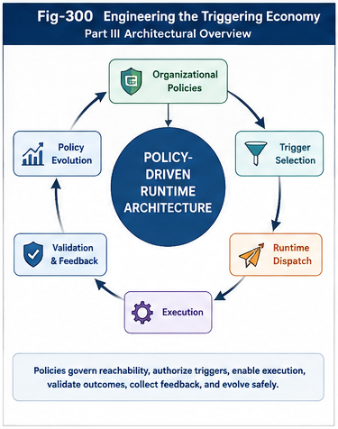

# Part III — Policy-Driven Runtime Architecture

## Engineering the Triggering Economy

Part III translates the theoretical and economic foundations of the Triggering Economy into an executable software architecture.

Part I established policy as a computational primitive.

Part II established triggering as the operational currency of intelligence and introduced the Triggering Economy.

Part III addresses the engineering question:

> **How can organizational policies govern, activate, validate, and evolve runtime computation in a practical system?**

The answer is **Policy-Driven Runtime Architecture**.

This part defines the runtime pipeline, policy engine, triggering mechanisms, organizational graphs, validation structures, feedback systems, evolution controls, APIs, and reference architecture required to implement Policy-Driven Organizational Synthesis as a practical computational framework.

---



---

## Part III Thesis

> **Policy is executable organization.**

A policy-driven runtime does not treat organizational policy as documentation, configuration, or administrative guidance alone.

It treats policy as active runtime infrastructure capable of determining:

* what computation may execute,
* which computational candidate is eligible,
* what runtime authority may be granted,
* which path should be selected,
* how execution should be dispatched,
* what validation is required,
* which feedback may influence future policy.

Part III therefore moves PDOS from organizational theory to Runtime Organizational Computing.

---

## From the Triggering Economy to Runtime Architecture

Part II introduced the Triggering Economy.

Part III provides its foundational machinery.

```text
Triggering Economy
        │
        ▼
Organizational Policies
        │
        ▼
Policy Runtime Engine
        │
        ▼
Trigger Selection
        │
        ▼
Runtime Dispatch
        │
        ▼
Execution
        │
        ▼
Validation and Feedback
        │
        ▼
Controlled Policy Evolution
```

The Triggering Economy defines the value of runtime activation.

Policy-Driven Runtime Architecture defines how that activation is implemented.

---

## Runtime Organizational Pipeline

The engineering backbone of Part III is the Organizational Runtime Pipeline.

```text
Runtime Request
      │
      ▼
Context Construction
      │
      ▼
Organizational Resolution
      │
      ▼
Policy Evaluation
      │
      ▼
Candidate Discovery
      │
      ▼
Trigger Selection
      │
      ▼
Runtime Dispatch
      │
      ▼
Execution
      │
      ▼
Validation
      │
      ▼
Feedback Collection
      │
      ▼
Policy Evolution
```

This pipeline converts runtime demand into validated organizational evidence.

It also forms a closed loop through which future runtime behavior can improve.

---

## Core Architectural Separations

Part III introduces several strict engineering separations.

### Policy versus Execution

Policies govern computation.

Execution units perform computation.

A component should not gain organizational authority merely because it possesses computational capability.

### Trigger Selection versus Runtime Dispatch

Trigger Selection determines:

> **What should become active?**

Runtime Dispatch determines:

> **How should that selected computation enter execution?**

### Execution versus Validation

Execution produces a result.

Validation determines whether the result is organizationally acceptable.

### Feedback versus Policy Evolution

Feedback provides evidence.

It does not directly become active policy.

### Capability versus Authority

A computational unit may be able to perform a task without being permitted to perform it under the current runtime context.

These separations make runtime organization observable, governable, testable, and secure.

---

## Runtime Authority

Every significant trigger transfers runtime authority.

That authority may include permission to:

* access data,
* invoke services,
* consume resources,
* modify state,
* call downstream agents,
* create additional triggers,
* persist results,
* request human approval.

Part III treats runtime authority as an explicit engineering object.

```text
Authority Grant
├── Governing Policy
├── Actor
├── Allowed Operations
├── Data Scope
├── Resource Scope
├── Cost Limit
├── Expiration
├── Downstream Delegation
└── Revocation Conditions
```

Authority should remain:

* explicit,
* minimal,
* scoped,
* time-bounded,
* traceable,
* revocable.

---

## Runtime Organizational Graphs

Policy-driven systems operate over organizational relationships rather than flat component lists.

The Runtime Organizational Graph represents:

* organizational scopes,
* policies,
* actors,
* triggers,
* agents,
* Brain Units,
* services,
* tools,
* models,
* validators,
* resources,
* runtime paths,
* results,
* feedback.

The graph distinguishes:

```text
Potential Organizational Structure
        from
Active Runtime Structure
        from
Actual Execution Structure
```

Potential connectivity does not imply runtime reachability.

A path becomes runtime-reachable only when:

```text
Runtime Reachability
=
Structural Path
+
Policy Permission
+
Authority
+
Runtime Conditions
+
Resource Availability
```

This principle is called **Selective Runtime Reachability**.

---

## Validation before Learning

A runtime result should not influence future policy merely because execution completed.

A result may be:

* technically correct,
* organizationally unauthorized,
* structurally invalid,
* too expensive,
* insecure,
* unsuitable for downstream triggering.

Part III therefore places validation before organizational learning.

```text
Execution
    │
    ▼
Validation
    │
    ▼
Accepted Organizational Feedback
    │
    ▼
Policy Review and Evolution
```

The central principle is:

> **Operational success is not organizational acceptance.**

---

## No Direct Self-Modification

Part III explicitly rejects unrestricted runtime self-modification.

There is no direct path from execution success to active policy change.

```text
Validated Feedback
      │
      ▼
Evidence Aggregation
      │
      ▼
Structural-Delta Analysis
      │
      ▼
Policy Evolution Proposal
      │
      ▼
Validation and Simulation
      │
      ▼
Approval
      │
      ▼
Shadow or Canary Deployment
      │
      ▼
Monitoring
      │
      ├── Promotion
      └── Rollback
```

Every policy evolution should be:

* evidence-based,
* versioned,
* scoped,
* validated,
* approved,
* observable,
* reversible.

---

## Architectural Planes

The PDOS Reference Runtime Architecture contains five primary planes.

### 1. Interaction and Request Plane

Accepts runtime demand from:

* users,
* systems,
* events,
* agents,
* sensors,
* schedules,
* external organizations.

### 2. Organizational Governance Plane

Contains:

* Runtime Context Builder,
* Organizational Scope Resolver,
* Runtime Organizational Graph,
* Policy Repository,
* Policy Runtime Engine,
* Authority Service.

### 3. Triggering and Dispatch Plane

Contains:

* Candidate Repository,
* Candidate Discovery Service,
* Trigger Selector,
* Trigger Decision Store,
* Runtime Dispatcher,
* Endpoint Resolver,
* Resource Manager.

### 4. Execution and Validation Plane

Contains:

* Runtime Executor,
* Execution Adapters,
* Runtime State Manager,
* Result Store,
* Validation Engine,
* Validator Registry.

### 5. Feedback and Evolution Plane

Contains:

* Runtime Trace Store,
* Feedback Collector,
* Feedback Repository,
* Structural Delta Analyzer,
* Policy Evolution Manager,
* Simulation Environment,
* Deployment and Rollback Manager.

---

## Cross-Cutting Controls

Several architectural controls span every runtime plane.

### Security and Authority

Controls:

* identity,
* policy scope,
* permission,
* delegation,
* revocation,
* tenant isolation.

### Observability and Audit

Preserves:

* Trace IDs,
* Decision Traces,
* Runtime Graphs,
* authority paths,
* failure paths,
* policy histories.

### Versioning and Replay

Versions:

* policies,
* graphs,
* candidates,
* validators,
* APIs,
* execution adapters,
* runtime traces.

### Cost and Resource Control

Measures:

* Triggering Cost,
* Execution Cost,
* Validation Cost,
* total runtime economics.

### Failure, Fallback, and Recovery

Defines:

* retry,
* fallback,
* reselection,
* escalation,
* cancellation,
* rollback.

---

## Runtime API Sequence

Part III defines an API-first runtime architecture.

```text
RuntimeRequest
      ↓
RuntimeContext
      ↓
PolicyDecision
      ↓
TriggerDecision
      ↓
DispatchRequest
      ↓
RuntimeResult
      ↓
ValidationResult
      ↓
OrganizationalFeedback
      ↓
PolicyEvolutionProposal
```

Each contract represents a distinct organizational boundary.

The architecture should preserve these boundaries even when implemented within a single process.

---

## Part III Papers

| ID           | Title                                  | Primary Contribution                                                                                    |
| ------------ | -------------------------------------- | ------------------------------------------------------------------------------------------------------- |
| **PDOS-201** | Engineering the Triggering Economy     | Establishes Policy-Driven Runtime Architecture as the engineering foundation of the Triggering Economy. |
| **PDOS-202** | Organizational Runtime Pipeline        | Defines the complete runtime sequence from request to policy evolution.                                 |
| **PDOS-203** | Policy Runtime Engine                  | Defines executable policy evaluation and structured Policy Decisions.                                   |
| **PDOS-204** | Trigger Selection and Dispatch         | Separates runtime selection from routing and execution preparation.                                     |
| **PDOS-205** | Runtime Organizational Graphs          | Defines policy-governed runtime structure and Selective Runtime Reachability.                           |
| **PDOS-206** | Organizational Feedback and Validation | Establishes validation as the control boundary before organizational learning.                          |
| **PDOS-207** | Runtime Policy Evolution               | Defines controlled, versioned, scoped, validated, and reversible policy change.                         |
| **PDOS-208** | Organizational Runtime APIs            | Defines the engineering contracts connecting runtime components.                                        |
| **PDOS-209** | Reference Runtime Architecture         | Integrates all Part III components into a complete runtime blueprint.                                   |
| **PDOS-210** | Summary                                | Consolidates the engineering principles and implementation path of Part III.                            |

---

## Recommended Reading Path

### For Readers New to Part III

Begin with:

1. **PDOS-201 — Engineering the Triggering Economy**
2. **PDOS-202 — Organizational Runtime Pipeline**
3. **PDOS-209 — Reference Runtime Architecture**
4. **PDOS-210 — Summary**

This sequence provides the fastest architectural overview.

### For Software Architects

Read:

1. PDOS-201
2. PDOS-202
3. PDOS-203
4. PDOS-204
5. PDOS-205
6. PDOS-209

### For Runtime and Infrastructure Engineers

Read:

1. PDOS-202
2. PDOS-204
3. PDOS-205
4. PDOS-208
5. PDOS-209

### For Governance, Safety, and QA Engineers

Read:

1. PDOS-203
2. PDOS-206
3. PDOS-207
4. PDOS-209

### For Reference-Implementation Developers

Read all papers in numerical order.

---

## Part III Figures

| Figure      | Title                                                 | Primary Role                             |
| ----------- | ----------------------------------------------------- | ---------------------------------------- |
| **Fig-300** | Engineering the Triggering Economy                    | Part III architectural overview          |
| **Fig-301** | Organizational Runtime Pipeline                       | Complete runtime sequence                |
| **Fig-302** | Policy Runtime Engine                                 | Policy evaluation and governance         |
| **Fig-303** | Trigger Selection and Dispatch                        | Runtime activation core                  |
| **Fig-304** | Runtime Organizational Graphs                         | Policy-governed organizational structure |
| **Fig-305** | Organizational Feedback and Validation                | Validation and feedback control loop     |
| **Fig-306** | Runtime Policy Evolution                              | Controlled policy-evolution lifecycle    |
| **Fig-307** | Organizational Runtime APIs                           | API contracts and component boundaries   |
| **Fig-308** | Reference Runtime Architecture                        | Complete engineering blueprint           |
| **Fig-309** | Part III Summary — Policy-Driven Runtime Architecture | Integrated runtime loop and summary      |

---

## Core Figures

Readers seeking a visual introduction should begin with:

```text
Fig-300
Engineering the Triggering Economy
        │
        ▼
Fig-301
Organizational Runtime Pipeline
        │
        ▼
Fig-308
Reference Runtime Architecture
        │
        ▼
Fig-309
Part III Summary
```

These four figures provide the complete architectural story of Part III.

---

## Engineering Figures

The following figures describe the central runtime mechanisms:

```text
Fig-302
Policy Runtime Engine

Fig-303
Trigger Selection and Dispatch

Fig-304
Runtime Organizational Graphs

Fig-307
Organizational Runtime APIs
```

---

## Control and Evolution Figures

The following figures describe safe organizational learning:

```text
Fig-305
Organizational Feedback and Validation

Fig-306
Runtime Policy Evolution
```

Together, they establish:

> **Validation before learning, and reversible evolution after validation.**

---

## Runtime Invariants

A conforming PDOS runtime should preserve several architectural invariants.

### No Execution without a Trigger Decision

Every governed execution must have an explicit activation record.

### No Trigger Decision without a Policy Decision

Every activation must have organizational authority.

### No Silent Authority Amplification

Downstream authority must remain within the approved grant.

### No Policy Learning from Unvalidated Evidence

Raw execution cannot directly modify policy.

### No Active Policy without Version and Approval

Runtime behavior must remain reproducible.

### No Fallback outside Approved Paths

Dispatch failure cannot authorize arbitrary substitution.

### No Hidden Runtime Path

Policy, selection, dispatch, execution, validation, and fallback must remain traceable.

---

## Minimal Reference Implementation

The smallest useful PDOS runtime may include:

```text
RuntimeContextBuilder

OrganizationalScopeResolver

PolicyEngine

CandidateRepository

TriggerSelector

RuntimeDispatcher

RuntimeExecutor

ValidationEngine

FeedbackCollector
```

A top-level coordinator invokes these components in sequence.

The first implementation does not require:

* autonomous policy learning,
* distributed microservices,
* graph databases,
* open federation,
* advanced model-based optimization.

It requires correct architectural boundaries and complete runtime tracing.

---

## Suggested Java Package Structure

A Java-oriented reference implementation may use:

```text
com.dbm.pdos
├── api
├── request
├── context
├── organization
├── policy
├── authority
├── candidate
├── trigger
├── dispatch
├── execution
├── validation
├── feedback
├── evolution
├── observability
├── audit
├── event
├── storage
└── demo
```

The package structure should reflect organizational responsibilities rather than technical convenience alone.

---

## Incremental Implementation Roadmap

### Stage 1 — Deterministic Local Runtime

Implement:

* Runtime Request,
* Runtime Context,
* static policies,
* deterministic Trigger Selection,
* local execution,
* basic validation,
* runtime trace.

### Stage 2 — Policy Runtime Engine

Add:

* policy scope,
* inheritance,
* conflict resolution,
* Policy Decisions,
* explanation.

### Stage 3 — Runtime Organizational Graph

Add:

* typed nodes and edges,
* policy-governed reachability,
* graph-based candidate discovery.

### Stage 4 — Trigger Selection and Dispatch

Add:

* candidate ranking,
* Trigger Decisions,
* Dispatch Requests,
* fallback,
* cancellation,
* asynchronous execution.

### Stage 5 — Feedback and Validation

Add:

* validators,
* Structural Delta,
* Feedback Repository,
* Triggering Cost metrics.

### Stage 6 — Controlled Policy Evolution

Add:

* proposals,
* simulation,
* approval,
* shadow deployment,
* canary deployment,
* rollback.

### Stage 7 — Distributed and Federated Runtime

Add:

* event transport,
* distributed execution,
* Trust Gateways,
* federated capability projections.

---

## Relationship to the Triggering Economy

Part III provides engineering representations for the major Part II concepts.

| Triggering Economy Concept    | Part III Engineering Representation                 |
| ----------------------------- | --------------------------------------------------- |
| Triggering as Currency        | Trigger Decision                                    |
| Triggering Cost               | Stage-level runtime metrics                         |
| Organizational Policy         | Policy Decision                                     |
| Runtime Authority             | Authority Grant                                     |
| Triggering Agent              | Governed execution candidate                        |
| Triggering Service            | Dispatchable runtime capability                     |
| Personal Triggering Economy   | Local policy and Brain Unit runtime                 |
| Enterprise Triggering Economy | Scoped governance, audit, and distributed execution |
| Open Triggering Ecosystem     | Federated Trust Gateway and capability projection   |

Part II defines the economic architecture.

Part III defines the runtime architecture.

---

## Relationship to Structural Intelligence

Part III provides implementation positions for the broader Structural Intelligence framework.

| Framework | Role in Policy-Driven Runtime Architecture                              |
| --------- | ----------------------------------------------------------------------- |
| **SRMS**  | Structural candidate and path recognition                               |
| **FTRIA** | Runtime invariant operators                                             |
| **SRAI**  | Structural runtime-intelligence coordination                            |
| **GTDO**  | Computational groups, dispatch trees, and call paths                    |
| **FTRI**  | Event, Actor, Trigger, and runtime switching                            |
| **RCP**   | Authority, activation, selective reachability, and switching primitives |
| **CKOI**  | Reusable computational knowledge assets                                 |
| **PDOS**  | Organizational policy, runtime governance, feedback, and evolution      |

PDOS serves as the organizational integration layer.

It does not replace these frameworks.

It provides the runtime architecture through which they can cooperate.

---

## Engineering Principles

Part III can be summarized through the following engineering principles.

### Organization before Execution

Runtime demand should be organized before computational resources are activated.

### Policy before Trigger

Every significant runtime activation should be supported by explicit organizational policy.

### Trigger before Dispatch

The decision of what should run must remain separate from how it is invoked.

### Capability Is Not Authority

A component may be capable without being permitted.

### Potential Connectivity Is Not Runtime Reachability

Runtime paths require policy, authority, conditions, and resources.

### Validation before Learning

Execution evidence must be validated before influencing policy.

### Feedback Is Not Policy

Feedback may justify a proposal, but it does not directly become active governance.

### Every Decision Is Traceable

Policy, trigger, dispatch, execution, validation, and evolution should remain inspectable.

### Every Evolution Is Reversible

Policy and graph changes must support versioning and rollback.

### Organizational Semantics before Technology Choice

The architecture should not depend on one model, programming language, graph database, cloud provider, or agent framework.

---

## Part III in One Runtime Loop

```text
Organize
    │
    ▼
Govern
    │
    ▼
Select
    │
    ▼
Dispatch
    │
    ▼
Execute
    │
    ▼
Validate
    │
    ▼
Learn
    │
    ▼
Evolve
```

This loop is the operational core of Policy-Driven Runtime Architecture.

---

## Part III in One Sentence

> **Part III transforms the Triggering Economy into an executable runtime architecture in which organizational policies govern reachability, authority, trigger selection, dispatch, execution, validation, feedback, and reversible policy evolution.**

---

## Closing Statement

The future of intelligent systems will not be determined only by the scale of models or the abundance of computational resources.

It will increasingly depend on whether those resources can be organized, governed, activated, validated, and improved through explicit runtime architecture.

Policy-Driven Runtime Architecture provides that foundation.

It transforms organizational policy into executable governance.

It transforms triggering into an explicit and observable runtime decision.

It transforms execution into a validated organizational process.

It transforms feedback into structured evidence.

It transforms evolution into controlled and reversible improvement.

Part III therefore establishes the foundational engineering architecture required to build the Triggering Economy as a practical Runtime Organizational Computing system.
