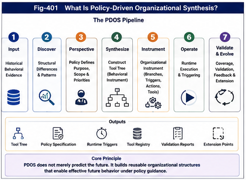

# PDOS-401 — What Is Policy-Driven Organizational Synthesis?

## Abstract

Policy-Driven Organizational Synthesis (PDOS) is a computational framework for discovering structural regularities from historical behavioral data and synthesizing policy-guided operational superstructures.

Unlike conventional systems that primarily produce predictions, rankings, classifications, summaries, or isolated recommendations, PDOS produces reusable organizational instruments. These instruments preserve relevant structural differences, organize them under an explicit policy perspective, and support future runtime triggering, decision-making, feedback, validation, and structural evolution.

The defining output of PDOS is therefore not merely knowledge about a domain. It is an executable organizational structure constructed from knowledge.

This distinction places PDOS between knowledge discovery and runtime intelligence. Historical data provides evidence. Structural analysis identifies differences, branches, conditions, and recurring behavioral patterns. Policy determines which relationships should be emphasized, preserved, separated, connected, or operationalized. Organizational synthesis then constructs a superstructure capable of guiding future behavior.

PDOS can therefore be summarized as:

> Historical behavior transformed into policy-guided organizational infrastructure.

Its long-term importance lies in three properties:

1. **Automation** — organizational instruments can be generated and updated with reduced manual construction.
2. **Structural extension** — generated structures can grow through new branches, policies, triggers, and runtime modules.
3. **Scalability** — many domain instruments can be generated, compared, composed, and evolved into larger organizational ecologies.

---



---

## 1. Why a Formal Definition Is Necessary

PDOS may initially appear similar to several established forms of computation:

* knowledge organization,
* decision-tree construction,
* rule induction,
* workflow generation,
* policy optimization,
* program synthesis,
* planning,
* agent orchestration,
* predictive modeling,
* or large-scale data analysis.

PDOS may use elements related to all of these, but it is not reducible to any one of them.

A knowledge base stores information.

A prediction model estimates an output.

A workflow specifies an existing sequence.

A rule engine applies predefined conditions.

A planner searches for a path toward a goal.

A program synthesizer constructs executable logic under a specification.

PDOS addresses a different problem:

> How can historical background, behavior, and outcome data be transformed into a reusable organizational structure that supports future policy-guided runtime behavior?

The central object is not an isolated answer.

The central object is an **organizational superstructure**.

This superstructure may contain:

* structural difference trees,
* behavioral branches,
* policy priorities,
* triggering conditions,
* runtime paths,
* decision boundaries,
* exception structures,
* feedback channels,
* validation mechanisms,
* versioned organizational modules,
* and future extension points.

A formal definition is therefore required to distinguish PDOS from systems that merely extract information or optimize a single output.

---

## 2. Formal Definition

**Policy-Driven Organizational Synthesis (PDOS)** is a computational framework that transforms historical behavioral evidence into reusable, policy-guided organizational superstructures.

A PDOS process typically performs the following operations:

1. collects or receives structured and unstructured evidence describing background, behavior, and outcome;
2. discovers structural differences, recurring conditions, branches, transitions, and behavioral regularities;
3. applies an explicit policy perspective that determines organizational relevance and priority;
4. synthesizes selected structures into an operational superstructure;
5. exposes the resulting structure for runtime triggering, decision support, execution, feedback, validation, and evolution.

The output of PDOS is called an **organizational instrument** when it can be reused to guide future behavior within a domain.

A more compact definition is:

> PDOS is the policy-guided synthesis of operational organization from historical behavioral structure.

A broader definition is:

> PDOS is a computational method for converting historical experience into extensible runtime infrastructure.

---

## 3. The Core Input: Background, Behavior, and Result

PDOS is especially suited to domains in which data contains a strong sense of movement.

Such data does not merely describe static objects. It describes situations in which something happened.

A minimal behavioral record contains three major elements:

### 3.1 Background

The background describes the conditions under which an action or event occurred.

Examples include:

* economic conditions before an interest-rate decision;
* battlefield conditions before a military deployment;
* market conditions before an investment action;
* institutional conditions before a regulatory change;
* technical and commercial conditions before adoption of a new technology;
* environmental conditions before a robot changes behavior;
* system conditions before software changes runtime paths.

Background may contain:

* state,
* environment,
* constraints,
* available resources,
* actors,
* incentives,
* risks,
* dependencies,
* and prior events.

### 3.2 Behavior

Behavior describes what was done.

Examples include:

* raising or lowering interest rates;
* deploying a particular military unit;
* buying, selling, hedging, or holding;
* adopting or rejecting a technology;
* switching runtime channels;
* selecting a workflow;
* changing an organizational policy;
* invoking a tool or agent.

Behavior is important because PDOS does not study conditions in isolation. It studies conditions in relation to actions.

### 3.3 Result

The result describes what followed.

Examples include:

* inflation changes,
* employment changes,
* market reactions,
* operational success or failure,
* cost,
* delay,
* risk reduction,
* strategic advantage,
* unintended consequences,
* structural adaptation,
* or future path dependence.

The background–behavior–result structure allows PDOS to discover not only correlation, but operational organization.

---

## 4. From Historical Data to Structural Regularity

Historical data is not itself an organizational instrument.

A large dataset may contain millions of events and still fail to provide usable behavioral guidance.

PDOS therefore begins with structural discovery.

The purpose of structural discovery is not merely to find average similarity. It is to identify operationally meaningful differences.

These may include:

* which background differences changed behavior;
* which behavior differences changed results;
* which combinations produced stable outcomes;
* which rare exceptions were decisive;
* which branches should remain separated;
* which conditions triggered a new operational mode;
* which apparent similarities concealed different consequences;
* and which recurring structures can be reused.

This process may generate:

* difference trees,
* condition hierarchies,
* branch structures,
* causal candidates,
* runtime state distinctions,
* action classes,
* failure boundaries,
* and trigger candidates.

The goal is not to eliminate all differences.

The goal is to preserve the differences required for future organization.

---

## 5. Why Policy Is Necessary

Historical data rarely determines a single useful organizational structure.

The same evidence can support multiple valid perspectives.

For example, the same economic history may be organized around:

* inflation control,
* employment,
* financial stability,
* currency strength,
* long-term growth,
* distributional effects,
* or crisis resilience.

The same military history may be organized around:

* territorial control,
* force preservation,
* speed,
* deterrence,
* logistics,
* technological superiority,
* or civilian-risk reduction.

The same market history may be organized around:

* return,
* drawdown,
* liquidity,
* volatility,
* capital preservation,
* timing,
* or robustness under regime change.

Data can reveal relationships.

Data alone cannot decide which relationships deserve organizational authority.

That choice requires policy.

In PDOS, policy functions as an explicit control layer that determines:

* what the structure is for;
* which outcomes matter;
* which risks must be preserved;
* which branches must remain visible;
* which tradeoffs are acceptable;
* which exceptions require independent treatment;
* which triggers should have authority;
* and which future behaviors the instrument should support.

Policy is therefore not an afterthought.

It is a computational primitive of organizational synthesis.

---

## 6. Policy as Perspective

A policy is more than an objective function.

It is a perspective through which evidence is selected and organized.

Different perspectives may generate different tool trees from the same historical data.

This is not necessarily a defect.

It is a consequence of organizational purpose.

A policy perspective may determine:

* which variables become primary nodes;
* which differences become branches;
* which results are interpreted as success or failure;
* which anomalies are preserved;
* which time horizons matter;
* which tradeoffs are exposed;
* and which runtime paths are allowed.

PDOS therefore does not claim to generate a view from nowhere.

It generates an organizational structure from an explicit perspective.

This makes policy authority visible and inspectable.

Traditional systems often embed perspective implicitly inside:

* labels,
* training objectives,
* reward functions,
* ranking criteria,
* model architecture,
* data selection,
* or human evaluation.

PDOS instead treats perspective as a named and testable part of the synthesis process.

---

## 7. The Meaning of Organizational Synthesis

Organization is not equivalent to grouping.

Synthesis is not equivalent to summarization.

Organizational synthesis means constructing a larger operational structure from discovered relationships while preserving the differences required for runtime use.

The synthesized structure may combine:

* multiple evidence sources,
* multiple local patterns,
* multiple decision branches,
* multiple trigger conditions,
* multiple policy priorities,
* multiple runtime modules,
* and multiple validation channels.

The result is a **superstructure** because it is built above the original local structures.

A superstructure does not merely contain the source material.

It determines how source structures can be:

* reached,
* selected,
* combined,
* activated,
* inhibited,
* validated,
* updated,
* and extended.

This is why PDOS is an organizational synthesis framework rather than a knowledge extraction framework.

---

## 8. Structure-Preserving Superstructure Construction

PDOS must preserve relevant structure while building a higher-level organization.

This creates a fundamental engineering tension.

If synthesis preserves too little, important branches collapse into averages.

If synthesis preserves too much, the output becomes a large, unstructured archive.

The purpose of PDOS is therefore not maximal preservation.

It is **policy-relevant structural preservation**.

A successful PDOS superstructure should preserve:

* decisive differences,
* reusable conditions,
* exception branches,
* action alternatives,
* trigger boundaries,
* outcome distinctions,
* uncertainty,
* and extension points.

At the same time, it should compress:

* redundant cases,
* repeated local patterns,
* irrelevant variation,
* duplicated logic,
* and structurally equivalent paths.

PDOS can therefore be understood as a form of organizational compression.

It compresses historical experience without reducing it to a single metric or trajectory.

---

## 9. The Output: Organizational Instruments

The primary output of PDOS is an organizational instrument.

An organizational instrument is a reusable structure that guides future behavior.

It may take the form of:

* a policy tree,
* a strategy tree,
* a trigger tree,
* a runtime dispatch structure,
* a decision superstructure,
* a tool-selection organization,
* a domain action architecture,
* or a network of cooperating organizational modules.

An organizational instrument differs from a static report because it can be used repeatedly.

It differs from a prediction because it can support multiple outcomes and branches.

It differs from a fixed workflow because it can respond to changing conditions.

It differs from a conventional decision tree because it may include:

* multiple perspectives,
* runtime feedback,
* evolving structure,
* versioning,
* structural validation,
* and recursive composition.

An organizational instrument is not necessarily fully autonomous.

It may support:

* human decision-makers,
* AI agents,
* hybrid teams,
* software systems,
* robots,
* institutions,
* or distributed runtime ecologies.

---

## 10. PDOS as Tool Construction

PDOS may be described as a tool-construction framework, but this statement requires precision.

Existing AI systems already construct or discover important computational tools.

Examples include:

* attention mechanisms,
* learned representations,
* routing operators,
* generated code,
* plans,
* workflows,
* and tool-use sequences.

PDOS does not claim that earlier AI systems cannot create tools.

Its distinctive aim is the synthesis of **domain-specific organizational instruments**.

A computational operator answers:

> How can this computation be performed?

An organizational instrument answers:

> How should domain knowledge, decisions, triggers, actions, and feedback be organized for repeated future use?

Transformer operators such as KQV and attention are foundational computational machinery.

PDOS operates at another level:

* it organizes domain behavior;
* constructs policy-guided runtime structures;
* and connects computational capabilities into reusable operational systems.

The relationship is complementary.

Computational infrastructure can support PDOS.

PDOS can organize computational infrastructure into domain instruments.

---

## 11. PDOS and Gap Bridging

Many AI systems are designed to bridge gaps.

They infer missing values, predict continuations, reconstruct incomplete signals, or map observations into smooth latent representations.

These methods are powerful.

However, gap bridging and organizational synthesis preserve different properties.

Gap bridging often seeks continuity.

PDOS often seeks structure.

Gap bridging may compress many examples into:

* a curve,
* a probability,
* a trajectory,
* an embedding,
* or a predicted continuation.

PDOS seeks to preserve:

* branching,
* exceptions,
* structural alternatives,
* triggering conditions,
* and future growth paths.

This distinction matters because historical data may contain latent organizational extension.

A branch that appears statistically minor may later become strategically decisive.

A discontinuity may represent:

* a regime change,
* a new policy,
* a new actor,
* a new tool,
* a new failure mode,
* or a new organizational opportunity.

PDOS therefore treats some gaps and differences as information to preserve, rather than defects to erase.

---

## 12. Runtime Triggering

A PDOS structure becomes operational when it supports runtime triggering.

Runtime triggering determines which part of an organizational instrument becomes active under current conditions.

A simplified process is:

1. observe the current background;
2. map the background into the organizational structure;
3. identify relevant branches and constraints;
4. apply active policy;
5. select or construct a runtime path;
6. trigger an action, recommendation, tool, or further analysis;
7. collect the result;
8. feed the result back into validation and evolution.

This separates construction time from runtime.

Historical evidence is used to build the instrument.

Current evidence is used to activate the instrument.

The resulting structure can therefore be reused without reconstructing the entire system for every new case.

---

## 13. Feedback, Validation, and Evolution

PDOS is incomplete without feedback.

An organizational instrument must be tested against future behavior.

Feedback may reveal:

* missing branches,
* incorrect conditions,
* narrow perspectives,
* obsolete policies,
* weak triggers,
* duplicated paths,
* unstable outcomes,
* hidden exceptions,
* or new structural opportunities.

Validation in PDOS is broader than predictive accuracy.

It may include:

* branch coverage,
* exception coverage,
* structural consistency,
* runtime usefulness,
* policy alignment,
* perspective diversity,
* future compatibility,
* rollback safety,
* and extension capacity.

The result of validation may be:

* parameter adjustment,
* threshold adjustment,
* branch revision,
* new policy creation,
* trigger replacement,
* perspective expansion,
* local restructuring,
* or synthesis of a new superstructure.

This makes PDOS capable of organizational evolution.

---

## 14. Major Use Cases

PDOS is intended as an open-domain framework.

### 14.1 Monetary Policy

Historical inputs may include:

* inflation,
* employment,
* credit conditions,
* asset prices,
* exchange rates,
* political conditions,
* prior rate decisions,
* and downstream effects.

PDOS may synthesize multiple policy instruments oriented toward:

* inflation control,
* employment stability,
* crisis response,
* financial-system resilience,
* or long-term growth.

### 14.2 Military and Strategic Operations

Historical inputs may include:

* terrain,
* force composition,
* logistics,
* weapons,
* command structure,
* timing,
* adversary behavior,
* operational decisions,
* and outcomes.

PDOS may construct operational structures for:

* deployment,
* force preservation,
* maneuver,
* supply,
* defense,
* escalation control,
* or strategic adaptation.

### 14.3 Financial Markets

Historical inputs may include:

* prices,
* volume,
* liquidity,
* macroeconomic conditions,
* policy events,
* market regimes,
* investor behavior,
* actions,
* and results.

PDOS may construct instruments for:

* trading,
* risk control,
* hedging,
* portfolio rotation,
* regime detection,
* or capital preservation.

### 14.4 Technology Development

Historical inputs may include:

* scientific maturity,
* infrastructure,
* cost,
* regulation,
* market demand,
* organizational capability,
* adoption strategy,
* and commercial result.

PDOS may synthesize tools for:

* technology selection,
* investment timing,
* deployment strategy,
* adoption pathways,
* and failure-risk management.

### 14.5 Software and AI Runtime

Historical inputs may include:

* system state,
* requests,
* resources,
* failures,
* tool calls,
* runtime paths,
* policy choices,
* and outcomes.

PDOS may synthesize:

* runtime dispatch trees,
* agent organizations,
* policy-controlled workflows,
* failure recovery structures,
* validation paths,
* and evolving tool ecologies.

---

## 15. The Three Defining Properties

The long-term potential of PDOS is based on three major properties.

### 15.1 Automation

PDOS seeks to automate part of the work traditionally required to:

* analyze historical cases,
* extract structural distinctions,
* construct decision structures,
* define runtime paths,
* and maintain organizational knowledge.

Automation reduces the cost of producing domain instruments.

### 15.2 Structural Extension

PDOS outputs are structures rather than terminal scalar results.

A structure can receive:

* new branches,
* new triggers,
* new tools,
* new policies,
* new validation channels,
* and new organizational layers.

This allows PDOS instruments to grow.

### 15.3 Scale

Many organizational instruments can be synthesized in parallel.

They can later be:

* compared,
* composed,
* nested,
* reused,
* versioned,
* specialized,
* and connected into larger ecologies.

Scale therefore comes not only from larger models, but from larger organizations of reusable tools.

---

## 16. What PDOS Is Not

To avoid conceptual overreach, PDOS should not be described as:

* a guaranteed causal-discovery system;
* a universal truth generator;
* a replacement for all predictive modeling;
* an automatically correct decision-maker;
* an objective policy selector;
* a complete ASI architecture;
* or a system that removes the need for human judgment.

Policy can be narrow.

Historical data can be biased.

Structural discovery can be incomplete.

Tool trees can overfit a perspective.

Runtime feedback can be delayed or misleading.

Organizational synthesis can create false confidence if its authority is not properly bounded.

PDOS therefore requires:

* explicit policy declaration,
* provenance,
* multi-perspective comparison,
* structural validation,
* controlled runtime authority,
* versioning,
* rollback,
* and human or institutional governance where appropriate.

---

## 17. PDOS as Organizational Intelligence

PDOS points toward a form of intelligence that is not defined only by representation, prediction, or generation.

It is defined by the ability to construct and evolve organization.

Organizational intelligence includes the ability to:

* identify operationally meaningful differences;
* preserve decisive branches;
* select structures under policy;
* synthesize reusable instruments;
* trigger appropriate runtime paths;
* validate outcomes;
* revise structures;
* and recursively compose tools into larger systems.

This does not imply that PDOS alone constitutes advanced general intelligence.

It suggests that organizational synthesis may be one of the missing capabilities required for future large-scale intelligent systems.

A system that can answer questions is useful.

A system that can use tools is more operational.

A system that can generate domain tools is more extensible.

A system that can validate, combine, and evolve those tools begins to form an organizational ecology.

PDOS is a framework for studying and engineering that transition.

---

## 18. Core Principle

The central principle of PDOS is:

> Knowledge becomes operationally valuable when it can be synthesized into a policy-guided structure that supports future runtime behavior.

This principle leads to a broader statement:

> The primary product of PDOS is not a prediction about the future, but an organizational instrument for acting within it.

And finally:

> PDOS transforms historical behavior into extensible organizational infrastructure.

---

## 19. Summary

Policy-Driven Organizational Synthesis is a framework for converting historical background, behavior, and result data into reusable runtime organization.

Its computational path is:

```text
Historical Behavioral Evidence
        ↓
Structural Difference Discovery
        ↓
Policy Perspective
        ↓
Structure-Preserving Organizational Synthesis
        ↓
Operational Superstructure
        ↓
Runtime Triggering
        ↓
Feedback and Validation
        ↓
Structural Evolution
```

PDOS differs from conventional prediction-centered systems because it does not stop at an output.

It constructs an instrument.

PDOS differs from static knowledge organization because its structures are intended for runtime activation.

PDOS differs from fixed workflow construction because its organization can preserve alternatives, receive feedback, and evolve.

PDOS differs from ordinary tool use because it seeks to synthesize domain-specific organizational instruments.

Its defining direction is:

> From knowledge organization to behavioral instruments, from behavioral instruments to runtime organization, and from runtime organization toward organizational intelligence.
