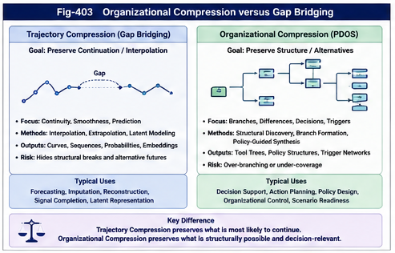

# PDOS-403 — Organizational Compression versus Trajectory Compression

## Abstract

Historical data must be compressed before it can become computationally useful.

The critical question is not whether compression occurs, but what the compression preserves.

Many contemporary algorithms compress observations into trajectories, latent spaces, probability distributions, interpolated functions, predicted continuations, or average behavioral patterns. These methods can be understood broadly as forms of **trajectory compression**. Their primary objective is often to bridge gaps, reduce uncertainty, and represent many observations through a smaller continuous or metric structure.

Policy-Driven Organizational Synthesis (PDOS) pursues a different compression target.

PDOS compresses historical experience into reusable organizational structures. It seeks to preserve decisive differences, alternative branches, triggering conditions, policy distinctions, exception paths, and future extension points. This process may be called **organizational compression**.

The distinction is fundamental:

> Trajectory compression preserves continuation.

> Organizational compression preserves the structure required for future action.

Trajectory compression is often optimized for estimation.

Organizational compression is optimized for operational reuse.

The two approaches are complementary in many systems, but they are not interchangeable. When a gap represents noise, trajectory bridging may be appropriate. When a gap represents a regime boundary, policy change, alternative strategy, or emerging branch, bridging it may destroy the very structure needed for future intelligence.

---



---

## 1. Compression Is Unavoidable

Raw historical data is rarely usable directly.

A domain may contain:

* millions of events,
* thousands of variables,
* incomplete observations,
* repeated cases,
* contradictory outcomes,
* rare exceptions,
* changing environments,
* and multiple policy objectives.

No human or machine can treat every record as an independent operational rule.

Some form of compression is necessary.

Compression reduces complexity by replacing many observations with a smaller representation.

That representation may be:

* a statistic,
* a function,
* a model,
* an embedding,
* a trajectory,
* a tree,
* a graph,
* a set of rules,
* or an organizational instrument.

Every compressed representation loses something.

The central design question is therefore:

> Which information must remain available after compression?

Different answers produce different computational paradigms.

---

## 2. What Is Trajectory Compression?

Trajectory compression represents many observations through a compact description of change, continuation, tendency, or position.

It may produce:

* a fitted curve,
* a regression function,
* a predicted sequence,
* a probability distribution,
* an interpolated path,
* a latent manifold,
* a state transition estimate,
* or a single expected outcome.

A simplified form is:

```text
Observed State A
        ↓
Estimated Continuation
        ↓
Observed or Expected State B
```

The representation attempts to explain or bridge the movement from one state to another.

Trajectory compression is valuable when the objective is to estimate:

* what is missing,
* what comes next,
* what value lies between observations,
* what trend dominates,
* or which continuation is most probable.

Examples include:

* time-series forecasting,
* sequence prediction,
* interpolation,
* regression,
* signal reconstruction,
* motion prediction,
* next-token prediction,
* and some forms of world modeling.

These methods may be highly nonlinear and sophisticated.

The word “trajectory” does not imply that they use only simple curves.

It refers to their functional orientation toward representing or predicting continuation through a state or representation space.

---

## 3. Gap Bridging

A common operation within trajectory compression is **Gap Bridging**.

Gap Bridging begins with incomplete or separated observations.

The algorithm attempts to infer what lies between them.

```text
Observation A
       \
        \
         Unknown Region
        /
       /
Observation B
        ↓
Estimated Bridge
```

Gap Bridging may be appropriate when the missing region is caused by:

* sampling limitations,
* temporary sensor failure,
* unavailable measurements,
* incomplete text,
* missing frames,
* or ordinary uncertainty within a stable process.

In such cases, continuity is a useful prior.

However, continuity is not always neutral.

A bridge implicitly asserts that the observations on both sides belong to a sufficiently coherent process.

That assertion can become a source of information loss.

---

## 4. The Simple-Supported-Beam Analogy

Gap Bridging can be compared to placing a simple-supported beam across two observed endpoints.

The beam connects the sides.

It creates a usable span.

It may provide an efficient approximation of the missing region.

But the beam also introduces a structural assumption:

> The most important relationship between the two endpoints is the span connecting them.

This assumption may suppress other possibilities.

The missing region might contain:

* several branches,
* a change of actor,
* a policy reversal,
* a structural break,
* a hidden constraint,
* a new technology,
* a failure,
* or a transition into an entirely different regime.

The bridge resolves the gap by replacing these unresolved possibilities with one connective structure.

The computation succeeds at continuity.

It may fail at preserving extension potential.

---

## 5. Why Gap Bridging Can Be Lossy

All compression is selective.

Gap Bridging becomes structurally lossy when the algorithm treats a meaningful discontinuity as if it were only missing continuity.

Suppose historical observations contain:

```text
State A
  ├── Path B
  ├── Path C
  ├── Path D
  └── Path E
```

A continuation-centered representation may compress the alternatives into:

```text
State A
    ↓
Expected Path
```

This may improve prediction under ordinary conditions.

However, it may remove:

* minority branches,
* rare but decisive failures,
* alternative policies,
* conditional strategies,
* regime transitions,
* and latent structural options.

The resulting model may preserve the dominant trajectory while losing the organization of alternatives.

This is a form of lossy compression.

The loss is not necessarily measured by reconstruction error.

It is measured by the disappearance of reusable structural distinctions.

---

## 6. Metric Loss versus Structural Loss

Trajectory systems are often evaluated through metric error.

Examples include:

* mean squared error,
* prediction loss,
* likelihood,
* classification accuracy,
* ranking quality,
* or reconstruction distance.

These metrics evaluate whether the compressed representation predicts or reconstructs observations well.

Organizational systems require an additional category of evaluation:

> Structural loss.

Structural loss occurs when compression removes distinctions required for future behavior.

Examples include:

* two different failure modes merged into one category;
* two policies represented by one average response;
* a rare emergency branch removed because it is statistically small;
* a regime change smoothed into a continuous trend;
* an action alternative omitted because it was historically uncommon;
* or an exception treated as noise even though it determines safety.

A representation can have low metric loss and high structural loss.

This is one of the central reasons why prediction quality alone cannot evaluate an organizational instrument.

---

## 7. What Is Organizational Compression?

Organizational compression converts many historical cases into a smaller structure that preserves their operational organization.

Its output may contain:

* difference trees,
* policy branches,
* trigger conditions,
* action alternatives,
* result classes,
* exception paths,
* shared constraints,
* reusable modules,
* and extension points.

A simplified process is:

```text
Historical Cases
        ↓
Difference Discovery
        ↓
Branch Preservation
        ↓
Policy-Guided Organization
        ↓
Reusable Tool Structure
```

The purpose is not to reconstruct every case.

The purpose is to retain enough organization to guide future runtime behavior.

Organizational compression asks:

* Which cases are structurally equivalent?
* Which differences changed behavior?
* Which differences changed results?
* Which branches should remain separate?
* Which conditions deserve triggers?
* Which exceptions require independent paths?
* Which modules can be reused?
* Which future branches should the structure be able to accept?

The compressed result is therefore not one continuation.

It is an organized space of possible behaviors.

---

## 8. Compression of Results versus Compression of Generators

A deeper distinction can be made.

Trajectory compression often compresses historical results.

Organizational compression attempts to compress part of the mechanism that generated those results.

Consider two possible outputs from the same history.

### Output A: Compressed Historical Result

```text
Under Condition X,
Outcome Y is Most Likely
```

### Output B: Compressed Behavioral Generator

```text
Under Condition X:
    if Policy P1 is active → consider Action A;
    if Constraint C appears → enter Branch B;
    if Exception E occurs → trigger Path D;
    validate through Outcome Set R.
```

Output A summarizes what happened.

Output B preserves a reusable organization for generating or selecting future behavior.

This leads to an important principle:

> PDOS does not merely compress history.

> It seeks to compress history’s reusable organizational generator.

This generator is incomplete and provisional.

It is not a perfect causal model.

However, it preserves more of the structure required for action, extension, and future revision.

---

## 9. Continuity and Branching

Trajectory compression and organizational compression make different default commitments.

Trajectory compression tends to prefer continuity.

Organizational compression must permit branching.

Continuity is useful when:

* the governing process remains stable;
* neighboring observations are meaningfully related;
* missing values are ordinary;
* and a smooth approximation is operationally sufficient.

Branching is necessary when:

* different policies produce different behaviors;
* rare conditions activate different rules;
* system modes change;
* actors enter or leave;
* a new technology alters the process;
* constraints become binding;
* or a discontinuity itself carries information.

A branch is not merely a more complicated trajectory.

It represents an organizational choice, separation, or alternative authority.

This is why a tree or graph may preserve information that a single continuous representation does not.

---

## 10. Gap as Error versus Gap as Information

Different computational paradigms interpret gaps differently.

A prediction-centered system may treat a gap as:

* missing information,
* uncertainty,
* sparse sampling,
* or a region requiring estimation.

An organizational system may also ask whether the gap represents:

* a boundary,
* an unresolved branch,
* a change of regime,
* an unavailable action,
* an excluded perspective,
* an institutional separation,
* or an opportunity for new structure.

The gap may therefore be either:

1. an error to bridge;
2. an uncertainty to estimate;
3. a boundary to preserve;
4. or a structural opening to investigate.

PDOS should not assume that every gap is valuable.

It should avoid assuming that every gap is meaningless.

The correct treatment is a policy-guided structural question.

---

## 11. Historical Regularity and Future Extension

A trajectory model usually asks:

> Given the historical path, what continuation is supported?

PDOS asks an additional question:

> What future structures can grow from the historical organization?

This is the problem of extension.

Historical data may contain evidence for:

* stable branches,
* emerging branches,
* dormant alternatives,
* failed strategies,
* underrepresented conditions,
* and previously impossible actions.

A compressed organizational structure can expose these as explicit nodes or extension points.

For example:

```text
Existing Policy Tree
  ├── Normal Operation
  ├── Crisis Operation
  ├── Resource-Constrained Operation
  └── Reserved Extension Point
```

When new evidence arrives, a branch can be:

* added,
* split,
* specialized,
* deprecated,
* or connected to another tool.

This allows the representation to grow externally.

A trajectory can also be retrained or extended.

The difference is that structural extension is explicit in the organizational representation rather than absorbed invisibly into new parameters.

---

## 12. A Monetary-Policy Example

Consider thirty years of central-bank behavior.

A trajectory-compression approach may model:

* inflation trends,
* employment trends,
* rate-change probabilities,
* or expected market reactions.

This may provide strong predictive value.

However, historical monetary policy may include structurally distinct regimes:

* ordinary inflation control;
* recession response;
* financial-crisis intervention;
* liquidity emergency;
* asset-bubble management;
* supply-shock response;
* or currency-defense behavior.

If these regimes are bridged into one average policy function, the representation may obscure why the same inflation level led to different actions under different conditions.

Organizational compression would instead preserve branches such as:

```text
Current Background
  ├── Demand-Driven Inflation
  ├── Supply Shock
  ├── Credit Crisis
  ├── Employment Collapse
  └── Currency Instability
```

Each branch may use different:

* policies,
* actions,
* risk measures,
* triggers,
* and validation criteria.

The output is not necessarily a better one-step forecast.

It is a more reusable policy instrument.

---

## 13. A Military Example

Military history contains many superficially similar situations that differ structurally.

Two operations may share:

* similar force size,
* similar terrain,
* similar objectives,
* and similar timing.

Yet they may differ in:

* logistics,
* command reliability,
* intelligence quality,
* civilian constraints,
* adversary adaptation,
* or political authority.

Trajectory compression may identify a dominant outcome pattern.

Organizational compression may preserve distinct branches for:

* rapid maneuver,
* fortified defense,
* supply vulnerability,
* degraded communication,
* adversary deception,
* or civilian-risk constraints.

A rare failure branch may be statistically small.

It may also be strategically essential.

For operational use, preservation of that branch can be more important than minimizing average prediction error.

---

## 14. A Financial-Market Example

Market history strongly illustrates the danger of assuming stable continuation.

A model may fit:

* price trends,
* volatility patterns,
* correlations,
* liquidity behavior,
* or expected returns.

These relationships can be highly useful within a regime.

However, markets may undergo:

* liquidity breaks,
* policy shocks,
* correlation reversals,
* leverage cascades,
* structural regulation changes,
* or technology-driven trading changes.

A gap or discontinuity may therefore signal a new regime.

Organizational compression can represent:

```text
Market State
  ├── Trend Regime
  ├── Mean-Reversion Regime
  ├── Liquidity Stress
  ├── Policy Shock
  ├── Correlation Breakdown
  └── Unknown or Emerging Regime
```

The unknown branch is especially important.

It prevents the system from forcing every new state into an existing continuation.

---

## 15. A Technology-Development Example

Technology histories are often interpreted through adoption curves.

These curves compress many developments into:

* emergence,
* growth,
* maturity,
* and decline.

This is useful, but technology evolution frequently contains branching.

A technology may succeed through:

* infrastructure readiness,
* manufacturing cost reduction,
* regulatory acceptance,
* ecosystem formation,
* military demand,
* consumer adoption,
* or integration with another technology.

It may fail through different structural routes.

A single trajectory may describe adoption volume.

An organizational instrument can preserve the conditions and strategies that generated different adoption paths.

This makes it more useful for guiding future technology investment and deployment.

---

## 16. Comparison Table

| Dimension               | Trajectory Compression                            | Organizational Compression                          |
| ----------------------- | ------------------------------------------------- | --------------------------------------------------- |
| Primary objective       | Estimate or reconstruct continuation              | Preserve reusable operational organization          |
| Typical output          | Curve, sequence, probability, embedding, forecast | Tree, graph, policy structure, trigger network      |
| Default preference      | Continuity                                        | Branching where operationally meaningful            |
| Treatment of gaps       | Infer or bridge                                   | Inspect, classify, preserve, or bridge              |
| Main compression target | Observed outcomes or state movement               | Behavioral organization and reusable generators     |
| Primary validation      | Prediction or reconstruction quality              | Structural coverage and runtime usefulness          |
| Treatment of exceptions | Often downweighted or modeled as uncertainty      | May receive explicit independent branches           |
| Policy role             | Often implicit in objective or reward             | Explicitly controls synthesis                       |
| Future growth           | Usually through retraining or parameter update    | Through explicit branch, tool, and policy extension |
| Main risk               | Overfitting or poor generalization                | Perspective narrowing or structural overgrowth      |
| Main loss               | Metric information                                | Structural distinctions and extension potential     |
| Best suited for         | Estimation and continuation                       | Reusable decision and runtime organization          |

---

## 17. Why Organizational Compression Is Also Lossy

Organizational compression should not be presented as lossless.

It also removes information.

It may compress:

* minor variations,
* repeated examples,
* structurally equivalent cases,
* low-priority branches,
* weak associations,
* and historical detail.

It can fail by:

* selecting the wrong policy;
* creating artificial branches;
* preserving noise as structure;
* omitting a decisive variable;
* overcomplicating the tool;
* or encoding institutional bias.

The difference is not that organizational compression avoids loss.

The difference is that it chooses a different preservation objective.

It tries to preserve information needed for:

* branching,
* triggering,
* action,
* validation,
* and extension.

This preservation objective must itself be tested.

---

## 18. When Trajectory Compression Is Better

PDOS does not imply that organizational compression should replace all trajectory methods.

Trajectory compression may be preferable when:

* the process is stable and continuous;
* the output is primarily numerical;
* the prediction horizon is short;
* operational branches are minimal;
* missing data is genuinely missing rather than structurally absent;
* or high-frequency estimation is more important than explicit organization.

Examples may include:

* sensor interpolation,
* audio reconstruction,
* short-horizon movement estimation,
* ordinary demand forecasting,
* and local control within a stable operating regime.

In many systems, trajectory models can serve as components inside a PDOS structure.

For example:

```text
Policy Branch
    ↓
Selected Trajectory Model
    ↓
Local Prediction
    ↓
Runtime Action
```

PDOS can organize when and why a particular trajectory model should be used.

---

## 19. When Organizational Compression Is Better

Organizational compression becomes especially valuable when:

* multiple policies are legitimate;
* rare exceptions are decisive;
* regimes change;
* actions have different consequences under similar states;
* runtime authority must be explicit;
* tools must be reused and combined;
* future branches are expected;
* or explanations must expose the structure of decision-making.

These conditions are common in:

* institutional decision systems,
* military operations,
* finance,
* healthcare,
* regulation,
* robotics,
* software runtime,
* scientific strategy,
* and complex organizational management.

The more important the alternatives, exceptions, and policy differences become, the less sufficient a single trajectory is likely to be.

---

## 20. Hybrid Compression

The most capable systems may combine both paradigms.

A hybrid architecture may use trajectory compression for:

* local estimation,
* probability calculation,
* sequence completion,
* parameter forecasting,
* and signal reconstruction.

It may use organizational compression for:

* regime selection,
* policy control,
* branch management,
* model dispatch,
* exception handling,
* and runtime evolution.

A simplified architecture is:

```text
Current Evidence
        ↓
Organizational Structure
        ↓
Policy and Regime Selection
        ↓
Local Trajectory Model
        ↓
Prediction or Estimate
        ↓
Action and Feedback
        ↓
Organizational Validation
```

This relationship is complementary.

Trajectory models can provide strong local computation.

PDOS can determine their structural scope and runtime authority.

---

## 21. Structural Preservation Criteria

A PDOS compression process should explicitly test what has been preserved.

Possible criteria include:

### 21.1 Branch Preservation

Are behaviorally distinct paths still represented?

### 21.2 Exception Preservation

Are rare but important cases visible?

### 21.3 Trigger Preservation

Are the conditions that change runtime behavior retained?

### 21.4 Policy Preservation

Can the structure distinguish different organizational objectives?

### 21.5 Outcome Preservation

Are materially different results kept separate?

### 21.6 Extension Preservation

Can new branches be added without rebuilding the entire system?

### 21.7 Provenance Preservation

Can each branch be traced to evidence and policy choices?

These criteria provide a basis for measuring structural loss.

---

## 22. Structural Loss Tests

A practical validation process may ask:

1. What historical cases no longer have a clear location in the compressed structure?
2. Which exception cases were merged into dominant branches?
3. Which policy changes would require rebuilding the whole tool?
4. Which new events cannot be represented without false similarity?
5. Which branches produce contradictory outcomes under apparently identical conditions?
6. Which decisions depend on information removed during compression?
7. Which runtime failures arise because a gap was bridged rather than preserved?
8. Which alternative perspectives generate substantially different structures?

These tests do not produce one universal score.

They expose where compression has destroyed operational organization.

---

## 23. Unknown Branches and Reserved Structure

A mature organizational instrument should not pretend to cover all futures.

It may explicitly include:

* unknown branches,
* deferred classification,
* human escalation,
* exploratory analysis,
* or reserved extension points.

For example:

```text
Observed Runtime State
  ├── Known Branch A
  ├── Known Branch B
  ├── Known Exception C
  └── Unknown Structure
          ↓
      Investigation
          ↓
      New Branch Candidate
```

This design protects against forced bridging.

It allows the system to recognize that current evidence may not belong to any existing trajectory or policy branch.

The unknown state is not a failure of intelligence.

It is a structural safeguard against false continuity.

---

## 24. From History to Growth Potential

Trajectory compression often preserves the strongest historical regularities.

Organizational compression additionally seeks to preserve historical **growth potential**.

Growth potential includes:

* alternative branches that could become important;
* policy structures that can be recombined;
* triggers that can activate new tools;
* modules that can be reused elsewhere;
* and extension points for unknown future conditions.

This leads to a deeper formulation:

> Trajectory compression preserves what history most strongly predicts.

> Organizational compression preserves what history makes structurally possible.

The first supports continuation.

The second supports construction.

---

## 25. The Externalizing Property of Structure

A metric output tends to terminate.

A structural output can externalize.

It can extend beyond its original scope by receiving:

* another node,
* another branch,
* another tool,
* another policy,
* another actor,
* another validation loop,
* or another organizational layer.

This is why structure can become dynamic.

The structure does not move by itself.

It becomes capable of movement because runtime inputs can activate different paths and feedback can modify the organization.

Organizational compression therefore preserves not only a historical representation, but a substrate for future computation.

---

## 26. Core Principles

The first principle is:

> Compression should be evaluated by what it preserves, not only by how much it reduces.

The second principle is:

> A low prediction error does not guarantee low structural loss.

The third principle is:

> Gaps should be bridged only when continuity is operationally justified.

The fourth principle is:

> Differences, exceptions, and discontinuities may be the starting points of future organization.

The fifth principle is:

> PDOS compresses historical experience into structures that can continue to act, grow, and evolve.

---

## 27. Summary

Trajectory compression and organizational compression solve different problems.

Trajectory compression asks:

> What compact representation best explains or predicts the observed path?

Organizational compression asks:

> What compact structure best preserves the branches, policies, triggers, alternatives, and outcomes required for future behavior?

The contrast can be represented as:

```text
Trajectory Compression

Historical Observations
        ↓
Continuity or Latent Representation
        ↓
Prediction, Reconstruction, or Expected Path
```

```text
Organizational Compression

Historical Behavioral Cases
        ↓
Structural Difference Discovery
        ↓
Policy-Guided Branch Preservation
        ↓
Reusable Organizational Instrument
        ↓
Runtime Triggering and Structural Extension
```

Gap Bridging is powerful when a gap is genuinely part of a continuous process.

It becomes lossy when a gap contains a structural boundary or unrealized branch.

PDOS therefore does not reject bridging.

It places bridging under organizational control.

Its central claim is:

> Historical data should not be compressed so aggressively that its future organizational possibilities disappear.

The broader direction is:

> From compressing trajectories to compressing behavioral generators, and from fitting historical continuation to preserving the structural capacity for future action.
