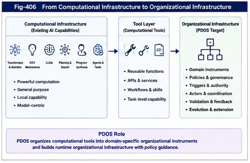

# PDOS-406 — From Computational Tools to Organizational Instruments

## Abstract

Artificial intelligence has already demonstrated a powerful capacity to create, discover, combine, and use tools.

Modern AI systems contain and generate:

* attention mechanisms;
* KQV operators;
* learned representations;
* routing functions;
* code;
* workflows;
* plans;
* search procedures;
* model-generated APIs;
* and tool-use sequences.

For this reason, the claim that future AI will move from “using tools” to “manufacturing tools” requires careful qualification.

The transition is not from a stage in which AI produces no tools to a stage in which tool construction suddenly begins.

The deeper transition is from the construction and use of **computational tools** toward the synthesis of **organizational instruments**.

A computational tool performs or supports a computation.

An organizational instrument structures how knowledge, policies, actors, triggers, decisions, tools, constraints, feedback, and authority are arranged for repeated future use within a domain.

Policy-Driven Organizational Synthesis (PDOS) operates at this organizational level.

It does not replace attention, KQV, large language models, program synthesis, planning, or tool-using agents. It provides a framework for organizing such capabilities into policy-guided domain instruments and runtime ecologies.

The central progression is:

```text
Computational Operators
        ↓
Computational Tools
        ↓
Reusable Computational Infrastructure
        ↓
Domain-Specific Organizational Instruments
        ↓
Runtime Organizational Infrastructure
        ↓
Organizational Intelligence
```

The defining claim is therefore not:

> AI did not manufacture tools before PDOS.

It is:

> PDOS extends AI tool construction from local computational capability toward reusable, policy-guided, structurally extensible organization.

---



---

## 1. Why the Tool Distinction Matters

The word “tool” is broad.

It may refer to:

* a mathematical operator;
* a software library;
* a model;
* a physical device;
* a workflow;
* a decision procedure;
* an institutional process;
* or a complete operational system.

Without distinguishing these levels, several different claims become confused.

For example:

* attention is a tool;
* a compiler is a tool;
* an LLM is a tool;
* a generated program is a tool;
* a trading strategy is a tool;
* a monetary-policy framework is a tool;
* and a multi-agent runtime organization is also a tool.

All of these statements may be valid.

However, they describe different kinds of computational and organizational objects.

PDOS requires a layered vocabulary because its contribution is not simply “more tool use.”

Its contribution concerns what is being organized, what the output can control, and how the output can grow.

---

## 2. Four Tool Levels

A useful distinction contains four levels.

### 2.1 Computational Operator

A computational operator performs a local transformation.

Examples include:

* matrix multiplication;
* attention;
* KQV projection;
* convolution;
* sorting;
* gradient update;
* filtering;
* routing;
* thresholding;
* and structural comparison.

A computational operator answers:

> How is this local computation performed?

---

### 2.2 Computational Tool

A computational tool combines one or more operators into a reusable capability.

Examples include:

* a parser;
* a compiler;
* a search engine;
* a forecasting model;
* a classifier;
* a database;
* an LLM;
* a planner;
* or a code generator.

A computational tool answers:

> What reusable computational capability is available?

---

### 2.3 Domain Instrument

A domain instrument organizes knowledge and computation for a recurring operational purpose.

Examples include:

* a monetary-policy decision instrument;
* a military logistics instrument;
* a market-risk instrument;
* a medical triage instrument;
* a technology-investment instrument;
* or a software recovery instrument.

A domain instrument answers:

> How should this domain be organized for repeated future behavior?

---

### 2.4 Organizational Infrastructure

Organizational infrastructure connects many domain instruments, policies, actors, validation mechanisms, runtime authorities, and feedback loops.

It answers:

> How should many tools and decisions cooperate, compete, trigger, validate, and evolve as a system?

PDOS is primarily concerned with the third and fourth levels.

---

## 3. Transformer as a Tool-Producing Architecture

Transformer systems should be recognized as major tool-producing architectures.

Their importance extends beyond language generation.

Transformer-based systems have introduced or operationalized reusable computational structures such as:

* self-attention;
* KQV decomposition;
* multi-head attention;
* residual processing;
* token-based representation;
* sequence-wide contextualization;
* learned routing;
* and scalable representation transformation.

These structures have been applied across:

* language;
* vision;
* code;
* audio;
* biology;
* robotics;
* and multimodal systems.

This is a genuine form of computational tool construction.

The architecture created a reusable family of operators and systems that could be adapted across domains.

Any theory of future tool-manufacturing AI should acknowledge this history.

---

## 4. KQV as a Computational Superstructure

KQV may be interpreted as more than three matrices.

Within a Transformer block, Query, Key, and Value projections participate in a reusable computational organization.

The structure determines:

* what is seeking information;
* what information can be matched;
* what content can be transferred;
* and how context affects the resulting representation.

At scale, stacked attention layers form a substantial computational superstructure.

They organize:

* representation flow;
* context integration;
* token interaction;
* and feature transformation.

Therefore, it would be inaccurate to claim that current AI lacks superstructures.

Modern models clearly contain them.

The more precise question is:

> What kind of superstructure is being constructed, and what kind of runtime authority does it support?

Transformer superstructures primarily organize representation and computation inside a model.

PDOS superstructures aim to organize domain behavior, policies, tools, triggers, actors, and feedback outside or above a single model.

---

## 5. Internal Computational Structure versus External Organizational Structure

This distinction can be expressed as follows.

### Internal Computational Structure

Organizes:

* features;
* tokens;
* activations;
* representations;
* attention;
* routing;
* and model output.

Its main concern is computational transformation.

### External Organizational Structure

Organizes:

* domain states;
* policies;
* decisions;
* actors;
* tools;
* runtime branches;
* authority;
* validation;
* and institutional or system-level feedback.

Its main concern is operational organization.

The distinction is not absolute.

Some agent systems already extend beyond the model boundary.

Some organizational instruments may contain substantial learned computation.

The point is not to create a rigid separation.

The point is to identify a change in the primary object of synthesis.

---

## 6. Representation Infrastructure

LLMs and Transformers provide powerful representation infrastructure.

They can:

* encode large domains;
* retrieve contextual relations;
* generate explanations;
* translate between forms;
* synthesize code;
* summarize evidence;
* and propose actions.

This infrastructure is highly reusable.

However, representation capability does not automatically determine:

* which policy should govern;
* which branch has runtime authority;
* which tools should be reachable;
* which actor controls the process;
* which exceptions require escalation;
* which result validates the structure;
* or how the organization should evolve.

These are organizational questions.

PDOS does not compete with representation infrastructure.

It seeks to turn representation capability into governed operational organization.

---

## 7. Why Output Generation Is Not Yet Organizational Synthesis

An LLM may generate:

* a decision tree;
* a workflow;
* a policy document;
* a program;
* an agent plan;
* or a list of tool calls.

Such outputs may be useful organizational artifacts.

However, generating an artifact does not by itself establish a PDOS process.

A PDOS instrument requires additional properties:

* explicit policy provenance;
* structural preservation from historical evidence;
* branch and exception coverage;
* runtime trigger definitions;
* authority boundaries;
* validation procedures;
* versioning;
* rollback;
* feedback;
* and extension mechanisms.

A generated tree may be a draft.

An organizational instrument is a governed runtime object.

The distinction resembles the difference between generating code and operating a validated production system.

---

## 8. Tool Use, Tool Generation, and Tool Institutionalization

AI tool development can be divided into three capabilities.

### 8.1 Tool Use

The system selects and invokes an existing tool.

Examples include:

* search;
* calculator use;
* API calls;
* code execution;
* retrieval;
* and database access.

### 8.2 Tool Generation

The system creates a new computational artifact.

Examples include:

* code;
* formulas;
* workflows;
* prompts;
* plans;
* and local decision structures.

### 8.3 Tool Institutionalization

The system turns an artifact into a durable organizational instrument.

This requires:

* declared purpose;
* policy;
* evidence;
* scope;
* runtime interface;
* authority;
* validation;
* maintenance;
* and evolution.

PDOS is especially concerned with the third capability.

It asks how generated tools become reusable organizational infrastructure rather than disposable outputs.

---

## 9. Static Tools and Evolutionary Instruments

A further distinction concerns growth.

Many computational tools are relatively stable.

Their internal implementation may be updated, but their organizational identity remains fixed.

Examples include:

* a sorting library;
* a matrix operator;
* a parser;
* or a specific inference routine.

PDOS instruments are intended to be structurally evolvable.

They may receive:

* new branches;
* new policies;
* new triggers;
* new actors;
* new constraints;
* new evidence;
* new child tools;
* and new validation layers.

This leads to the concept of an **evolutionary organizational instrument**.

Its value lies not only in what it can do now, but in how explicitly it can be extended and revised.

---

## 10. The Difference between Weight Evolution and Organizational Evolution

Modern AI systems evolve primarily through changes to:

* parameters;
* training data;
* reward functions;
* context;
* adapters;
* or prompts.

These changes can produce major behavioral differences.

However, the resulting evolution is often encoded implicitly inside model behavior.

PDOS emphasizes explicit organizational evolution.

Examples include:

```text
Existing Tool Tree
        ↓
Detected Coverage Gap
        ↓
New Branch
        ↓
New Trigger
        ↓
Updated Authority
        ↓
Versioned Instrument
```

This explicitness provides:

* auditability;
* local modification;
* structural comparison;
* rollback;
* and governance.

Parameter evolution and organizational evolution can cooperate.

They should not be treated as identical.

---

## 11. Computational Infrastructure

Computational infrastructure includes the reusable substrate required for large-scale computation.

Examples include:

* hardware;
* operating systems;
* networks;
* databases;
* compilers;
* model runtimes;
* vector stores;
* foundation models;
* and API platforms.

Transformer and LLM systems belong substantially to this layer.

They provide broad computational capacity that can be reused across many applications.

This infrastructure answers:

> What computation can be performed at scale?

It does not necessarily answer:

> How should a specific institution or domain organize its policies, tools, triggers, and authority?

That is the role of organizational infrastructure.

---

## 12. Organizational Infrastructure

Organizational infrastructure provides reusable structures for coordinated behavior.

It may contain:

* policy registries;
* tool registries;
* organizational APIs;
* trigger networks;
* runtime dispatch;
* actor permissions;
* validation services;
* provenance;
* version control;
* rollback;
* and feedback channels.

It answers:

* which tools exist;
* who may use them;
* under which conditions;
* for what purpose;
* with what authority;
* and how their performance changes the organization.

PDOS transforms domain evidence into this level of infrastructure.

---

## 13. A Layered Infrastructure Stack

A simplified stack is:

```text
Physical and Digital Hardware
        ↓
Primitive Computational Operators
        ↓
Software and Model Runtimes
        ↓
Transformers, LLMs, and General Computational Tools
        ↓
Domain-Specific Organizational Instruments
        ↓
Policy-Controlled Runtime Organizations
        ↓
Recursive Organizational Ecology
```

Each layer depends on lower layers.

Higher layers do not invalidate lower layers.

A monetary-policy instrument may use:

* databases;
* statistical models;
* LLMs;
* search;
* simulation;
* and human expertise.

PDOS provides the organization that determines how these components cooperate.

---

## 14. Components versus Equipment

An industrial analogy is useful.

A factory may produce:

* bearings;
* motors;
* processors;
* sensors;
* steel;
* and control circuits.

These are powerful reusable components.

Another factory may combine them into:

* aircraft;
* medical equipment;
* robots;
* vehicles;
* or industrial machines.

Transformer operators resemble highly general computational components.

LLMs resemble broad-purpose computational machines.

PDOS aims to synthesize domain equipment and organizational systems from such capabilities.

The analogy should not be pushed too far.

Its purpose is to clarify the hierarchy:

> A reusable component and a domain instrument can both be tools, while occupying different organizational levels.

---

## 15. Domain Instruments

A domain instrument combines several kinds of content.

It may include:

* domain knowledge;
* historical cases;
* predictive models;
* rules;
* policies;
* tools;
* actors;
* constraints;
* triggers;
* and feedback.

For example, a financial-resilience instrument may call:

* a liquidity model;
* a volatility estimator;
* an LLM-based news analyzer;
* a policy-event detector;
* and a risk-control engine.

The value of the instrument lies not in any one component.

It lies in the organization that determines:

* when each component is used;
* what authority it has;
* how conflicts are resolved;
* and how results affect future structure.

---

## 16. Organizational Instruments as Tool-of-Tools

A PDOS instrument can be a **tool-of-tools**.

It may not perform every local computation internally.

Instead, it organizes access to specialized tools.

A simplified example is:

```text
Runtime Background
        ↓
Policy and Regime Identification
        ↓
Tool Selection
  ├── Forecast Model
  ├── LLM Analyst
  ├── Simulation Engine
  ├── Risk Calculator
  └── Human Review
        ↓
Result Integration
        ↓
Action and Feedback
```

The organizational instrument determines the calling structure.

This makes PDOS compatible with heterogeneous AI.

It can organize:

* symbolic tools;
* statistical tools;
* LLMs;
* databases;
* humans;
* robots;
* and institutional processes.

---

## 17. Why Policy Changes Tool Reachability

In a conventional software system, all available functions may be technically callable.

In an organizational system, technical availability should not imply runtime reachability.

Policy may determine:

* which tools can be invoked;
* which data they may access;
* which actors may authorize them;
* and what actions they may produce.

For example:

```text
Normal Policy
  ├── Advisory Model
  ├── Standard Workflow
  └── Human Approval

Emergency Policy
  ├── Crisis Model
  ├── Fast-Track Trigger
  └── Bounded Automatic Action
```

The tool set changes with policy.

PDOS therefore synthesizes not only a list of tools, but a policy-controlled reachability structure.

---

## 18. Organizational APIs

An organizational instrument should expose interfaces beyond ordinary function calls.

An organizational API may declare:

* purpose;
* required background;
* active policy;
* accepted evidence;
* available branches;
* output authority;
* trigger conditions;
* validation state;
* and rollback path.

A simplified organizational API could include:

```text
Instrument:
Policy Version:
Input State:
Applicable Regimes:
Available Actions:
Authority Level:
Validation Status:
Escalation Path:
Feedback Channel:
```

This makes organizational capability reusable and inspectable.

---

## 19. LLMs inside PDOS

LLMs can serve many roles inside a PDOS architecture.

They may support:

* evidence extraction;
* event normalization;
* semantic comparison;
* policy interpretation;
* branch proposal;
* exception discovery;
* code generation;
* report generation;
* and human interface.

However, an LLM should not automatically control:

* policy authority;
* final branch selection;
* runtime execution;
* validation acceptance;
* or structural evolution.

Those functions require explicit organizational rules.

PDOS can use LLMs as powerful computational participants without treating them as the entire organization.

---

## 20. PDOS inside LLM Systems

The relationship can also operate in the opposite direction.

PDOS structures can improve LLM-based systems by providing:

* bounded context;
* explicit policy;
* tool routing;
* domain-specific branches;
* validation paths;
* and runtime authority.

Instead of asking an LLM to solve every problem inside one unconstrained context, a PDOS structure can determine:

* which branch applies;
* which knowledge base is relevant;
* which tools are reachable;
* which output format is required;
* and what validation must follow.

This can reduce organizational ambiguity.

---

## 21. From Prompting to Organizational Control

Prompting supplies temporary instruction.

Organizational control supplies durable structure.

A prompt may state:

* act as a financial analyst;
* prioritize safety;
* compare three strategies;
* or call a calculator.

A PDOS instrument may encode these requirements as:

* persistent policy;
* branches;
* authority limits;
* tool permissions;
* validation;
* and feedback.

Prompting can initiate behavior.

Organizational control determines how behavior remains consistent across time, users, tools, and versions.

PDOS therefore moves from ephemeral instruction toward persistent organization.

---

## 22. From Agent Workflow to Organizational Instrument

Agent workflows are closer to PDOS than isolated model calls.

They may include:

* planning;
* tool use;
* memory;
* iteration;
* and validation.

However, many workflows remain:

* manually authored;
* narrow;
* static;
* weakly governed;
* and difficult to evolve structurally.

PDOS extends agent workflows by emphasizing:

* synthesis from historical behavioral evidence;
* explicit policy perspectives;
* structural coverage;
* multi-perspective comparison;
* runtime authority;
* versioning;
* and recursive tool generation.

An agent workflow can be one implementation form of a PDOS instrument.

It is not automatically equivalent to the full framework.

---

## 23. From Program Synthesis to Organizational Synthesis

Program synthesis creates executable logic under a specification.

PDOS shares several properties with program synthesis.

Both may:

* construct reusable artifacts;
* use constraints;
* generate executable behavior;
* and support validation.

The difference lies in the target object.

Program synthesis typically generates:

* a program;
* function;
* query;
* or formal procedure.

Organizational synthesis generates a larger structure containing:

* programs;
* policies;
* tools;
* actors;
* branches;
* authority;
* feedback;
* and evolution.

A PDOS instrument may contain synthesized programs.

Its central object is the runtime organization in which those programs operate.

---

## 24. From Planning to Organizational Synthesis

Planning chooses a sequence of actions toward a goal.

PDOS may use planning.

However, planning normally assumes that:

* the state space;
* action space;
* goal;
* and transition structure

are already sufficiently defined.

PDOS addresses an earlier and broader problem:

* how the state space should be organized;
* which action branches should exist;
* which policies define goals;
* which tools are available;
* and how the organization should change after execution.

Planning operates inside an organization.

PDOS may construct and evolve the organization itself.

---

## 25. From Workflow Automation to Organizational Evolution

Workflow automation improves repeated execution.

It can reduce labor and error.

However, a workflow usually encodes an established process.

PDOS seeks to discover and synthesize processes from historical evidence and then allow them to evolve.

The transition is:

```text
Known Process
        ↓
Workflow Automation
```

versus:

```text
Historical Behavior
        ↓
Structural Discovery
        ↓
Policy-Guided Process Synthesis
        ↓
Runtime Validation
        ↓
Organizational Evolution
```

The first automates a known tool.

The second can generate and revise the tool itself.

---

## 26. Tool Manufacturing as a Developmental Direction

The phrase “tool-manufacturing AI” remains useful if interpreted as a direction of emphasis.

It highlights a transition from:

* producing answers;
* using existing tools;
* and optimizing local outputs

toward:

* generating reusable domain instruments;
* organizing tool ecologies;
* and evolving runtime infrastructure.

The phrase should not be used to erase current AI achievements.

Its value is developmental.

It identifies the next major organizational capability.

A careful formulation is:

> Current AI already constructs and uses computational tools. Future progress may increasingly depend on systems that can synthesize, validate, deploy, and evolve domain-specific organizational instruments at scale.

---

## 27. The Stages Are Not Parallel or Equal

“Tool-using AI” and “tool-manufacturing AI” should not be treated as two parallel categories.

Tool manufacturing depends on tool use.

An instrument that cannot invoke or operate its components is not useful.

The development is cumulative:

```text
Tool Execution
        ↓
Tool Selection
        ↓
Tool Generation
        ↓
Tool Validation
        ↓
Tool Institutionalization
        ↓
Tool Recursion
        ↓
Organizational Ecology
```

Each higher stage contains lower capabilities.

The distinction therefore concerns the dominant capability and object of intelligence, not a strict historical replacement.

---

## 28. Manufacturing Tools that Manufacture Tools

The most important extension occurs when organizational instruments generate new instruments.

For example:

```text
Market Instrument
        ↓
Detects New Regime
        ↓
Generates Specialized Regime Tool
        ↓
Validates Tool in Shadow Runtime
        ↓
Registers New Tool
        ↓
Uses Tool in Future Decisions
```

This is more than tool use.

It is recursive organizational synthesis.

The output becomes part of the production process for later outputs.

This creates the possibility of tool factories and organizational ecologies.

---

## 29. Recursion Requires Governance

Recursive tool generation can amplify errors.

A narrow perspective may generate:

* a narrow tool;
* which produces narrow data;
* which validates the same perspective;
* which generates more narrow tools.

This is organizational self-reinforcement.

Therefore, recursive generation must include:

* policy provenance;
* perspective validation;
* structural coverage;
* independent testing;
* authority limits;
* versioning;
* and rollback.

Tool recursion without validation can become tool-chain collapse.

---

## 30. Local Tool Intelligence versus System Intelligence

A powerful model may be highly capable as a local tool.

System intelligence depends on more.

It requires:

* selecting the right tool;
* coordinating several tools;
* preserving constraints;
* handling exceptions;
* assigning authority;
* monitoring results;
* and changing the organization when needed.

This leads to a distinction:

> Local intelligence performs difficult computation.

> Organizational intelligence determines how difficult computations become reliable collective behavior.

PDOS is aimed primarily at the second problem.

---

## 31. Why Organizational Instruments May Be More Extensible

A computational operator can be reused widely.

However, its output often terminates in a result or representation.

An organizational instrument can extend through explicit structure.

It can add:

* a branch;
* a child instrument;
* a policy fork;
* a validation channel;
* an actor;
* or a runtime mode.

This extension is visible and localizable.

For example:

```text
Existing Instrument
  ├── Normal Branch
  ├── Stress Branch
  └── Unknown Branch
          ↓
      New Evidence
          ↓
      Specialized Child Instrument
```

The structure creates a place for growth.

---

## 32. Scale through Organization

Model scaling increases capability through:

* more parameters;
* more data;
* more computation;
* and broader training.

Organizational scaling increases capability through:

* more tools;
* more validated branches;
* more perspectives;
* more reusable modules;
* and better coordination.

These forms of scale can cooperate.

A large model can support many organizational instruments.

A mature organizational ecology can make more effective use of many models.

The future may depend on both:

> computational scale and organizational scale.

---

## 33. Organizational Scale Is Not Mere Tool Count

A system with thousands of tools is not necessarily well organized.

Organizational scale requires:

* discoverability;
* naming;
* scope;
* policy;
* compatibility;
* authority;
* validation;
* and composition.

Without these, tool abundance becomes tool disorder.

PDOS provides a framework for converting tool quantity into usable organization.

---

## 34. Organizational Instruments and Collective Learning

A computational tool can be shared.

An organizational instrument can share more than capability.

It can expose:

* why it exists;
* what evidence shaped it;
* what policy controls it;
* which branches it preserves;
* which failures revised it;
* and what authority it has earned.

This supports collective learning.

Different groups can:

* reuse branches;
* compare policies;
* fork instruments;
* add exception cases;
* and validate tools in new environments.

The shared object is not only code or weights.

It is an inspectable history of organizational reasoning.

---

## 35. From Model Ecosystem to Tool Ecology

Today’s AI ecosystem includes:

* foundation models;
* specialist models;
* APIs;
* agents;
* plugins;
* databases;
* and human workflows.

PDOS points toward a tool ecology in which these components are organized through:

* policy;
* runtime triggering;
* validation;
* selective reachability;
* and structural evolution.

A tool ecology is more than a marketplace of capabilities.

It is a runtime organization capable of deciding:

* which tools cooperate;
* which tools compete;
* which tools remain dormant;
* which tools are deprecated;
* and which new tools should be created.

---

## 36. Toward Organizational Infrastructure as a Public Layer

If organizational instruments become reusable, they may form shared infrastructure.

Possible public layers include:

* standard policy declarations;
* branch-description formats;
* tool registries;
* validation records;
* authority labels;
* provenance standards;
* and organizational APIs.

This could allow tools built by different organizations to interoperate without surrendering their policy identity.

Such infrastructure would support a broader Triggering Economy.

Organizations could contribute:

* models;
* tools;
* policies;
* validated branches;
* and runtime services.

PDOS would help organize how these assets become operational.

---

## 37. Safety through Organizational Separation

Organizational instruments can also improve safety.

Instead of giving one model unrestricted access to all knowledge and tools, PDOS can enforce:

* domain separation;
* policy-specific reachability;
* local authority;
* bounded tool access;
* validation gates;
* and rollback paths.

For example:

```text
User Request
        ↓
Policy Classification
        ↓
Authorized Tool Domain
        ↓
Bounded Runtime Path
        ↓
Validation
        ↓
Output or Escalation
```

This reduces the risk of a fully connected, unbounded runtime system.

---

## 38. The Complementarity Principle

PDOS should be positioned through complementarity.

A strong statement is:

> Computational tools provide capability; organizational instruments provide coordinated purpose, scope, authority, and evolution.

Transformer and LLM systems can contribute:

* representation;
* generation;
* reasoning;
* coding;
* and semantic flexibility.

PDOS contributes:

* explicit policy;
* structure;
* tool identity;
* runtime organization;
* coverage;
* validation;
* and recursive evolution.

Neither layer is sufficient for all intelligent behavior.

Together, they can support richer systems.

---

## 39. Core Distinctions

The central distinctions can be summarized as follows.

| Computational Tool                                 | Organizational Instrument                                   |
| -------------------------------------------------- | ----------------------------------------------------------- |
| Performs or supports computation                   | Organizes repeated domain behavior                          |
| Often local or task-centered                       | Domain- and policy-centered                                 |
| Produces values, representations, or artifacts     | Produces runtime organization                               |
| May be reusable                                    | Must be structurally reusable                               |
| Usually has technical interfaces                   | Requires policy and organizational interfaces               |
| Often evaluated by performance                     | Evaluated by performance and coverage                       |
| May have implicit authority                        | Must expose runtime authority                               |
| Usually updated through implementation or training | Can evolve through branches, policies, and tool composition |
| Can exist independently                            | Often coordinates many tools and actors                     |
| Answers “How can this be computed?”                | Answers “How should this domain act and evolve?”            |

---

## 40. What PDOS Does Not Claim

PDOS does not claim that:

* existing AI cannot create tools;
* Transformer architectures are merely passive;
* KQV is not a meaningful computational structure;
* LLMs cannot generate workflows or programs;
* program synthesis is unimportant;
* agents cannot organize tool use;
* or organizational intelligence requires abandoning model scaling.

Its claim is narrower and stronger:

> Existing computational capabilities can be lifted into a new layer of explicit, policy-guided, validated, and evolvable organizational instruments.

---

## 41. Formal Developmental Statement

A careful developmental statement is:

> The current generation of AI has demonstrated broad capability in computational representation, prediction, generation, tool use, and local tool construction. PDOS extends this trajectory toward the synthesis of domain-specific organizational instruments that coordinate tools, policies, actors, triggers, constraints, authority, validation, and structural evolution.

A more compact statement is:

> PDOS does not begin tool manufacturing. It changes the primary product from computational capability to operational organization.

---

## 42. Core Principles

The first principle is:

> AI already manufactures computational tools.

The second principle is:

> Computational superstructures and organizational superstructures occupy different but connected layers.

The third principle is:

> PDOS primarily synthesizes domain-specific organizational instruments rather than isolated operators or outputs.

The fourth principle is:

> Tool generation becomes organizational intelligence only when purpose, policy, runtime authority, validation, and evolution are made explicit.

The fifth principle is:

> Transformers, LLMs, agents, and program synthesis are potential components of PDOS, not competing categories.

The sixth principle is:

> The developmental transition is cumulative: from tool use to tool generation, from tool generation to tool institutionalization, and from tool institutionalization to recursive organizational ecology.

---

## 43. Summary

The transition from computational tools to organizational instruments should not be described as a simple opposition between old and new AI.

Modern AI already creates powerful computational structures.

Transformer, KQV, attention, large language models, program synthesis, planning, and agent workflows are genuine tool-building achievements.

PDOS begins from that foundation.

Its contribution is to move the center of synthesis upward:

```text
Computation
    ↓
Computational Tool
    ↓
Tool Composition
    ↓
Policy-Guided Domain Instrument
    ↓
Runtime Organizational Infrastructure
    ↓
Recursive Organizational Ecology
```

A computational tool provides capability.

An organizational instrument provides:

* purpose;
* perspective;
* branch structure;
* selective reachability;
* runtime authority;
* validation;
* and evolution.

The central conclusion is:

> The future of tool-manufacturing AI is not merely the generation of more algorithms, programs, or model outputs. It is the construction of reusable organizational instruments capable of coordinating those capabilities into bounded, extensible, and continuously improving systems.

PDOS is a framework for engineering that transition.
