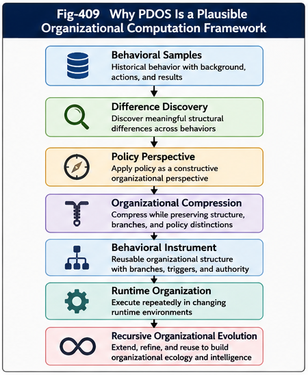
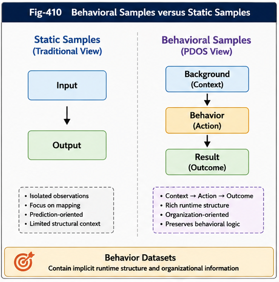
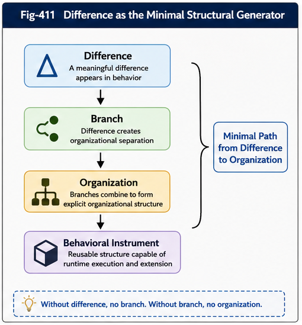
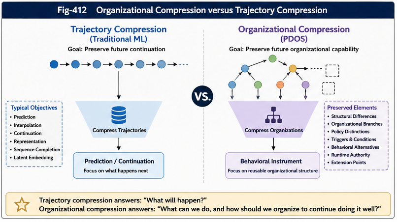
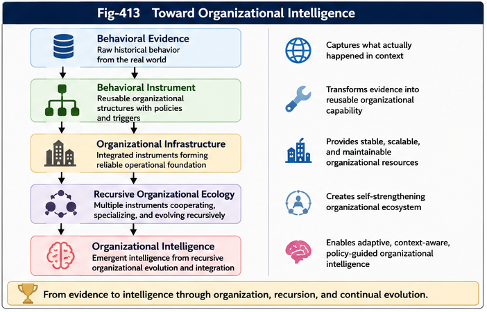

# PDOS-409 — Why PDOS Is a Plausible Organizational Computation Framework

## Abstract

Policy-Driven Organizational Synthesis (PDOS) proposes that historical behavioral evidence can be transformed into reusable organizational instruments through structural difference discovery, policy-guided organizational compression, and recursive organizational synthesis.

Because PDOS introduces a new computational perspective, an important question naturally arises:

> **Why should such a framework be expected to work?**

This question does not ask whether every implementation will succeed.

Instead, it asks whether the computational assumptions behind PDOS are sufficiently grounded to justify long-term engineering development and scientific investigation.

This article argues that PDOS derives its plausibility from several mutually reinforcing observations.

First, many real-world datasets are naturally behavioral datasets rather than collections of isolated observations.

Second, structural difference serves as one of the smallest generators of explicit organizational structure.

Third, policy functions not merely as an evaluation criterion but as a constructive perspective that determines which structures are synthesized.

Fourth, organizational instruments provide reusable behavioral infrastructure rather than one-time predictive outputs.

Finally, recursive organizational synthesis enables validated organizational structures to become construction materials for future organizational structures.

These observations suggest that PDOS should not be viewed as an isolated algorithm.

Instead, PDOS represents a systematic reorganization of existing computational principles around organizational synthesis.

The objective of this article is therefore not to prove PDOS.

Its objective is to explain why PDOS constitutes a plausible organizational computation framework whose engineering potential justifies continued research.

---



---

# 1. Introduction

Every new computational framework must eventually answer a fundamental question.

> **Why should this framework be expected to succeed?**

The answer cannot rely upon optimism, conceptual elegance, or engineering enthusiasm alone.

Instead, the framework should demonstrate that:

- its assumptions are consistent with established computational principles;
- its computational objective is well defined;
- and its organization enables capabilities difficult to obtain through existing approaches.

PDOS should therefore be evaluated from two complementary perspectives.

The first concerns **computational continuity**.

Does PDOS build upon principles already present throughout computer science, machine learning, runtime systems, software engineering, and organizational computation?

The second concerns **organizational novelty**.

Does PDOS organize these principles in a manner that enables new computational capabilities?

This article argues that the answer to both questions is affirmative.

PDOS does not attempt to replace existing computational paradigms.

Instead, it reorganizes behavioral evidence, structural differences, policy perspectives, runtime triggering, and recursive synthesis into a unified organizational framework.

Its plausibility therefore derives less from inventing entirely new computational primitives than from reorganizing mature computational principles around a different computational objective.

---

# 2. Behavioral Samples Rather than Static Samples

One of the strongest assumptions behind PDOS concerns the nature of its input data.

Many traditional learning systems implicitly assume datasets consisting primarily of independent observations.

Conceptually,

```text
Input
    ↓
Output
```

The computational objective is to learn an appropriate mapping between inputs and outputs.

Many real-world organizational datasets, however, possess a richer internal structure.

Instead of isolated observations, they naturally describe **behavior**.

Each record often contains information corresponding to:

```text
Background
        ↓
Behavior
        ↓
Result
```

---



---

Examples include:

- central bank interest-rate decisions;
- military operations;
- financial trading;
- medical diagnosis and treatment;
- software incident recovery;
- manufacturing processes;
- technology evolution;
- robotics;
- autonomous systems.

These datasets are not simply collections of measurements.

They describe actions performed under specific contexts that subsequently produce observable consequences.

In other words, they already contain elementary runtime structures.

PDOS therefore treats historical evidence primarily as **behavioral samples**, rather than static observations.

This distinction fundamentally changes the computational objective.

Instead of asking:

> Which output best fits this input?

PDOS asks:

> Which reusable organizational structure best explains and supports this family of behaviors?

The latter question naturally leads toward organizational synthesis rather than isolated prediction.

---

# 3. Behavioral Samples Already Contain Runtime Structure

Behavior differs fundamentally from static information.

Every behavior implicitly contains a runtime process.

Conceptually,

```text
Background
        ↓
Current Situation
        ↓
Behavior Selection
        ↓
Execution
        ↓
Observed Result
```

This sequence already resembles the execution model of a runtime system.

Many behavioral datasets therefore contain latent representations of:

- runtime states;
- triggering conditions;
- behavioral trajectories;
- decision boundaries;
- execution paths;
- outcome evaluation;
- environmental feedback.

PDOS does not introduce these concepts artificially.

Instead, it attempts to recover and reorganize structures already embedded within historical behavioral evidence.

Consequently, organizational synthesis becomes an exercise in structural reconstruction rather than arbitrary rule invention.

This observation constitutes one of the strongest sources of prior confidence for PDOS.

The framework begins with structures that already exist implicitly within historical behavior.

---

# 4. Difference as the Minimal Structural Generator

Perhaps the most fundamental computational observation behind PDOS concerns structural difference.

Suppose two behavioral records are completely identical.

No meaningful organizational distinction exists.

No branching becomes necessary.

Now suppose a meaningful behavioral difference appears.

Immediately, organizational separation becomes possible.

Conceptually,

```text
Difference
        ↓
Branch
        ↓
Organization
```

This progression is remarkably general.

---



---

Decision trees emerge because differences partition observations.

Runtime dispatchers emerge because different situations require different execution paths.

Policies become necessary because differences produce competing organizational objectives.

Behavioral specialization becomes possible because structural differences reveal reusable operational distinctions.

Consequently, structural difference may be viewed as one of the smallest computational generators of explicit organization.

PDOS therefore does not treat difference merely as statistical variation.

Instead, difference becomes the origin of organizational structure itself.

This observation explains why PDOS places structural difference discovery at the center of organizational computation.

---

# 5. Difference Discovery Is Already Computationally Mature

Another reason PDOS possesses encouraging engineering potential is that structural difference discovery is itself a mature computational discipline.

Modern computing already provides numerous reliable methods for discovering meaningful differences.

Examples include:

- statistical regression;
- hypothesis testing;
- clustering;
- information gain;
- entropy reduction;
- feature importance analysis;
- graph comparison;
- causal inference;
- runtime trace analysis;
- structural comparison.

PDOS does not replace these techniques.

Instead, it reorganizes their outputs.

Their role becomes:

```text
Behavioral Samples
        ↓
Difference Discovery
        ↓
Candidate Organizational Branches
```

Difference discovery therefore becomes an evidence-generation layer rather than the final computational objective.

PDOS extends the computational pipeline beyond analysis toward organizational synthesis.

The novelty lies not in discovering differences themselves, but in transforming validated structural differences into reusable organizational instruments.

---

# 6. Policy as a Constructive Perspective

Many computational systems introduce policy only after structural generation has already completed.

The computational sequence often resembles:

```text
Model
      ↓
Prediction
      ↓
Policy Filter
```

PDOS proposes a fundamentally different interpretation.

Policy participates directly in organizational construction.

Rather than filtering completed structures, policy influences:

- which behavioral differences deserve preservation;
- which branches should be synthesized;
- which exceptions require explicit representation;
- which organizational objectives receive priority;
- which future behaviors become operationally significant.

The computational sequence therefore becomes:

```text
Policy Perspective
        ↓
Difference Discovery
        ↓
Organizational Compression
        ↓
Behavioral Instrument
```

Policy therefore functions as a **constructive perspective** rather than a post-processing constraint.

This interpretation explains why identical behavioral evidence may legitimately produce different organizational instruments under different policy objectives.

The resulting differences do not necessarily indicate inconsistency.

Instead, they reflect purposeful organizational specialization.

---

# 7. Organizational Compression Rather than Trajectory Compression

Traditional machine learning frequently attempts to compress trajectories.

Typical objectives include:

- prediction;
- interpolation;
- continuation;
- representation learning;
- latent embedding;
- sequence completion.

Conceptually,

```text
Historical Data
        ↓
Trajectory Compression
        ↓
Prediction
```

PDOS pursues a different computational objective.

Its primary target is **organizational compression**.

---



---

Instead of preserving only statistical continuity, PDOS attempts to preserve:

- structural differences;
- organizational branches;
- policy distinctions;
- triggering conditions;
- behavioral alternatives;
- runtime authority;
- extension points.

Conceptually,

```text
Historical Behavior
        ↓
Organizational Compression
        ↓
Behavioral Instrument
```

This distinction is significant.

Trajectory compression seeks to preserve future continuation.

Organizational compression seeks to preserve future organizational capability.

The two objectives are complementary rather than contradictory.

PDOS therefore introduces an additional dimension of computational compression rather than replacing existing approaches.

---

# 8. Behavioral Instruments Rather than Predictive Outputs

Traditional learning systems frequently terminate with a prediction.

Typical outputs include:

- probabilities;
- classifications;
- rankings;
- generated sequences;
- numerical estimates.

PDOS instead aims to construct reusable behavioral instruments.

Conceptually,

```text
Historical Behavior
        ↓
Organizational Compression
        ↓
Behavioral Instrument
```

A behavioral instrument may include:

- organizational branches;
- runtime triggers;
- policy boundaries;
- authority assignments;
- validation paths;
- exception handling;
- recursive extension points.

Unlike a single prediction, a behavioral instrument can support repeated runtime decisions under changing operational conditions.

Its value therefore extends beyond one inference.

It becomes reusable organizational infrastructure.

This distinction fundamentally changes the evaluation criterion.

Instead of asking:

> Was the prediction correct?

PDOS increasingly asks:

> Does the organizational instrument continue to support effective runtime behavior while preserving structural adaptability?

This shift from predictive outputs toward reusable organizational infrastructure represents one of the defining characteristics of Policy-Driven Organizational Synthesis.

---

# 9. Multi-Step Runtime Reuse

One of the most important properties of a behavioral instrument is that it is reusable.

Many predictive systems generate an output that is consumed immediately.

After the prediction has been used, the computation terminates.

Conceptually,

```text
Input
    ↓
Prediction
    ↓
End
```

Behavioral instruments operate differently.

The same organizational structure may participate repeatedly throughout an evolving runtime process.

Conceptually,

```text
Runtime State t
        ↓
Behavioral Instrument
        ↓
Action
        ↓
Runtime State t+1
        ↓
Same Behavioral Instrument
        ↓
Action
        ↓
Runtime State t+2
```

The organizational structure remains stable while runtime conditions evolve.

Only the activated branches change.

This distinction is significant.

The computational object is no longer a one-time prediction.

It becomes a reusable organizational runtime component.

The same behavioral instrument may therefore support hundreds or thousands of runtime decisions throughout its operational lifetime.

This property provides an important engineering advantage.

The organizational cost of constructing the instrument can be amortized across many future runtime executions.

---

# 10. Structural Externalization

Another important source of confidence for PDOS is the external nature of organizational structures.

Many computational outputs terminate after generation.

For example:

- probability estimates;
- regression values;
- classifications;
- embeddings;
- generated text.

Although these outputs may later become inputs to additional computation, they do not naturally expose explicit structural extension points.

Behavioral instruments differ fundamentally.

Their internal organization can continue to grow.

Conceptually,

```text
Behavioral Instrument
        │
        ├── Existing Branch
        ├── Existing Branch
        ├── Existing Branch
        └── Extension Point
                ↓
         New Organizational Branch
```

The instrument itself explicitly preserves locations where future organizational knowledge may be attached.

This property may be called **Structural Externalization**.

Instead of terminating computation, the generated structure exposes opportunities for subsequent structural evolution.

This capability distinguishes organizational computation from many forms of terminal prediction.

The organizational output itself becomes an evolving computational object.

---

# 11. Structural Extension Rather than Structural Replacement

Many computational systems improve by replacing an existing model with a better one.

The progression is often:

```text
Old Model
      ↓
Retraining
      ↓
New Model
```

PDOS supports another possibility.

Instead of replacing an existing organizational instrument, new knowledge may simply extend it.

Conceptually,

```text
Existing Behavioral Instrument
        ↓
New Behavioral Evidence
        ↓
New Organizational Branch
        ↓
Expanded Behavioral Instrument
```

This distinction has important engineering implications.

Local organizational growth becomes possible without reconstructing the entire organizational system.

Existing validated branches remain available.

Only newly discovered organizational structures require additional validation.

This incremental evolution closely resembles the growth of engineering systems, biological systems, and institutional organizations.

---

# 12. Recursive Organizational Potential

The previous chapters established that behavioral instruments are reusable.

The next observation is even more important.

Behavioral instruments may themselves become construction materials for future behavioral instruments.

Conceptually,

```text
Behavioral Instrument
        ↓
Runtime Experience
        ↓
New Behavioral Evidence
        ↓
New Behavioral Instrument
```

The computational output therefore becomes a computational input.

This recursive property distinguishes organizational synthesis from many conventional prediction-oriented systems.

Recursive organizational synthesis enables:

- specialization;
- refinement;
- policy branching;
- domain adaptation;
- hierarchical organization;
- organizational inheritance.

Instead of constructing isolated tools, PDOS gradually constructs an organizational ecology.

---

# 13. Tool Trees Can Become Tool Factories

Recursive organizational synthesis naturally produces another important observation.

A sufficiently mature behavioral instrument may eventually support the generation of additional behavioral instruments.

Conceptually,

```text
Behavioral Instrument
        ↓
Tool Generation
        ↓
New Behavioral Instruments
```

The instrument therefore changes its role.

Initially, it serves as a runtime decision-support structure.

Later, it becomes an organizational production mechanism.

Conceptually,

```text
Tool
      ↓
Tool Tree
      ↓
Tool Factory
```

This transition significantly increases organizational scalability.

Instead of constructing every instrument manually, validated organizational knowledge begins to participate directly in future organizational construction.

This possibility represents one of the strongest long-term motivations behind PDOS.

---

# 14. Organizational Ecology

As recursive synthesis continues, organizational structures no longer exist in isolation.

Instead, multiple behavioral instruments begin cooperating.

Conceptually,

```text
Behavioral Instrument A
          │
Behavioral Instrument B
          │
Behavioral Instrument C
          │
Behavioral Instrument D
```

These instruments may:

- cooperate;
- specialize;
- compete;
- validate one another;
- exchange organizational information;
- share runtime evidence.

The computational objective therefore shifts again.

Instead of optimizing a single organizational instrument, PDOS increasingly optimizes an evolving organizational ecology.

This progression provides a natural explanation for why organizational computation may eventually exceed the capability of isolated behavioral models.

---

# 15. Engineering Plausibility

One important characteristic of PDOS is that very few of its individual computational components are fundamentally new.

Behavioral datasets already exist.

Structural difference analysis already exists.

Policy reasoning already exists.

Runtime systems already exist.

Decision trees already exist.

Graph structures already exist.

Statistical learning already exists.

Validation methodologies already exist.

Recursive software construction already exists.

The novelty of PDOS lies elsewhere.

It reorganizes these mature computational components around organizational synthesis.

Conceptually,

```text
Behavior
        +
Difference
        +
Policy
        +
Runtime
        +
Validation
        +
Recursion
        ↓
Organizational Instrument
```

This organizational integration constitutes the primary innovation.

PDOS therefore benefits from decades of previous engineering progress rather than requiring entirely new computational foundations.

---

# 16. Relationship to Existing Computational Paradigms

Because PDOS builds upon existing computational principles, it should not be interpreted as a competing paradigm that replaces previous AI methods.

Instead, PDOS complements them.

Machine Learning contributes:

- statistical generalization;
- representation learning;
- prediction.

Runtime Systems contribute:

- execution management;
- state transitions;
- triggering.

Software Engineering contributes:

- modularity;
- reuse;
- validation;
- version control.

Decision Trees contribute:

- explicit branching;
- interpretable structure.

Graph Systems contribute:

- structural representation;
- dependency organization.

PDOS integrates these capabilities around one additional computational objective:

> **Organizational Synthesis.**

Consequently, PDOS should be viewed less as a competing computational paradigm than as an organizational layer capable of coordinating existing computational technologies.

---

# 17. Sources of Prior Confidence

The observations developed throughout this article can now be summarized.

The prior confidence behind PDOS derives from multiple independent sources.

Behavioral evidence naturally contains runtime structures.

Structural difference naturally generates organizational branches.

Policy naturally guides organizational specialization.

Behavioral instruments naturally support repeated runtime execution.

Organizational structures naturally permit explicit structural extension.

Recursive synthesis naturally supports organizational evolution.

Existing computational technologies already provide mature methods for many individual components required by PDOS.

These observations reinforce one another.

The plausibility of PDOS therefore does not depend upon one revolutionary algorithm.

Instead, it emerges from the convergence of several mature computational principles around organizational computation.

---

# 18. Summary

This article has examined why Policy-Driven Organizational Synthesis constitutes a plausible computational research direction.

The argument does not rely upon speculative assumptions.

Instead, it builds upon several observations.

First, many real-world datasets are behavioral datasets that already contain implicit runtime structures.

Second, structural differences naturally generate explicit organizational branches.

Third, policy acts as a constructive organizational perspective rather than merely a post-processing filter.

Fourth, behavioral instruments provide reusable runtime infrastructure instead of isolated predictive outputs.

Fifth, organizational structures possess explicit extension points that permit incremental structural growth.

Finally, recursive organizational synthesis allows validated organizational structures to become construction materials for future organizational structures.

These properties collectively suggest that PDOS should be understood as a systematic reorganization of existing computational principles around organizational synthesis.

Its strength does not arise from inventing entirely new computational primitives.

Rather, its strength derives from organizing mature computational capabilities toward a new computational objective.

The central conclusion of this article is therefore:

> **PDOS derives its plausibility not from introducing fundamentally new computational primitives, but from reorganizing established computational principles into a unified framework for organizational synthesis.**

This perspective provides a strong conceptual foundation for the continued engineering development of Policy-Driven Organizational Synthesis and its potential role in future Organizational Intelligence.

---

# 19. Research Opportunities

Policy-Driven Organizational Synthesis should be viewed as the beginning of a long-term engineering research program rather than the conclusion of one.

Many important scientific and engineering questions remain open.

Examples include:

- automatic behavioral sample extraction;
- behavioral trajectory reconstruction;
- structural difference discovery;
- policy-conditioned organizational compression;
- behavioral instrument synthesis;
- structural coverage measurement;
- perspective validation;
- recursive organizational synthesis;
- organizational version control;
- organizational runtime databases;
- organizational APIs;
- organizational operating systems;
- organizational simulation;
- organizational security;
- hybrid AI runtime architectures.

These research directions are largely complementary rather than mutually exclusive.

Together they define a long-term roadmap toward Organizational Intelligence.

---

# 20. Limitations

PDOS should not be interpreted as a universal solution.

Like every computational framework, it possesses assumptions and limitations.

First, behavioral evidence is often incomplete.

Historical records rarely capture every variable influencing future behavior.

Consequently, organizational synthesis should always be interpreted as evidence-guided rather than evidence-complete.

Second, structural differences do not automatically imply causal relationships.

A structural difference may represent:

- correlation;
- causal influence;
- environmental coincidence;
- measurement bias;
- or hidden organizational factors.

Additional validation therefore remains essential.

Third, policy perspectives inevitably influence organizational construction.

Different policy perspectives may legitimately generate different organizational instruments from the same behavioral evidence.

This diversity should not necessarily be viewed as inconsistency.

Instead, it reflects different organizational objectives.

Consequently, structural coverage and perspective validation become essential engineering components rather than optional enhancements.

Fourth, recursive organizational synthesis introduces new governance challenges.

As organizational structures become capable of generating additional organizational structures, mechanisms for validation, rollback, version control, authority management, and organizational auditing become increasingly important.

Finally, organizational complexity itself may become an engineering constraint.

Large organizational ecologies require continuous simplification, maintenance, restructuring, and lifecycle management.

PDOS therefore introduces both new computational opportunities and new organizational responsibilities.

---

# 21. Core Principles

The discussion throughout this article may be summarized by the following principles.

## Principle 1

Behavioral samples contain richer computational information than isolated observations because they explicitly preserve relationships among background, behavior, and result.

---

## Principle 2

Structural difference is one of the smallest computational generators of explicit organizational structure.

```text
Difference
      ↓
Branch
      ↓
Organization
```

---

## Principle 3

Policy functions as a constructive organizational perspective rather than merely a post-processing filter.

---

## Principle 4

Organizational compression preserves reusable behavioral structure rather than only statistical continuation.

---

## Principle 5

Behavioral instruments constitute reusable organizational infrastructure rather than one-time predictive outputs.

---

## Principle 6

Behavioral instruments support repeated runtime execution through reusable organizational structures.

---

## Principle 7

Explicit organizational structures naturally expose extension points for future structural growth.

---

## Principle 8

Recursive organizational synthesis enables organizational knowledge to participate directly in future organizational construction.

---

## Principle 9

PDOS reorganizes mature computational principles into a unified organizational computation framework rather than replacing existing computational paradigms.

---

## Principle 10

The long-term potential of PDOS derives from the combination of:

- organizational synthesis;
- organizational recursion;
- structural externalization;
- organizational scalability;
- continuous validation.

Together these properties provide the engineering foundation for Organizational Intelligence.

---

# 22. Why PDOS Is a Plausible Organizational Computation Framework

The discussion throughout this article allows the original question to be answered directly.

Why should PDOS be regarded as a plausible computational framework?

Not because it introduces an entirely new mathematical primitive.

Not because it replaces existing AI.

Not because it rejects current computational paradigms.

Rather, PDOS derives its plausibility from the convergence of several mature computational principles.

Behavior naturally contains runtime structures.

Structural differences naturally generate organizational branches.

Policy naturally guides organizational specialization.

Organizational compression naturally produces reusable behavioral instruments.

Behavioral instruments naturally support repeated runtime execution.

Explicit organizational structures naturally permit structural extension.

Recursive synthesis naturally enables organizational evolution.

Modern computing already possesses mature techniques supporting nearly every individual component required by PDOS.

The innovation therefore lies primarily in organizational integration.

Instead of viewing these computational capabilities independently, PDOS organizes them into a unified computational framework centered on behavioral organization.

Conceptually,

```text
Behavioral Samples
        ↓
Difference Discovery
        ↓
Policy Perspective
        ↓
Organizational Compression
        ↓
Behavioral Instrument
        ↓
Runtime Organization
        ↓
Recursive Organizational Evolution
```

This computational progression provides a coherent explanation for why PDOS possesses significant engineering potential.

---

# 23. Relationship to Organizational Intelligence

Throughout Part IV, Organizational Intelligence has been presented as the long-term research objective of PDOS.

The present article provides the missing theoretical bridge.

If behavioral samples naturally contain organizational information,

if structural differences naturally generate organizational branches,

if policy naturally guides organizational specialization,

and if behavioral instruments naturally evolve through recursive organizational synthesis,

then Organizational Intelligence may emerge as the cumulative result of these organizational processes.

Organizational Intelligence therefore should not be viewed as a mysterious computational property.

Instead, it may gradually emerge from the continuous accumulation, validation, specialization, integration, and recursive evolution of behavioral instruments.

Conceptually,

```text
Behavioral Evidence
        ↓
Behavioral Instruments
        ↓
Organizational Infrastructure
        ↓
Recursive Organizational Ecology
        ↓
Organizational Intelligence
```

This progression connects the theoretical foundations developed throughout Part IV into a single organizational narrative.

---



---

# 24. Conclusion

Every important computational framework begins by changing the primary computational perspective.

Machine learning shifted attention from manually written rules toward statistical learning.

Runtime systems shifted attention from static programs toward dynamic execution.

Software engineering shifted attention from isolated programs toward reusable modular systems.

PDOS proposes another transition.

It shifts the primary computational objective from prediction alone toward organizational synthesis.

Instead of asking:

> What is the most accurate prediction?

PDOS increasingly asks:

> What is the most reusable organizational structure capable of supporting future behavior?

This transition naturally transforms historical behavioral evidence into behavioral instruments rather than isolated predictive outputs.

Those behavioral instruments may subsequently evolve into organizational infrastructures, recursive organizational ecologies, and ultimately Organizational Intelligence.

PDOS therefore should not be interpreted as a competing alternative to existing computational paradigms.

Instead, it provides an additional organizational layer capable of integrating behavioral evidence, structural difference discovery, policy guidance, runtime execution, validation, and recursive synthesis into a unified computational framework.

The long-term significance of PDOS will ultimately depend upon engineering validation rather than conceptual argument alone.

Nevertheless, its computational assumptions derive from multiple mature principles that have already demonstrated practical value across computer science, artificial intelligence, runtime systems, software engineering, organizational theory, and systems architecture.

The central conclusion of this article is therefore:

> **PDOS derives its plausibility not from introducing fundamentally new computational primitives, but from reorganizing established computational principles into a unified framework for organizational synthesis.**

This observation provides both the theoretical foundation and the engineering motivation for the continuing development of Policy-Driven Organizational Synthesis and its potential contribution to future Organizational Intelligence.

---

# Closing Perspective

Many successful engineering revolutions have not resulted from discovering entirely new computational primitives.

Instead, they emerged from reorganizing existing computational capabilities around new engineering objectives.

Programming languages reorganized machine instructions.

Operating systems reorganized computational resources.

Databases reorganized information.

Software engineering reorganized large software systems.

Cloud computing reorganized distributed infrastructure.

PDOS proposes another organizational transition.

It reorganizes behavioral evidence, structural differences, policy perspectives, runtime execution, validation, and recursive evolution into explicit organizational computation.

If this organizational perspective proves effective through continued engineering practice, it may provide an important foundation for future Organizational Intelligence.
