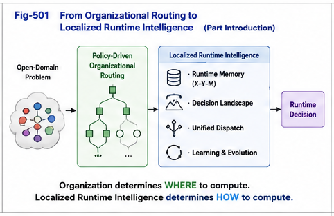

# PDOS-501

# From Organizational Intelligence to Localized Runtime Intelligence

**Part V — Localized Runtime Intelligence**

**Computation, Decision, and Learning over Policy-Driven Organizations**

---

## Abstract

Policy-Driven Organizational Synthesis (PDOS) has thus far focused on one central objective: organizing open-domain problems into policy-driven computational structures. Through policy-guided differential decomposition, complex real-world problems can be routed, with minimal structural loss, toward their most relevant organizational nodes.

This organizational capability represents a major step beyond conventional knowledge organization because it transforms an open-domain problem into a localized computational context.

However, organization alone does not solve the problem.

Once an organizational node has been identified, the system must determine how computation should proceed inside that node. The fundamental question therefore becomes:

> **How should intelligence operate after organization has already localized the problem?**

This question motivates the second half of the PDOS computational framework:

> **Localized Runtime Intelligence.**

Rather than treating intelligence as a single global computation over an undifferentiated knowledge space, PDOS proposes that runtime computation should primarily occur within localized organizational contexts created by policy-driven routing.

This transition—from organizational intelligence to localized runtime intelligence—forms the foundation of Part V.

---



---

# 1. Organization Is Not the Final Goal

Policy-driven organization is frequently misunderstood as a classification problem.

It is not.

Classification merely assigns labels.

Organization constructs computational structures.

Within PDOS, the objective of organizational routing is to transform an initially unstructured decision problem into a localized runtime environment.

Conceptually,

```text
Open Problem

        │

        ▼

Policy Perspective

        │

        ▼

Differential Organization

        │

        ▼

Localized Organizational Node
```

At this point, organization has already completed its primary responsibility.

The remaining challenge is no longer organizational.

Instead, it becomes computational.

The node must now determine what action should be taken.

Consequently,

> **Organization should be viewed as the preparation stage of runtime intelligence rather than the final objective of intelligence.**

---

# 2. Why Localization Matters

A common assumption in modern AI is that every decision should be made by searching or reasoning over a large unified model.

Such an approach is often appropriate before sufficient context has been identified.

However, once organizational routing has localized the problem, the computational situation changes fundamentally.

For example,

```
Medical Diagnosis
        ↓
Respiratory Diseases
        ↓
Pulmonary Infection
        ↓
Bacterial Pneumonia
```

After routing reaches the final organizational node, continuing to reason over the entire global knowledge space becomes increasingly inefficient.

Most of the remaining global information has already become irrelevant to the localized decision.

The computational objective therefore changes from

> **Global Search**

to

> **Localized Runtime Computation.**

This shift is one of the central ideas introduced by Part V.

---

# 3. Localized Runtime Intelligence

Once a problem has been localized, intelligence becomes fundamentally different from global reasoning.

Instead of asking,

> "What does the entire world know about this problem?"

the system asks,

> "Given the current localized organizational context, what computation should occur here?"

This seemingly small shift produces a major architectural consequence.

The computational scope becomes dramatically smaller.

The runtime context becomes significantly richer.

The decision space becomes substantially more focused.

Rather than repeatedly solving the original open-domain problem, the system now operates within a localized runtime landscape specifically created for that category of problems.

Localized Runtime Intelligence therefore represents a computational paradigm in which organization precedes computation, and computation is performed over localized organizational structures rather than over the original undifferentiated problem space.

---

# 4. From Global Intelligence to Localized Intelligence

This transition can be summarized as follows.

Traditional runtime paradigm:

```
Problem
        │
        ▼
Global Model
        │
        ▼
Decision
```

PDOS runtime paradigm:

```
Problem
        │
        ▼
Policy-Driven Organizational Routing
        │
        ▼
Localized Organizational Node
        │
        ▼
Localized Runtime Intelligence
        │
        ▼
Decision
```

The distinction is subtle but fundamental.

The purpose of organizational intelligence is not to replace runtime intelligence.

Instead, its purpose is to reduce the decision space before runtime intelligence begins.

This principle provides the conceptual bridge between organizational computation and localized runtime computation.

---

## Part 1 Summary

Part I of this article establishes the transition from organizational intelligence to localized runtime intelligence.

Policy-driven organization should not be viewed as the endpoint of computation.

Instead, it provides the computational foundation upon which localized runtime intelligence can operate.

Once a sufficiently relevant organizational node has been identified, the principal challenge is no longer organizational routing but localized runtime computation.

This observation motivates the remaining articles of Part V, which investigate how localized runtime intelligence performs computation, decision making, learning, and continuous evolution over policy-driven organizational structures.

---

**Next Article**

**PDOS-502 — Per-Node X–Y–M Runtime Memory**

Introducing the runtime memory model that serves as the computational foundation for localized runtime intelligence.