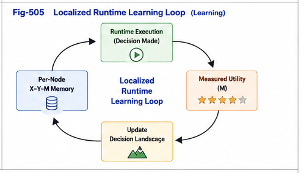

# PDOS-505

# Localized Runtime Learning

**Learning, Adaptation, and Continuous Improvement over Decision Landscapes**

**Part V — Localized Runtime Intelligence**

**Computation, Decision, and Learning over Policy-Driven Organizations**

---

## Abstract

PDOS-504 established that runtime dispatch methods operate over localized Decision Landscapes rather than over undifferentiated global knowledge spaces.

Once dispatch generates runtime decisions and measured outcomes become available, a new question naturally arises:

> **How should localized runtime intelligence improve itself?**

Traditional AI frequently treats learning as a global optimization problem, where updates are propagated throughout an entire model.

PDOS proposes a complementary computational paradigm.

Learning should primarily occur within the localized organizational nodes where runtime experience is generated.

Each node continuously accumulates X–Y–M runtime experiences, updates its own Decision Landscape, and incrementally improves future dispatch without requiring the entire organizational system to be retrained.

This paper introduces **Localized Runtime Learning**, a computational framework in which learning becomes a natural consequence of localized runtime operation.

---

# 1. Learning Begins After Decision

Decision making is not the endpoint of runtime computation.

Every runtime decision generates measurable consequences.

Conceptually,

```
Observation

        │

        ▼

Dispatch

        │

        ▼

Decision

        │

        ▼

Measured Utility
```

Once measured utility becomes available,

the organizational node possesses new runtime experience.

Learning therefore begins **after execution**, not before.

Every completed runtime cycle contributes additional computational knowledge to the localized node.

---

# 2. Local Learning Rather Than Global Retraining

Traditional machine learning often assumes that newly acquired knowledge should eventually influence an entire computational model.

While effective in many situations,

such global retraining becomes increasingly expensive as computational systems continue to grow.

PDOS adopts a different strategy.

Instead of immediately updating the entire organizational system,

learning first occurs within the localized organizational node responsible for the corresponding runtime decisions.

```
Localized Node

        │

        ▼

Runtime Experience

        │

        ▼

Decision Landscape Update

        │

        ▼

Improved Future Dispatch
```

Knowledge therefore evolves precisely where it is generated.

---

# 3. Runtime Learning Is Continuous

Localized runtime learning is not viewed as a sequence of isolated training sessions.

Instead,

learning becomes a continuous operational process.

Each execution contributes another runtime experience.

```
(X,Y,M)

↓

Landscape Update

↓

Future Dispatch Improvement
```

As runtime experiences accumulate,

the Decision Landscape becomes increasingly representative of real operational behavior.

Consequently,

runtime intelligence continuously improves through experience accumulation rather than periodic global reconstruction.

---



---

# 4. Multiple Learning Mechanisms Can Coexist

Localized Runtime Learning is intentionally algorithm-independent.

Different organizational nodes may employ different learning strategies according to their computational requirements.

Examples include

- statistical updating,
- structural refinement,
- runtime triggering adjustment,
- Transformer fine-tuning,
- reinforcement learning,
- optimization-based adaptation,
- or hybrid learning mechanisms.

Within PDOS,

these learning algorithms are interpreted as different methods for improving the same localized Decision Landscape.

The organizational framework itself remains unchanged.

---

# Part 1 Summary

Learning naturally follows runtime decision making.

Rather than propagating every new experience throughout an entire computational system,

PDOS proposes that learning should first occur within the localized organizational node where the experience was generated.

Localized Runtime Learning therefore enables continuous improvement while preserving the stability of the overall organizational framework.

---
# PDOS-505

# Localized Runtime Learning

**Learning, Adaptation, and Continuous Improvement over Decision Landscapes**

**Part V — Localized Runtime Intelligence**

**Computation, Decision, and Learning over Policy-Driven Organizations**

---

# 5. Localized Adaptation

Once runtime learning is localized, adaptation naturally becomes localized as well.

Instead of treating the entire computational system as one monolithic learning object, PDOS treats every organizational node as an independently evolving runtime component.

Conceptually,

```
Localized Runtime Node

        │

        ▼

Decision Landscape

        │

        ▼

Runtime Learning

        │

        ▼

Localized Adaptation
```

The adaptation is therefore constrained to the computational region where new runtime evidence has actually been observed.

This localized adaptation significantly reduces unnecessary changes to unrelated computational domains while preserving the stability of the overall organizational structure.

---

# 6. Continuous Runtime Evolution

Localized adaptation gradually produces continuous runtime evolution.

Each execution contributes one additional runtime experience.

```
(X,Y,M)

↓

Runtime Memory

↓

Decision Landscape

↓

Dispatch

↓

New Runtime Experience

↓

Landscape Update
```

The Decision Landscape therefore evolves continuously rather than episodically.

Over time,

the organizational node becomes increasingly specialized for its own operational environment.

This specialization is not manually engineered.

Instead,

it emerges naturally through repeated runtime interaction.

Localized Runtime Intelligence therefore evolves through operational experience rather than isolated retraining events.

---

# 7. Engineering Advantages

Localized Runtime Learning introduces several engineering advantages over global learning architectures.

First,

computational updates become localized.

Only the affected organizational node requires modification.

Second,

validation also becomes localized.

Updated runtime behavior can be verified inside the corresponding Decision Landscape without requiring complete system-wide regression.

Third,

rollback becomes localized.

If a newly learned strategy proves ineffective,

only the affected organizational node requires restoration.

Fourth,

computational maintenance becomes modular.

Different organizational nodes may evolve independently while remaining compatible with the overall organizational framework.

These engineering properties substantially improve scalability for large runtime systems.

---

# 8. Local Learning Enables Brain Units

Localized Runtime Learning naturally supports the emergence of specialized computational units.

As Decision Landscapes continue to accumulate runtime experience,

individual organizational nodes gradually develop increasingly specialized computational capabilities.

Instead of requiring one universal computational model,

multiple localized runtime units can evolve independently according to their own operational domains.

Conceptually,

```
Policy-Driven Organization

        │

        ▼

Localized Runtime Nodes

        │

        ▼

Localized Runtime Learning

        │

        ▼

Specialized Brain Units
```

Within the PDOS framework,

Brain Units are therefore not predefined architectural components.

They emerge naturally from sustained localized runtime learning over well-organized Decision Landscapes.

---

# 9. Toward Organizational Runtime Ecology

As increasing numbers of localized runtime nodes evolve,

the organizational system gradually transforms into a computational ecology.

Rather than consisting of one centralized intelligence,

the system becomes a network of specialized runtime components.

Each node contributes

- localized knowledge,
- localized experience,
- localized learning,
- and localized decision capabilities.

Meanwhile,

Policy-Driven Organizational Routing continues coordinating communication among these localized computational units.

Consequently,

organization and computation evolve together.

Organization determines computational locality.

Localized runtime learning continuously improves computational quality.

Together they form a self-improving runtime ecosystem.

---

# 10. From Runtime Learning to Organizational Evolution

Localized Runtime Learning represents more than a learning algorithm.

It establishes a new computational relationship between organization and intelligence.

```
Policy

↓

Organization

↓

Decision Landscape

↓

Dispatch

↓

Measured Utility

↓

Localized Learning

↓

Organizational Evolution
```

Learning no longer appears as an isolated optimization stage.

Instead,

it becomes an integral component of the runtime organizational lifecycle.

Every execution simultaneously performs computation,

collects evidence,

improves localized knowledge,

and strengthens future organizational intelligence.

This closed-loop evolution forms one of the defining characteristics of PDOS.

---

## Conclusion

Localized Runtime Learning transforms organizational nodes from passive repositories into continuously evolving computational entities.

Each localized runtime node accumulates experience,

updates its Decision Landscape,

improves dispatch strategies,

and gradually develops increasingly specialized computational capabilities.

Unlike traditional global learning architectures,

PDOS performs adaptation where operational knowledge is actually generated.

This localized learning paradigm improves scalability,

engineering maintainability,

validation,

rollback,

and long-term computational sustainability.

As organizational nodes continue evolving,

they naturally form specialized Brain Units and eventually larger organizational runtime ecologies.

Localized Runtime Learning therefore provides the evolutionary mechanism that completes the computational foundation established throughout Part V.

---

## Next Article

**PDOS-506 — Brain Units and Localized Intelligence**

**From Localized Runtime Learning to Specialized Computational Intelligence**