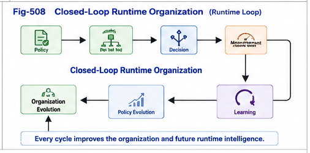

# PDOS-508

# Closed-Loop Runtime Organizations

**Organization, Decision, Learning, and Continuous Organizational Evolution**

**Part V — Localized Runtime Intelligence**

**Computation, Decision, and Learning over Policy-Driven Organizations**

---

## Abstract

Previous chapters established the computational foundations of Localized Runtime Intelligence.

PDOS-501 introduced the transition from organizational intelligence to localized runtime intelligence.

PDOS-502 defined Per-Node X–Y–M Runtime Memory.

PDOS-503 organized runtime experiences into Decision Landscapes.

PDOS-504 unified existing dispatch methods under a common computational framework.

PDOS-505 demonstrated localized runtime learning.

PDOS-506 introduced Brain Units.

PDOS-507 extended runtime intelligence to multiple policy perspectives.

The remaining question is no longer how individual runtime components operate.

Instead, the question becomes:

> **How do all these components continuously evolve together?**

This paper introduces **Closed-Loop Runtime Organizations**, a computational framework in which organization, decision making, runtime learning, and organizational evolution form one continuous self-improving computational cycle.

Rather than viewing organization as a static preprocessing stage, PDOS interprets organization itself as an adaptive runtime component that continuously evolves through operational experience.

---

# 1. Organization Is Never Finished

Traditional organizational systems are often constructed once and then remain relatively static.

Knowledge may change.

Algorithms may improve.

However,

the organizational structure itself is frequently assumed to be fixed.

PDOS adopts a different computational philosophy.

Organization is not a one-time engineering activity.

Instead,

organization continuously evolves together with runtime experience.

Every execution contributes new evidence.

Every new observation may improve organizational quality.

Consequently,

organization itself becomes a continuously evolving runtime object.

---

# 2. The Runtime Organizational Loop

The complete PDOS runtime process may be summarized as

```
Problem

        │

        ▼

Policy Perspective

        │

        ▼

Organizational Routing

        │

        ▼

Localized Runtime Node

        │

        ▼

Decision Landscape

        │

        ▼

Dispatch

        │

        ▼

Runtime Decision

        │

        ▼

Measured Utility

        │

        ▼

Localized Runtime Learning

        │

        ▼

Policy Evolution

        │

        ▼

Organizational Evolution
```

Unlike traditional computational pipelines,

this process does not terminate after producing a decision.

Instead,

every completed runtime cycle contributes directly to future organizational improvement.

---



---

# 3. Runtime Learning Drives Organizational Evolution

Localized Runtime Learning continuously improves Decision Landscapes.

Improved Decision Landscapes gradually influence dispatch quality.

As dispatch quality changes,

organizational effectiveness also changes.

Over time,

new runtime evidence may suggest

- improved organizational boundaries,
- refined policy definitions,
- additional organizational nodes,
- merged organizational regions,
- or entirely new policy perspectives.

Consequently,

organizational evolution naturally emerges from operational experience.

The organization is therefore no longer externally maintained.

Instead,

it increasingly becomes self-improving.

---

# 4. Closed Loops Produce Organizational Intelligence

The significance of a closed-loop architecture extends beyond learning alone.

Every completed runtime cycle simultaneously performs multiple computational functions.

```
Runtime Observation

↓

Decision

↓

Execution

↓

Measurement

↓

Learning

↓

Organization Update

↓

Future Decision
```

One execution therefore contributes to

- solving the current problem,
- improving future runtime decisions,
- refining localized computational knowledge,
- strengthening organizational structures,
- and increasing future runtime confidence.

The computational value of each execution therefore extends beyond its immediate operational objective.

---

## Part 1 Summary

Closed-Loop Runtime Organizations transform PDOS from a static organizational framework into a continuously evolving computational architecture.

Organization,

decision making,

measurement,

learning,

and policy evolution become components of one integrated runtime cycle.

The following sections discuss the engineering implications of this closed-loop architecture and its significance for future large-scale intelligent systems.

---
# PDOS-508

# Closed-Loop Runtime Organizations

**Organization, Decision, Learning, and Continuous Organizational Evolution**

**Part V — Localized Runtime Intelligence**

**Computation, Decision, and Learning over Policy-Driven Organizations**

---

# 5. Self-Evolving Organizations

One of the most important consequences of the closed-loop architecture is that organizations themselves become capable of continuous evolution.

Traditional organizational structures are typically revised through external engineering activities.

Experts redesign taxonomies.

Engineers rewrite rules.

Administrators reorganize workflows.

PDOS introduces a different computational paradigm.

Organization evolves from runtime evidence generated by the organization itself.

Conceptually,

```
Runtime Experience

↓

Localized Learning

↓

Policy Refinement

↓

Organizational Update

↓

Improved Organizational Routing
```

The organization therefore becomes an adaptive computational system rather than a static engineering artifact.

---

# 6. Runtime Sustainability

A practical AI system must remain effective over long operational periods.

Real-world environments continuously change.

User behavior evolves.

Operational objectives shift.

New runtime situations appear.

Closed-Loop Runtime Organizations naturally address these challenges.

Instead of periodically rebuilding the entire computational system,

PDOS performs continuous localized adaptation.

```
New Runtime Experience

↓

Localized Runtime Learning

↓

Decision Landscape Update

↓

Improved Dispatch

↓

Improved Organization
```

Consequently,

computational sustainability emerges from continuous runtime evolution rather than repeated global reconstruction.

The system remains operational while simultaneously improving itself.

---

# 7. Runtime Stability Through Localized Evolution

Continuous evolution does not imply continuous instability.

Because learning occurs within localized organizational nodes,

organizational changes remain localized whenever possible.

Only runtime regions supported by new operational evidence require adaptation.

The remaining organizational structure continues operating unchanged.

This localized evolution provides several important engineering advantages.

- Stable organizational foundations.
- Incremental deployment.
- Local verification.
- Local rollback.
- Continuous operation during evolution.

The result is a runtime architecture capable of improving itself without sacrificing operational stability.

---

# 8. Organization Becomes a Computational Primitive

One of the central conclusions of PDOS is that organization should no longer be viewed merely as information management.

Instead,

organization becomes an active computational primitive.

Policy organizes runtime computation.

Organization localizes computation.

Localized computation generates runtime experience.

Runtime experience improves organization.

Conceptually,

```
Policy

↓

Organization

↓

Localized Computation

↓

Runtime Experience

↓

Organizational Evolution
```

Organization therefore participates directly in computation rather than merely supporting computation.

This observation represents one of the defining architectural principles of PDOS.

---

# 9. Toward Organizational AI

The closed-loop architecture also suggests a broader direction for future AI systems.

Rather than measuring intelligence primarily by

- model size,
- parameter count,
- computational scale,
- or benchmark performance,

future systems may increasingly be evaluated according to

- organizational quality,
- localization capability,
- runtime adaptability,
- continuous learning,
- organizational robustness,
- and sustainable computational evolution.

Within this perspective,

the organizational architecture itself becomes a primary determinant of long-term intelligent behavior.

AI therefore evolves from

> **Model-Centric Intelligence**

toward

> **Organization-Centric Runtime Intelligence.**

---

# 10. The Complete PDOS Runtime Architecture

The complete computational architecture developed throughout Part V may now be summarized.

```
Open-Domain Problem

        │

        ▼

Policy Perspective

        │

        ▼

Policy-Driven Organizational Routing

        │

        ▼

Localized Runtime Node

        │

        ▼

X–Y–M Runtime Memory

        │

        ▼

Decision Landscape

        │

        ▼

Unified Dispatch

        │

        ▼

Runtime Decision

        │

        ▼

Measured Utility

        │

        ▼

Localized Runtime Learning

        │

        ▼

Brain Units

        │

        ▼

Multi-Policy Runtime Intelligence

        │

        ▼

Policy Evolution

        │

        ▼

Organizational Evolution
```

This architecture forms a complete computational loop.

Every runtime execution simultaneously

- solves the current problem,
- accumulates runtime knowledge,
- improves localized intelligence,
- strengthens organizational structures,
- and prepares the system for future computation.

Organization and computation therefore become mutually reinforcing processes within one unified runtime framework.

---

## Conclusion

Closed-Loop Runtime Organizations complete the computational framework introduced throughout Part V.

Rather than treating organization, decision making, learning, and adaptation as independent computational stages, PDOS integrates them into one continuous runtime lifecycle.

Each runtime execution contributes simultaneously to immediate operational objectives and long-term organizational improvement.

As organizational structures continue evolving through localized runtime learning, Brain Units, Decision Landscapes, and Multi-Policy Runtime Intelligence become increasingly capable and increasingly coordinated.

The resulting architecture provides a scalable foundation for future intelligent systems in which organization is no longer static infrastructure but an active computational mechanism continuously participating in runtime intelligence.

Closed-Loop Runtime Organizations therefore represent the operational realization of Policy-Driven Organizational Synthesis and establish the computational bridge from organizational intelligence toward self-evolving organizational AI.

---

## Next Article

**PDOS-509 — Localized Runtime Intelligence**

**Summary, Structural Integration, and Future Directions**