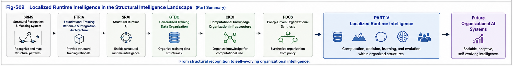

# PDOS-509

# Localized Runtime Intelligence

**Summary, Structural Integration, and Future Directions**

**Part V — Localized Runtime Intelligence**

**Computation, Decision, and Learning over Policy-Driven Organizations**

---

## Abstract

This concluding paper summarizes the computational framework developed throughout Part V.

Beginning with the transition from Organizational Intelligence to Localized Runtime Intelligence, Part V introduced a complete runtime computational architecture consisting of Per-Node Runtime Memory, Decision Landscapes, Unified Dispatch Methods, Localized Runtime Learning, Brain Units, Multi-Policy Runtime Intelligence, and Closed-Loop Runtime Organizations.

Collectively, these components establish a new computational perspective in which intelligence is organized before it is executed.

Rather than repeatedly reasoning over undifferentiated global knowledge spaces, PDOS proposes that runtime intelligence should operate primarily over localized computational environments created by Policy-Driven Organizational Routing.

Localized Runtime Intelligence therefore represents the computational realization of Policy-Driven Organizational Synthesis and completes the first theoretical foundation of PDOS.

---

# 1. From Organization to Runtime Intelligence

The central objective of Part V has been to answer one fundamental question.

> **What should happen after organizational routing has successfully localized an open-domain problem?**

The answer developed throughout this part is:

> **Localized Runtime Intelligence.**

Policy-Driven Organizational Routing determines where computation should occur.

Localized Runtime Intelligence determines how computation should occur.

Together they establish a complete organizational computation framework.

Conceptually,

```
Open-Domain Problem

        │

        ▼

Policy-Driven Organizational Routing

        │

        ▼

Localized Runtime Intelligence

        │

        ▼

Runtime Decision
```

Organization therefore becomes the prerequisite for efficient runtime computation.

---

# 2. The Architecture Developed in Part V

Part V progressively established the following computational architecture.

```
Localized Runtime Node

        │

        ▼

Per-Node X–Y–M Runtime Memory

        │

        ▼

Decision Landscape

        │

        ▼

Unified Dispatch

        │

        ▼

Localized Runtime Learning

        │

        ▼

Brain Units

        │

        ▼

Multi-Policy Runtime Intelligence

        │

        ▼

Closed-Loop Runtime Organizations
```

Each layer builds naturally upon the previous one.

No component operates independently.

Instead,

the framework functions as one integrated runtime architecture.

---

# 3. Organization Before Computation

One principle repeatedly emerged throughout Part V.

> **Organization should precede computation.**

Instead of repeatedly solving an open-domain problem using one undifferentiated computational process,

PDOS first organizes the problem into an appropriate localized runtime context.

Only after sufficient localization has been achieved does runtime intelligence begin.

This separation significantly reduces computational complexity while improving specialization, explainability, engineering maintainability, and continuous learning.

Organization therefore becomes an active computational mechanism rather than merely an information management technique.

---

# 4. Localized Intelligence Rather Than Unlimited Generalization

Part V also introduced a complementary perspective on future AI architectures.

Rather than assuming that every computational capability should continuously accumulate inside one increasingly larger model,

PDOS proposes that specialized localized runtime intelligence should emerge naturally from organizational structure.

Brain Units represent one possible realization of this architectural principle.

Large foundation models,

specialized runtime units,

Decision Landscapes,

and organizational routing may cooperate as complementary computational layers rather than competing architectural alternatives.

---

# 5. Organizational Intelligence and Runtime Intelligence

The relationship between the first four Parts of PDOS and Part V may now be summarized.

```
Policy

↓

Organization

↓

Localized Runtime Intelligence

↓

Continuous Organizational Evolution
```

The first four Parts primarily establish organizational intelligence.

Part V establishes runtime intelligence operating over those organizational structures.

Together they transform PDOS from an organizational theory into a complete runtime computational framework.

---

# 6. Relationship to the Structural Intelligence Framework

Localized Runtime Intelligence also strengthens the connections between PDOS and the broader Structural Intelligence research program.

Conceptually,

```
SRMS

↓

Structural Recognition

↓

FTRIA

↓

Structural Runtime Operators

↓

SRAI

↓

Structural Runtime Intelligence

↓

GTDO

↓

Training Organization

↓

CKOI

↓

Knowledge Organization

↓

PDOS

↓

Organizational Intelligence

↓

Localized Runtime Intelligence
```

Rather than introducing an isolated computational theory,

Part V extends the Structural Intelligence framework toward practical runtime computation.

Organization,

runtime learning,

and computational evolution become increasingly unified.

---



---


---

# 7. Future Research Directions

The framework introduced in Part V establishes numerous directions for future research.

Potential areas include

- advanced dispatch algorithms,
- confidence estimation,
- organizational fusion,
- adaptive policy generation,
- Brain Unit cooperation,
- organizational runtime verification,
- planning over Decision Landscapes,
- simulation-based runtime optimization,
- organizational APIs,
- and self-evolving organizational ecosystems.

These developments extend naturally from the computational foundation established in this part.

---

# 8. Concluding Remarks

Policy-Driven Organizational Synthesis began with a simple observation:

organization itself possesses computational value.

Part V extends this observation one decisive step further.

Organization not only structures computation.

Organization determines where computation should occur,

how computation should evolve,

and how runtime intelligence should continuously improve itself.

Localized Runtime Intelligence therefore represents the computational realization of organizational intelligence.

Together,

Policy,

Organization,

Decision,

Learning,

and Evolution form one continuous computational lifecycle.

This lifecycle transforms organization from static infrastructure into an active runtime participant capable of supporting scalable, adaptive, and continuously improving intelligent systems.

---

## Final Summary

Part V establishes the first complete theoretical framework for **Localized Runtime Intelligence**.

Through Per-Node Runtime Memory, Decision Landscapes, Unified Dispatch Methods, Localized Runtime Learning, Brain Units, Multi-Policy Runtime Intelligence, and Closed-Loop Runtime Organizations, PDOS demonstrates how organization and computation can be integrated into one unified runtime architecture.

The resulting framework provides a scalable computational foundation upon which future organizational AI systems may be constructed.

Rather than viewing intelligence as a single global computational process, PDOS proposes a complementary paradigm in which intelligence emerges through organized, localized, continuously evolving runtime computation.

Localized Runtime Intelligence therefore completes the first-generation computational foundation of Policy-Driven Organizational Synthesis and provides a new architectural perspective for future AI systems centered on organization, runtime computation, and continuous organizational evolution.

> **Routing determines WHERE.**
> **Local Runtime Intelligence determines HOW.**
>
---

**End of Part V**

**Localized Runtime Intelligence**

**Computation, Decision, and Learning over Policy-Driven Organizations**

**Policy-Driven Organizational Synthesis (PDOS)**